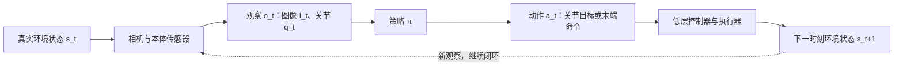
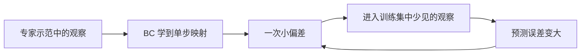
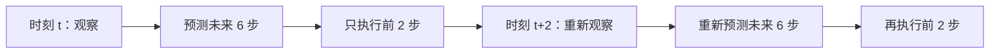

# 基础概念：从行为克隆到动作序列

> 阅读位置：本篇 → [ACT](./01-ACT.md) → [Diffusion Policy](./02-Diffusion-Policy.md) → [对照与自测](./03-对照与自测.md)。

## 1. 机器人策略到底在学什么？

机器人在时刻 $t$ 有真实状态 $s_t$，例如物体姿态、接触情况和关节位置。真实状态通常无法完整测量。策略得到的是**观察** $o_t$，可以包含相机图像 $I_t$、关节角 $q_t$、夹爪状态等，再输出**动作** $a_t$。动作可以是关节目标位置、末端位姿增量或速度命令；这些不是同一种控制接口，读论文时必须核对。

*图 1：本仓库绘制的闭环控制示意。策略给出动作，执行器作用于环境，下一次观察再修正行为。*

在模仿学习中，我们有专家示范数据 $\mathcal D=\{(o_t,a_t^*)\}$。最简单的行为克隆（behavior cloning, BC）把它当监督学习：

$$\min_\theta\;\mathbb E_{(o,a^*)\sim\mathcal D}\left[\ell\bigl(\pi_\theta(o),a^*\bigr)\right].$$

训练时模型看到专家到达过的观察；部署时它会看到**自己之前的动作**造成的观察。这两种分布不一定相同。

## 2. 为什么“每次只预测一步”不够？

设想机器人把电池插入卡槽：开始时偏差 1 毫米，下一步接触点变了，后续观察可能已偏离示范。即使训练集上的单步误差很小，闭环执行的误差仍可能逐步累积。这称为**复合误差**或**分布偏移**。此外，同一观察下专家可能选择不同但都正确的路径，单一均值回归容易得到夹在两条路径之间的、不合理的动作。

*图 2：复合误差的概念示意。并非每次偏差都会放大；放大的风险取决于环境、数据覆盖与策略恢复能力。*

## 3. Action chunk：一次预测一段未来动作

与 $\pi(a_t\mid o_t)$ 相比，动作序列策略学习 $\pi(a_{t:t+H-1}\mid o_t)$。这样可以让相邻动作更连贯，也能减少每一步都重新决定动作引入的抖动。**预测长度**和**实际执行长度**要分开看：模型可以预测未来 $H$ 步，但只执行前面一小段，然后重新观察并规划。

*图 3：预测与执行长度的概念示意；图中的 6 和 2 只是例子，并非论文的具体超参数。*

chunk 越长，通常越容易保持一段动作的连贯性，但对意外变化的反应也可能越慢。ACT 和 Diffusion Policy 都预测动作序列，处理这种权衡的方法不同。

## 4. 第 0 阶段与 VLA 的关系

第 0 阶段讨论的是**给定观察，怎样生成可执行动作**。之后 VLA 还要加入语言指令、跨任务数据和视觉语言预训练。即使模型能理解“把红杯放到架子上”，仍要回答：控制命令是离散 token、连续回归，还是生成一段动作？ACT 与 Diffusion Policy 正是理解这个问题的基础。

**阅读检查：**看到一篇机器人论文，先写下 $o_t$ 包含什么、$a_t$ 是什么单位与坐标系、模型预测多少步、执行多少步、控制频率是多少。缺少这些信息，就很难解释实验结果。
