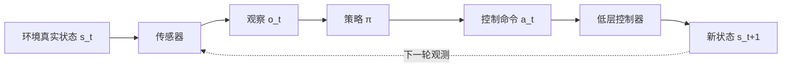
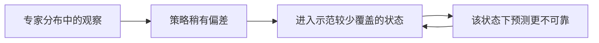
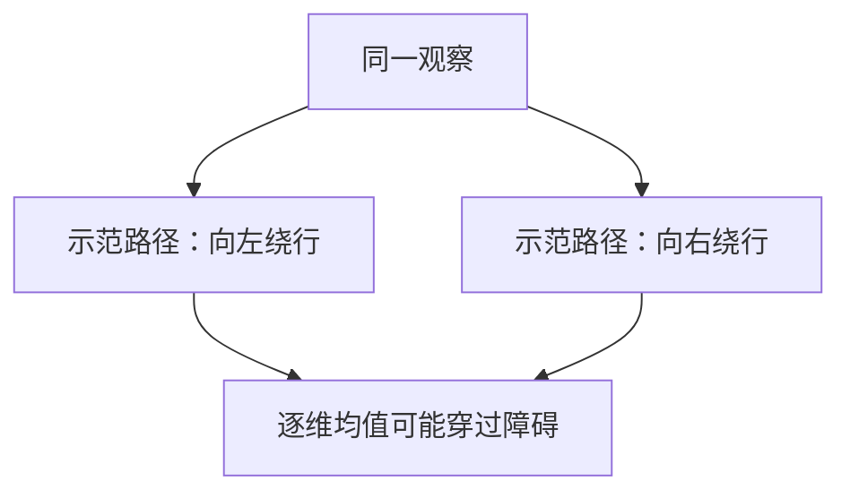
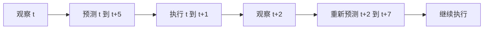

# 第 0 讲：从模仿学习到动作生成

> **本讲目的**：给后面的 [ACT](./01-ACT.md) 与 [Diffusion Policy](./02-Diffusion-Policy.md) 建立统一的数学语言。默认读者熟悉监督学习、RL 和机器人控制。第一次阅读约 20 分钟。

## 先把研究问题写准

机器人真实状态 $s_t$ 包括物体姿态、形变、接触状态、关节位置等。策略通常只能访问观察 $o_t=(I_t,q_t,\ldots)$：$I_t$ 是相机图像，$q_t$ 是本体感觉。动作 $a_t$ 进入低层控制器，再影响环境。这个系统的核心是一个闭环：

*图 1：策略与物理闭环。本图是概念示意；论文的实际控制栈还可能有插值、逆运动学、碰撞约束和电机伺服。*

读论文时，**“动作”一词必须落到具体接口**：关节绝对目标 $q^{\mathrm{target}}$、关节增量 $\Delta q$、末端位姿、末端速度或力矩并不等价。相同数值在不同频率、坐标系和控制器下也不等价。策略输出 14 维关节目标，不表示它直接控制 14 个电机的力矩。ACT 就是这样一个例子：策略给关节目标，底层 PID 跟踪目标。[ACT §IV](https://arxiv.org/html/2304.13705v1#S4)

## 行为克隆究竟优化什么？

给定专家示范 $\mathcal D=\{\tau_i\}_{i=1}^N$，其中 $\tau_i=(o_0,a_0^*,o_1,a_1^*,\ldots)$，行为克隆（BC）在专家占据的观察分布 $d_{\pi^*}$ 上拟合条件动作：

$$\hat\theta=\arg\min_\theta\;\mathbb E_{(o,a^*)\sim\mathcal D}\big[\ell(\pi_\theta(o),a^*)\big].$$

如果策略是概率分布，也可最小化负对数似然 $-\log p_\theta(a^*\mid o)$。**监督学习损失只在示范轨迹上计算；部署性能则由策略诱导的分布 $d_{\pi_\theta}$ 决定。**这两个分布的差异是理解模仿学习的第一道坎。

### 复合误差：为什么验证集损失低仍可能失败

假设每一步在专家分布上的错误概率约为 $\epsilon$。一次错误会让机器人进入专家很少访问的状态，随后的错误概率可能进一步上升。经典的最坏情况分析会出现随时域 $T$ 放大的轨迹损失，常用 $O(T^2\epsilon)$ 来说明普通 BC 的风险；这**不是**任何具体机器人的实测公式，也不表示每个系统都按平方恶化。对于接触丰富的插入任务，几毫米偏差就可能改变接触模式，直觉上更容易触发这个问题。[Ross et al., 2011](https://proceedings.mlr.press/v15/ross11a.html) · [ACT §I–II](https://arxiv.org/html/2304.13705v1#S1)

解决方向有很多：增加纠错示范、DAgger 式在线聚合、数据增强、显式历史、强化学习，或改变策略输出结构。ACT 的 chunking 属于最后一类。**预测 chunk 只能缓解某些误差机制，不能自动补齐训练数据没有覆盖的状态。**[ACT §II、§IV-A](https://arxiv.org/html/2304.13705v1#S2)

## 单步回归还有第二个问题：多模态

假设绕障碍物有左、右两条正确路径。若 $p(a\mid o)$ 有两个峰，平方误差下的最优确定性预测是条件均值 $\mathbb E[a\mid o]$；这个均值可能指向障碍物。即使改成 L1，预测也可能落在一组条件中位数上，未必对应一条真实示范。问题不在优化器是否足够强，而在**输出分布的表达能力**和上下文是否足够区分不同意图。

还有一种“多模态”来自任务阶段顺序：先收拾左侧还是右侧都能完成任务，但如果策略每个时刻随机切换目标，可能永远做不完。对机器人而言，**单步动作合理**与**整段轨迹一致**是两回事。Diffusion Policy 的 Push-T 与 Block Push 分析正是在研究不同时间尺度的多模态。[Diffusion Policy §5.3](https://arxiv.org/html/2303.04137v5#S5.SS3)

## 动作序列：预测、执行、重规划是三个不同决定

单步策略建模 $\pi(a_t\mid o_t)$。动作序列策略建模 $\pi(A_t\mid o_t)$，其中 $A_t=(a_t,\ldots,a_{t+H-1})$。这让模型在一次预测内表达动作的时间相关性。**但预测 $H$ 步不等于必须开环执行 $H$ 步**。可以只执行前 $E$ 步，再获取观察。若 $E=H$，重规划频率低；若 $E=1$，反应快但推理和动作拼接的负担更高。

*图 2：预测 6 步、执行 2 步只是示意，不是 ACT 或 Diffusion Policy 的固定配置。*

ACT 与 Diffusion Policy 对“如何使用重叠预测”给出不同机制。ACT 可以每一步再预测一个 chunk，并对**同一执行时刻**的多个候选动作做时间集成；Diffusion Policy 使用滚动时域控制，执行 $T_a$ 步后重新采样和规划。这不是简单的“前者闭环，后者开环”：两者都在更大的时间尺度上闭环。[ACT §IV-A](https://arxiv.org/html/2304.13705v1#S4.SS1) · [Diffusion Policy §2.3](https://arxiv.org/html/2303.04137v5#S2.SS3)

## 条件生成策略的共同框架

后续两篇论文都可以写成 $p_\theta(A_t\mid o_t)$，区别是**如何表示和产生这段动作**：

| 方法 | 训练时给什么监督 | 推理时怎样得到动作 |
| --- | --- | --- |
| 确定性回归 | 直接拟合示范动作，常用 L1/L2 | 一次前向，输出一个动作或 chunk |
| ACT 的 CVAE | 重建示范 chunk，并用 KL 约束潜变量 | 论文设 $z=0$，一次前向输出 chunk |
| Diffusion Policy | 给示范 chunk 加噪，学习预测噪声 | 从噪声出发，多步去噪生成 chunk |

ACT 的 CVAE 在训练中建模示范变化，但论文推理时固定 $z=0$，因此实际部署并非每一步都从多模态分布中随机采样。Diffusion Policy 可以通过不同初始噪声生成不同动作序列，但多样性是否有用仍需看任务、条件信息和执行过程。[ACT §IV-B](https://arxiv.org/html/2304.13705v1#S4.SS2) · [Diffusion Policy §2](https://arxiv.org/html/2303.04137v5#S2)

## 容易混淆的四组概念

1. **观察历史 vs 未来动作。** 策略可以同时看最近几帧，并预测未来若干步；二者分别解决部分可观测和动作连贯问题。
2. **动作预测频率 vs 电机伺服频率。** 大模型可能低频推理，低层控制器仍高频插值或跟踪。报告“50 Hz”时需看它说的是哪一层。
3. **动作分布多模态 vs 语言任务歧义。** 前者可能在任务已知时仍存在；后者需要加入目标或指令条件。VLA 会更多处理后者。
4. **策略与世界模型。** 策略直接给 $a_t$；世界模型预测状态、观察或潜表示如何变化，可供规划或训练。第 0 阶段的两篇论文主要是策略论文，不能把动作扩散误称为“预测未来世界画面”。

## 读论文时的固定检查表

看到新机器人模型，先写出 $o_t$、$a_t$、任务条件、预测窗口、执行窗口、决策频率与低层控制器。再问：示范从何而来？训练目标是什么？评测任务、初始状态随机化与成功判据是什么？最后才比较模型规模或成功率。进入下一篇时，带着这个框架读 [ACT](./01-ACT.md)。
