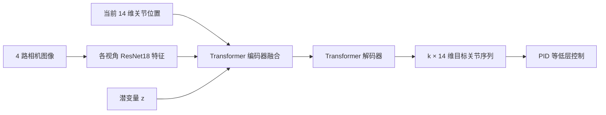
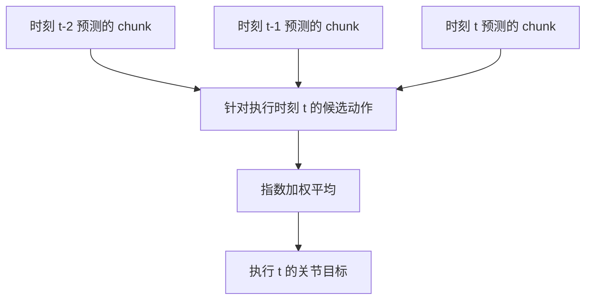
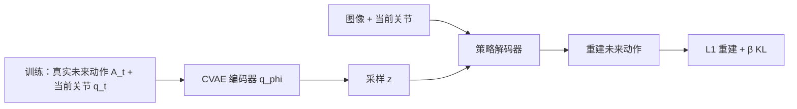

# 第 1 讲：ACT 与精细双臂模仿学习

> **阅读方式**：这是一份可独立阅读的讲义。先通读“任务—数据—方法—实验—局限”，再到[本地原论文](../papers/ACT_2304.13705.pdf)核对 Fig. 3、Fig. 4、Fig. 7 和 Table I–II。论文：[Zhao et al., 2023](https://arxiv.org/abs/2304.13705)，[项目与视频](https://tonyzhaozh.github.io/aloha/)。

## 1. 论文在解决哪两个问题？

这篇工作是**ALOHA 硬件 + ACT 策略**的系统论文。硬件问题是：能否用较低成本采集精细双臂遥操作示范？算法问题是：给定少量示范，如何学会高频、需要视觉纠偏、接触丰富的操作？如果只讨论模型而忽略示范质量与低层控制，会误读实验。ALOHA 用 leader–follower 关节映射采集示范；ACT 从这些数据中学习图像与关节状态到未来动作的映射。[论文 §I、§III](https://arxiv.org/html/2304.13705v1#S1)

“精细”不是形容词而是实验约束：电池插槽、杯盖、扎带等任务中，抓取或接触点偏几毫米就可能改变后续状态。论文所用策略是**单任务训练**；它没有自然语言输入，也不是跨机器人基础模型。[论文 §V](https://arxiv.org/html/2304.13705v1#S5)

## 2. 任务形式：明确每个张量

在时刻 $t$，观察 $o_t=(I_t^{1:4},q_t)$ 包括四路 RGB 图像和双臂 14 维关节位置。动作 $a_t\in\mathbb R^{14}$ 是两臂的**目标关节位置**，不是关节增量、末端位置或力矩。训练标签来自 leader 臂的关节位置；用 leader 而非 follower 关节位置，是因为二者的位置差在低层 PID 跟踪中隐含了施力信息。策略预测长度为 $k$ 的动作块 $A_t=(a_t,\ldots,a_{t+k-1})\in\mathbb R^{k\times14}$，电机内的低层控制器再跟踪目标。[论文 §IV](https://arxiv.org/html/2304.13705v1#S4)

*图 1：本仓库重画的推理路径。训练时另有一个 CVAE 编码器产生 $z$；推理时令 $z=0$。完整网络见论文 Fig. 3、Fig. 10。*

四路相机对应顶视、前视和两个腕部视角。它们提供全局几何与局部抓取细节，但也带来遮挡、低对比度及感知延迟。注意论文相机视频为 30 fps，遥操作/动作控制为 50 Hz；**相机帧率不等于控制频率**，不应把每个 50 Hz 动作都理解为来自一张全新图像。[论文附录 B、§VI-C](https://arxiv.org/html/2304.13705v1#A2)

## 3. 第一个设计：动作分块为什么有效？

普通单步 BC 学 $\pi_\theta(a_t\mid o_t)$；ACT 学 $\pi_\theta(A_t\mid o_t)$。如果严格每 $k$ 步才观察并预测一次，那么长为 $T$ 的任务只有约 $T/k$ 个高层决策点，论文把这称为缩短有效时域。这提供了减少反复独立决策和保持动作连贯性的直觉。**但这不是对部署时闭环误差的普遍数学保证。**实际 ACT 还使用每步重查策略与时间集成，因而不能简单认为“部署时一定开环执行 $k$ 步”。[论文 §IV-A](https://arxiv.org/html/2304.13705v1#S4.SS1)

chunk 还可容纳示范中的时间结构。比如操作者已经开始把电池推入插槽，之后会持续施力，偶尔短暂停顿。只有当前画面的一步动作，有时无法推断操作者处于哪个动作阶段；一段连续示范则提供局部时间上下文。不过 chunk 过长会削弱反应性，也使长序列预测更难。论文 Fig. 7(a) 的模拟消融从 $k=1$ 时约 1% 提升至 $k=100$ 时约 44% 的平均成功率，继续增大 $k$ 后回落；这些数字属于该消融的四个模拟设置，不能当成普适最优 $k$。[论文 §VI-A](https://arxiv.org/html/2304.13705v1#S6.SS1)

## 4. 第二个设计：时间集成不是普通平滑

若每个时刻都预测长度为 $k$ 的 chunk，那么在执行时刻 $t$，较早时刻 $t-k+1,\ldots,t$ 发起的预测都可能给出针对 $t$ 的候选动作。令 $\hat a_t^{(s)}$ 表示在时刻 $s$ 对执行时刻 $t$ 的预测，则执行动作是

$$a_t=\frac{\sum_{s\in\mathcal S_t}w_s\hat a_t^{(s)}}{\sum_{s\in\mathcal S_t}w_s},\qquad w_i=\exp(-mi),$$

其中 $\mathcal S_t$ 是覆盖 $t$ 的预测集合。论文按候选动作的先后顺序编号，并将最旧预测对应 $i=0$。这意味着 $m>0$ 时较旧预测的权重较大；减小 $m$ 可使新观察更快进入融合。[论文 §IV-A、Algorithm 2](https://arxiv.org/html/2304.13705v1#S4.SS1)

*图 2：融合的是**同一执行时刻**的多个估计，不是把 $a_{t-1}$、$a_t$、$a_{t+1}$ 直接平均。*

为什么这种机制有意义？严格每 $k$ 步切换一次预测，会在 chunk 边界产生突变；每步重查又可能导致新预测抖动。时间集成在两者之间进行加权折中。代价是每步推理、更高计算量，而且对突发环境变化的响应可能被旧预测拖慢。论文消融发现它对 ACT 与 BC-ConvMLP 有小幅收益，对检索式 VINN 则不利，因此它不是“所有策略都该使用”的通用后处理。[论文 §VI-A](https://arxiv.org/html/2304.13705v1#S6.SS1)

## 5. 第三个设计：CVAE 的训练与实际部署

同一观察下，人类示范可能有不同风格：路径、速度和短暂停顿各不相同。若直接对动作序列做逐点回归，模型会被迫对这些变化取折中。ACT 引入潜变量 $z$。训练时近似后验 $q_\phi(z\mid q_t,A_t)$ 读取当前关节状态和真实未来动作，产生对角高斯的均值与方差，再通过重参数化采样 $z$。解码器 $f_\theta(I_t^{1:4},q_t,z)$ 预测动作序列。训练目标是重建项加 KL 正则：

$$\mathcal L(\theta,\phi)=\mathbb E_{q_\phi(z\mid q_t,A_t)}\big[\lVert A_t-f_\theta(o_t,z)\rVert_1\big]+\beta D_{\mathrm{KL}}\!\left(q_\phi(z\mid q_t,A_t)\|\mathcal N(0,I)\right).$$

第一项要求动作重建准确；第二项把编码后的 $z$ 约束到先验附近，以便部署时可以用先验中的值。$\beta$ 增大通常限制 $z$ 传递的信息量，但并不自动保证泛化更好。[论文 §IV-B/C](https://arxiv.org/html/2304.13705v1#S4.SS2)

推理时未来专家动作不存在，所以**丢弃 CVAE 编码器**，设 $z=0$（标准正态先验的均值），只运行策略解码器。这样部署时给定相同输入的输出是确定性的。必须区分“训练时用生成潜变量处理示范变化”与“推理时显式采样多种动作”；论文做的是前者，并固定 $z$。[论文 §IV-B、附录 C](https://arxiv.org/html/2304.13705v1#S4.SS2)

> **核对细节**：论文 Algorithm 1 的伪代码把重建损失写为 MSE，但 §IV-C 说明实际实现采用 L1，作者认为 L1 提高精细动作建模。复现时应以正文、代码和配置共同核对，而不是机械照抄伪代码。[论文 §IV-C](https://arxiv.org/html/2304.13705v1#S4.SS3)

## 6. Transformer 在这里具体做了什么？

训练时 CVAE 编码器将 `[CLS]`、当前关节嵌入与长度 $k$ 的专家动作序列嵌入输入 Transformer，并由 `[CLS]` 输出 $z$ 的分布参数。策略侧的四张图各由 ResNet18 编码，空间特征展平成 token 并加入二维位置编码，再和关节嵌入、$z$ 融合。Transformer 解码器使用 $k$ 个未来时刻的查询嵌入，通过 cross-attention 读取融合特征，最后输出 $k\times14$。因此，“Transformer”既用于编码训练时的示范序列，也用于策略中的多视角融合与未来动作解码；它不是一个语言模型。[论文 §IV-C、附录 C](https://arxiv.org/html/2304.13705v1#S4.SS3)

## 7. 数据与实验：读数字时看分母

论文有 2 个 MuJoCo 模拟任务和 6 个 ALOHA 真机任务。真机每任务大多采集 50 条成功示范，Thread Velcro 为 100 条；每条约 8–14 秒，50 Hz 下约 400–700 个控制步。各任务约 10–20 分钟的有效示范，采集的实际耗时因重置和失败更长。模型约 80M 参数，按任务从头训练。[论文 §IV-C、§V-B](https://arxiv.org/html/2304.13705v1#S5.SS2)

代表性结果：Open Cup 最终成功率 84%，Slot Battery 为 96%，Thread Velcro 仅 20%。扎带失败主要出现在中途抓取与穿孔；目标细小且与背景对比度低，说明后续步骤的精细操作受视觉定位瓶颈限制。不要用摘要中“80–90%”概括所有任务。[论文 Table I–II、§V-C](https://arxiv.org/html/2304.13705v1#S5.SS3)

消融值得分开读：

| 消融 | 论文观察 | 正确解释 |
| --- | --- | --- |
| chunk 长度 | 由 1 增大后成功率上升，过长回落 | 连贯性与反应性存在权衡；最优值依任务而异 |
| 时间集成 | ACT 报告约 3.3% 的成功率增益，VINN 反而下降 | 只能说对论文中的参数化策略有帮助 |
| CVAE | 对脚本示范影响小；对人类示范去掉后平均成功率由 35.3% 降到 2% | 潜变量训练对该实验的人类动作变化很重要 |
| 控制频率 | 50 Hz 遥操作比 5 Hz 更快完成选定任务 | 这是遥操作用户研究，不能单独证明 ACT 模型需要 50 Hz 推理 |

上述消融的样本、任务和选择方式与主实验不同，不能把不同表格的百分比直接相减。[论文 §VI](https://arxiv.org/html/2304.13705v1#S6)

## 8. 如何评价 ACT 的贡献和边界？

ACT 的可迁移思想是：**用动作序列作为基本输出单位，显式处理示范变化，并设计预测之间的时间协调机制。**它给后续 VLA 的 action chunk 设计提供了重要参照。它不能证明模型已具备语言理解、跨任务零样本泛化或跨机器人迁移。硬件能力、示范质量和图像分辨率也会限制精细任务表现；论文明确提到一些任务超出该系统能力。[论文 §VII](https://arxiv.org/html/2304.13705v1#S7)

## 读完后应能回答

1. 为什么 leader 关节位置被用作动作标签，而非 follower 关节位置？
2. chunk 长度 $k$、重查策略频率与控制频率分别是什么？
3. 时间集成如何在同一执行时刻融合多个预测？旧预测为什么可能延缓反应？
4. CVAE 编码器训练时为何可见未来动作？推理时为什么固定 $z=0$？
5. 哪个实验支持“CVAE 有用”，哪个实验支持“50 Hz 遥操作有用”？不要把它们混为一谈。

下一讲：[Diffusion Policy：用条件扩散表示动作序列分布](./02-Diffusion-Policy.md)。
