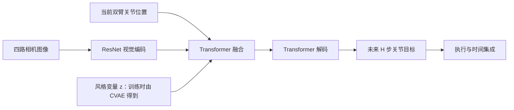
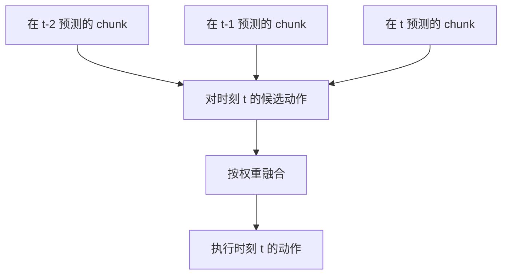

# ACT 精读：把精细操作拆成动作序列

**原论文：**[本地 PDF](../papers/ACT_2304.13705.pdf) · [arXiv:2304.13705](https://arxiv.org/abs/2304.13705) · [ALOHA 项目页](https://tonyzhaozh.github.io/aloha/)

**建议重点：**论文第 IV 节的方法、第 VI 节的消融实验，以及局限部分。

## 一句话概括

ACT（Action Chunking with Transformers）用多相机图像和机器人关节位置，**一次预测未来一段关节目标位置**；用 CVAE 学习人类示范中的动作变化，并在执行时融合重叠动作序列，让运动更平滑。[论文方法](https://arxiv.org/html/2304.13705v1#S4)

## 研究问题与输入输出

论文同时提出低成本双臂遥操作系统 ALOHA 与模仿学习策略 ACT。这里重点看策略：输入是四路 RGB 图像和两臂共 14 维关节位置；输出是未来 $H$ 步的双臂**绝对关节目标位置**，形状可理解为 $H\times14$。底层电机控制器负责跟踪这些目标。ACT 本身**没有语言指令输入**，因此它是后续 VLA 的动作学习基础，而不是一个 VLA。[论文 IV 节](https://arxiv.org/html/2304.13705v1#S4)

*图 1：本仓库重绘的 ACT 概念结构。原论文完整结构见其 Fig. 3。*

## 三个关键设计

### 1. 动作分块（action chunking）

普通单步策略预测 $a_t$；ACT 预测 $a_{t:t+H-1}$。论文认为，这相当于缩短有效决策时域，有助于缓解长时间执行中的复合误差，也能表达示范中持续一段时间的动作，例如抓取、插入或短暂停顿。**不能把“预测更远”理解成“永远开环执行更久”**：chunk 太长时，模型会更难响应新观察。论文消融实验中，分块长度增加最初带来明显收益，过大后表现回落。[论文 IV-A 与 VI-A](https://arxiv.org/html/2304.13705v1#S4.SS1)

### 2. 时间集成（temporal ensembling）

如果每个时刻都重新预测一个长度为 $H$ 的 chunk，多个 chunk 会对**同一个未来时刻**给出不同动作。ACT 对这些候选动作按权重平均，从而平滑预测，同时不断吸收新观察。它平均的是“针对同一时刻的多个预测”，不是把不同时刻动作简单做滑动平均。论文采用指数权重 $w_i=\exp(-mi)$。[论文 IV-A](https://arxiv.org/html/2304.13705v1#S4.SS1)

*图 2：时间集成示意。候选动作指向同一执行时刻。*

### 3. CVAE 学习示范中的变化

同一场景可以有多种正确操作路径。训练时，编码器读取当前关节状态及专家动作序列，得到潜变量 $z$ 的分布；解码器在视觉观察、关节状态和 $z$ 的条件下重建该动作序列。损失可概括为

$$\mathcal L=\mathcal L_{\mathrm{recon}}+\beta D_{\mathrm{KL}}\!\left(q_\phi(z\mid a_{t:t+H-1},q_t)\,\|\,\mathcal N(0,I)\right).$$

推理时没有专家未来动作，训练用的 CVAE 编码器被移除，论文将 $z$ 设为先验均值 $0$，进行确定性解码。[论文 IV-B](https://arxiv.org/html/2304.13705v1#S4.SS2)

> **读论文时留意：**论文的 Algorithm 1 伪代码把重建项写成 MSE，但正文 IV-C 明确说实际采用 L1，理由是动作预测更精确。复现时应核查代码和实验配置，不能仅凭伪代码决定损失形式。[论文 IV-C](https://arxiv.org/html/2304.13705v1#S4.SS3)

## 实验告诉我们什么？

- 论文在精细双臂任务上展示了低成本硬件与 ACT 的组合效果；这是一个**系统结果**，包含示范采集质量与控制硬件的影响，不能全归因于模型结构。[论文实验](https://arxiv.org/html/2304.13705v1#S5)
- 消融支持动作分块和时间集成有用；对于**人类示范**，去掉 CVAE 训练目标会明显降低论文测试设置中的成功率。[论文 VI 节](https://arxiv.org/html/2304.13705v1#S6)
- 这些实验不能证明 ACT 在所有机器人、所有任务上优于其他方法；它没有检验开放词汇语言指令或跨机器人泛化。

## 局限与通向下一篇的问题

ACT 的动作表示是连续关节目标，且主要依赖任务内示范。它能产生连贯动作，但面对同一观察下多条有效路径时，我们还可以追问：**能否直接学习复杂的动作序列分布，并从中采样？** Diffusion Policy 给出了另一种答案。

### 自测

1. 为什么 ACT 要预测 $H$ 步，但又在执行中反复查询策略？
2. 时间集成平均的到底是哪几种动作预测？
3. CVAE 编码器训练时为什么能看到未来动作，而推理时不能？
4. ACT 的动作是关节目标、末端位置，还是动作 token？
