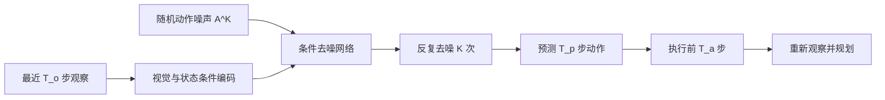
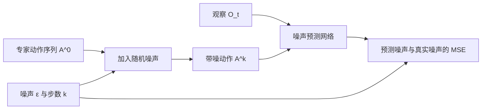

# Diffusion Policy 精读：在动作空间里去噪

**原论文：**[本地 PDF（arXiv v5）](../papers/Diffusion_Policy_2303.04137v5.pdf) · [arXiv:2303.04137](https://arxiv.org/abs/2303.04137) · [项目页与代码入口](https://diffusion-policy.cs.columbia.edu/)

**建议重点：**论文第 2–3 节的策略定义、第 4 节评测与第 9 节局限。

## 一句话概括

Diffusion Policy 将机器人策略写成**观察条件下的动作序列生成模型**：训练时对专家动作序列加噪并学习预测噪声；推理时从随机噪声出发，反复去噪得到一段动作，执行其中一小段后重新观察和规划。[论文第 2 节](https://arxiv.org/html/2303.04137v5#S2)

*图 1：本仓库绘制的 Diffusion Policy 推理流程。这里的去噪发生在动作序列上，不是在生成相机图像。*

## 先分清三个“时间长度”

| 记号 | 含义 | 作用 |
| --- | --- | --- |
| $T_o$ | 观察窗口 | 给策略提供最近多少步图像或状态 |
| $T_p$ | 预测窗口 | 一次生成多少步未来动作 |
| $T_a$ | 执行窗口 | 每次真正执行多少步才重新规划 |

通常 $T_a<T_p$。这就是**滚动时域控制**：有一个较长的动作预测，但只执行一段，再用新观察修正。它在动作连贯性与环境反馈之间取平衡。[论文 §2.3](https://arxiv.org/html/2303.04137v5#S2.SS3)

## 核心机制：条件扩散

令 $A^0$ 是专家示范中的一段真实动作，$\epsilon$ 是随机噪声，$k$ 是去噪步数。训练时构造带噪动作 $A^k$，网络在观察 $O_t$ 的条件下预测噪声。可以用下面的简化式理解训练目标：

$$\mathcal L=\mathbb E_{A^0,O_t,k,\epsilon}\left[\left\|\epsilon-\epsilon_\theta(O_t,A^k,k)\right\|_2^2\right].$$

推理时没有示范动作，先采样随机 $A^K$，再用网络逐步移除噪声，得到 $A^0$。论文比较了 1D temporal CNN 与 time-series diffusion transformer 两种去噪网络；模型架构和视觉编码器是不同的设计选择。[论文 §2–3](https://arxiv.org/html/2303.04137v5#S2)

*图 2：本仓库绘制的训练示意。测试时沿去噪方向反复运行网络，训练时不需要完整展开每一步。*

## 为什么这种表示有吸引力？

当绕过障碍物可以从左边也可以从右边时，直接均值回归可能给出撞向障碍物的中间轨迹。扩散模型可以表示**多峰的动作分布**，从中生成某一种连贯方案。论文还强调：对高维动作序列建模，以及训练相对稳定，是该方法的优势。[论文摘要与讨论](https://arxiv.org/abs/2303.04137)

但生成动作需要反复去噪，计算量和推理延迟高于简单的单次前向策略。论文明确把这一点列为局限；示范数据不足时，它也会继承行为克隆的问题。[论文第 9 节](https://arxiv.org/html/2303.04137v5#S9)

## 读实验时的边界

论文报告了仿真与真实机器人任务上的结果，并分析动作表示、执行窗口和推理延迟。其项目页摘要提到在 4 组基准的 12 个任务上，相比此前方法平均提升 46.9%；这个数字属于**论文指定基准与比较方式**，不是对所有任务的普遍增益。[论文项目页](https://diffusion-policy.cs.columbia.edu/)

## 通向 π₀ 的问题

Diffusion Policy 说明了：连续动作序列可以通过生成模型来学习。下一步读 π₀ 时，要注意它也面向连续动作生成，但采用 **flow matching**，并把预训练视觉语言模型接入机器人策略。扩散与 flow matching 的数学关系留到第 5 阶段深入；这里先建立直觉：**它们都不要求把每个连续动作维度先离散成文本 token。**

### 自测

1. 为什么去噪网络还需要输入观察 $O_t$？
2. $T_o$、$T_p$、$T_a$ 各控制什么？若 $T_a=T_p$，会发生什么？
3. 训练时和推理时的动作序列分别从哪里来？
4. 扩散策略的主要推理代价是什么？
