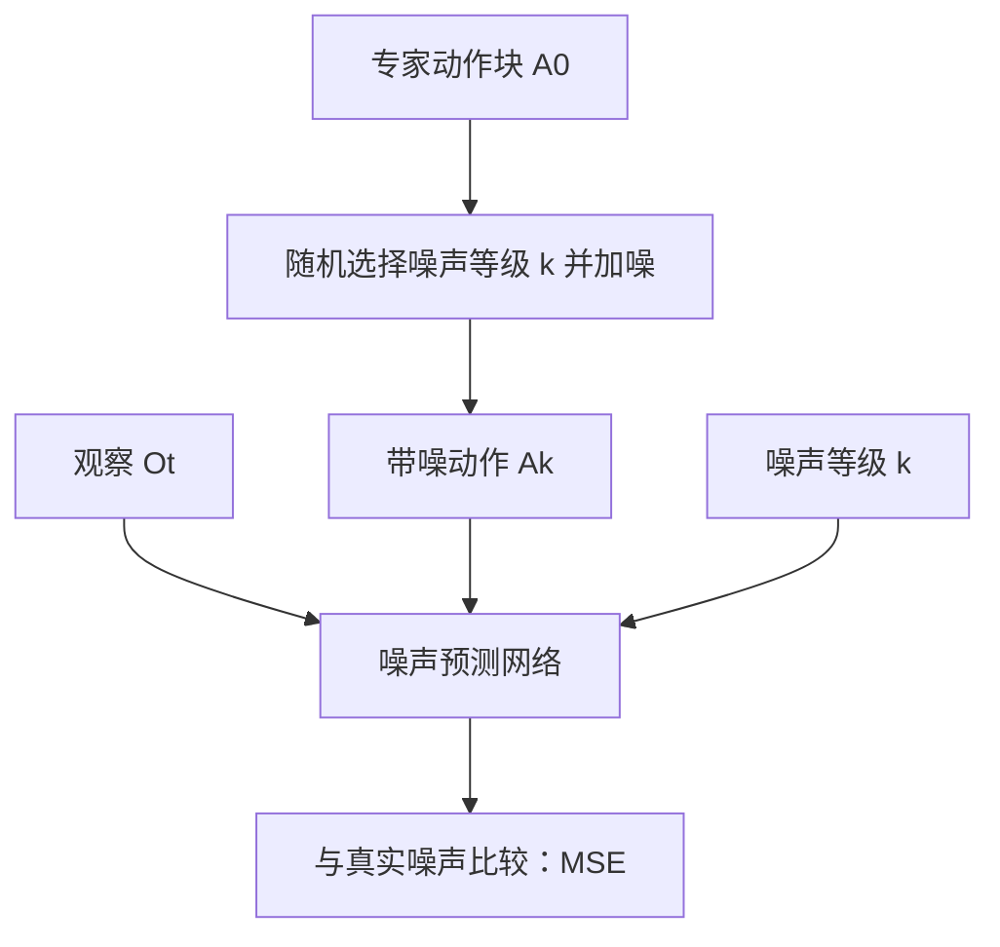

# 第 2 讲：Diffusion Policy 如何生成连续动作

> **阅读方式**：本讲可直接作为方法讲义；随后对照[本地原论文 v5](../papers/Diffusion_Policy_2303.04137v5.pdf)的 Fig. 2、Fig. 3、Fig. 5 和 Table 1–6。[论文 arXiv 页面](https://arxiv.org/abs/2303.04137) · [项目视频与代码入口](https://diffusion-policy.cs.columbia.edu/)。

## 1. 问题：条件动作分布，而非未来图像

Diffusion Policy 将视觉运动策略定义为 $p_\theta(A_t\mid O_t)$。$O_t$ 是最近一段观察，$A_t$ 是未来一段连续动作。它的目标是：在同一观察下，允许存在多条合理而连贯的动作轨迹，并在执行中定期重新观察。**扩散发生在动作序列上，不是在生成下一帧相机图像；这里不是世界模型。**[论文 §2.3](https://arxiv.org/html/2303.04137v5#S2.SS3)

这项工作可以拆为两个相对独立的选择：一是把机器人策略表示为条件扩散分布，二是把采样得到的动作序列用于滚动时域控制。若只理解去噪公式而忽略执行方案，就无法解释其真实机器人效果。

## 2. 三个时间窗口，以及第四个容易混淆的“步数”

| 符号 | 定义 | 控制层面的问题 |
| --- | --- | --- |
| $T_o$ | 观察历史长度 | 看多少帧/多少步本体状态？ |
| $T_p$ | 预测动作长度 | 一次生成多远的未来？ |
| $T_a$ | 执行动作长度 | 执行几步后重新观察和规划？ |
| $K$ | 扩散去噪迭代数 | 每次生成一段动作需要多少网络迭代？ |

前三者以**机器人控制步**计；$K$ 是**模型生成步**，不是机器人时间。一次策略调用可以在内部运行 $K$ 次去噪，得到 $T_p$ 个动作，只执行前 $T_a$ 个。论文的动作预测、执行和感知窗口由任务配置决定，不能把 $K=10$ 理解成“机器人执行 10 步”。[论文 §2.3、§3.4](https://arxiv.org/html/2303.04137v5#S2.SS3)

*图 1：本仓库重画的在线推理流程。$T_a<T_p$ 时，未执行的尾段不会被机械地全部执行。*

为什么预测比执行更长？更长的轨迹帮助模型形成方向一致的局部计划，而短执行窗口允许在物体滑动、抓取失败或遮挡变化后重新规划。$T_a$ 太小会增加推理负担和动作切换；太大则反应迟钝。论文消融中，多数测试任务的 $T_a=8$ 步表现较好，但这是实验发现，不是扩散模型的固有常数。[论文 §4.3、§5.3](https://arxiv.org/html/2303.04137v5#S5.SS3)

## 3. 从 DDPM 到条件动作去噪

设专家动作块为 $A^0$。前向加噪过程逐渐破坏数据，一个常见的等价写法是

$$A^k=\sqrt{\bar\alpha_k}A^0+\sqrt{1-\bar\alpha_k}\,\epsilon,\qquad \epsilon\sim\mathcal N(0,I).$$

训练时随机采样 $k$ 和噪声 $\epsilon$，用网络 $\epsilon_\theta(O_t,A^k,k)$ 预测加进去的噪声：

$$\mathcal L_{\mathrm{noise}}=\mathbb E_{A^0,O_t,k,\epsilon}\!\left[\left\|\epsilon-\epsilon_\theta(O_t,A^k,k)\right\|_2^2\right].$$

这和直接回归动作的区别很重要：网络学的是**在某一噪声级别、给定观察时，怎样把一个候选动作序列往数据分布方向修正**。推理时从 $A^K\sim\mathcal N(0,I)$ 出发，多次应用反向更新，最终得到 $A^0$。由于观察 $O_t$ 始终作为条件输入，不同画面会诱导不同动作分布。[论文 §2.1–2.3](https://arxiv.org/html/2303.04137v5#S2)

*图 2：训练只需要随机选一个噪声级别计算监督损失；推理才逐级去噪。式中的前向表达是便于理解的标准 DDPM 记法，论文正文用自己的噪声变量与更新系数书写。*

论文还用 score/能量梯度的视角解释去噪：网络给出如何修改当前带噪动作、使其更像示范的方向。这是有用的直觉，但不要把它误读成在线求解环境的最优控制问题；模型学的是示范分布的条件结构，并未在推理时显式优化任务奖励。[论文 §2、§4](https://arxiv.org/html/2303.04137v5#S2)

## 4. 多模态究竟体现在哪里？

Push-T 中可从左或右接近接触点；Block Push/Kitchen 中子目标的顺序也可以不同。若每一步独立采样动作，策略可能在模式之间频繁跳转。Diffusion Policy 对**整段 $A_t$**生成一个联合样本，因此在一个预测窗口内较容易保持路径的一致性；下一个窗口再依据新观察更新。论文用这些任务分析短时路径选择与长时子目标顺序两种多模态，并观察到相对基线的优势。[论文 §4.1、§5.3](https://arxiv.org/html/2303.04137v5#S4.SS1)

这不意味着扩散策略必然“知道”每条轨迹会成功。它可能生成示范分布中的低质量模式，也可能在重新规划时切换模式。时间一致性依赖动作块长度、执行窗口、条件观察和训练数据；不能单靠“使用 diffusion”四个字保证。

## 5. 网络与视觉编码：论文并非只有一个模型版本

论文比较两类噪声预测器：

| 版本 | 结构与条件注入 | 优点与代价 |
| --- | --- | --- |
| Diffusion Policy-C | 1D temporal CNN，以 FiLM 等方式注入观察与去噪步数 | 对许多任务较稳定；卷积偏向较平滑的时间信号，快速变化的动作可能受限 |
| Diffusion Policy-T | 时间序列 Transformer，把带噪动作作为序列 token，用注意力读取观察 | 对复杂、快速变化动作可能更有表达力；超参数更敏感 |

视觉条件经过 ResNet-18 编码。论文将全局平均池化换为空间 softmax 以保留位置信息，将 BatchNorm 换成 GroupNorm 以改善训练稳定性；多视角图像分别编码后组成条件表示。注意这与后续 VLA 常用的互联网预训练 VLM 不同：主方案主要从任务数据端到端训练视觉编码。[论文 §3.1–3.2](https://arxiv.org/html/2303.04137v5#S3)

预训练视觉编码器并非“总是无效”。论文在 Robomimic Square 的消融中，冻结预训练特征表现较弱，但微调 CLIP 预训练 ViT 得到很强结果。真机 Push-T 中，端到端方案优于所测的 ImageNet/R3M 方案。正确结论是：**视觉表征是否适合控制、是否可微调，与模型来源同样重要**；不能笼统推断“预训练不利于机器人”。[论文 §5.4、§6.1](https://arxiv.org/html/2303.04137v5#S5.SS4)

## 6. 实时推理不是免费得到的

扩散采样需要多次网络前向，延迟会直接影响闭环控制。论文采用 DDIM 以减少推理迭代，并报告在真机实验中用 100 个训练噪声步、10 个推理步，于 Nvidia 3080 上达到约 0.1 秒的推理延迟。这个数字是特定模型与硬件配置的结果，不代表所有扩散策略都能满足高频控制。[论文 §3.4](https://arxiv.org/html/2303.04137v5#S3.SS4)

另一个重要分层：真机 Push-T 的策略命令为 10 Hz，再线性插值到机器人 125 Hz 执行。前者是策略更新频率，后者是控制执行频率；把二者混为一谈会误判模型实时性。[论文 §6.1](https://arxiv.org/html/2303.04137v5#S6.SS1)

## 7. 动作表示与延迟：实验结论的条件

论文发现其扩散策略在所测任务中更能利用**位置控制**，部分基线则在速度控制下表现较好。这是架构与动作空间的交互作用，不是“位置控制在机器人里始终优于速度控制”。同理，使用滚动时域预测能缓解一定感知与推理延迟，论文报告在模拟延迟到 4 个控制步时保持较好表现；这也依赖具体任务、执行窗口和低层控制。[论文 §5.3](https://arxiv.org/html/2303.04137v5#S5.SS3)

若设计公平对照实验，至少需要固定：示范集和训练预算、观察配置、动作空间、预测/执行窗口、控制接口、验证集选模方式与初始化集合。论文为了比较各方法的最佳表现，允许扩散策略与基线选择不同的最佳动作表示；这适合评估“完整方法配置”，却不能把全部差异归因于去噪目标本身。[论文 §5.2–5.3](https://arxiv.org/html/2303.04137v5#S5)

## 8. 怎样读论文报告的结果？

论文在多组仿真与真机任务中报告总体平均成功率相对先前方法提高 46.9%。这属于**指定任务、基线和统计方式**下的结果。v5 版本还在评测说明中指出 Robomimic 初始化数量有代码问题：原计划的 50 个初始化实际只用了 22 个，各基线同样受影响。这不必否定整篇论文，但提醒我们不要把摘要数字当成无条件的模型属性。[论文 §5、§5.2](https://arxiv.org/html/2303.04137v5#S5)

真机 Push-T 的端到端版本在表中达到 95% 成功率，前提是论文定义的初始条件与 IoU 成功判据；Mug Flipping 和双臂任务展示了更复杂的操作，但不同任务的示范数、硬件和指标均不相同。读这些结果时，应看每个任务的**分母、判据、数据量和失败模式**，而不是只抽取一个最高数字。[论文 §6–7](https://arxiv.org/html/2303.04137v5#S6)

论文明确列出两类局限：示范不足时仍受行为克隆的数据覆盖限制；迭代采样比简单前向策略耗时更多，可能不适合极高频控制。实际项目还要检查接触安全、动作边界和失效恢复，不能把论文结果直接当作部署保证。[论文 §9](https://arxiv.org/html/2303.04137v5#S9)

## 9. 对后续 VLA 学习的意义

这篇论文说明：连续动作序列可以通过生成模型来表达，而不必每一维先量化为离散 token。之后读 OpenVLA 时，可比较离散动作 token 的表示与推理；读 π₀ 时，可比较 flow matching 的连续动作生成。这里先记住共同问题：**视觉/语言条件如何稳定地约束动作分布，以及采样延迟能否满足闭环频率。**

### 检查理解的五个问题

1. $T_o,T_p,T_a,K$ 各是什么单位？为什么 $K$ 不是机器人控制步？
2. 训练时有专家动作 $A^0$；推理时没有它，生成从哪里开始？
3. 条件扩散与无条件动作生成的差别体现在网络的哪个输入？
4. 为什么“预测 16 步、执行 8 步”仍是闭环？若执行全部 16 步，主要风险是什么？
5. 哪些实验支持“方法配置有效”，哪些实验才有助于隔离扩散目标本身的贡献？

继续读：[两篇方法的深入对照与研究练习](./03-对照与自测.md)。
