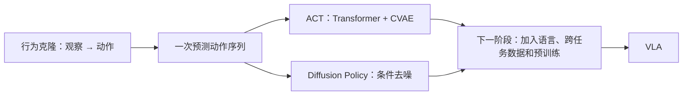

# 第 0 阶段对照总结与自测

## 一张图串起两篇论文

*图 1：本仓库绘制的知识依赖图；这是学习路线，不表示 ACT 或 Diffusion Policy 直接演化成某一个特定 VLA 模型。*

| 问题 | ACT | Diffusion Policy |
| --- | --- | --- |
| 主要目标 | 从精细双臂示范学习连贯关节控制 | 用条件扩散建模视觉运动策略的动作分布 |
| 输入 | 多路图像 + 当前关节位置 | 最近的图像/状态观察；具体配置随任务变化 |
| 输出 | 一段绝对关节目标位置 | 一段连续动作；动作空间随实验配置变化 |
| 动作序列如何生成 | Transformer 解码器结合 CVAE 潜变量，一次给出 chunk | 从噪声出发，经多步条件去噪生成 |
| 何时吸收新观察 | 可在每步查询策略，对同一时刻的重叠预测做时间集成 | 执行 $T_a$ 步后重新观察、生成新的动作序列 |
| 多种合理动作如何处理 | CVAE 学习示范中的变化；论文推理时设 $z=0$ | 通过条件生成分布采样不同动作序列 |
| 主要代价或限制 | 对任务内示范和硬件设置依赖较强；并非语言驱动通用策略 | 迭代去噪增加推理延迟；示范不足仍会影响性能 |

**共同点：**两篇工作都从示范学习连续机器人动作，都强调动作序列和闭环执行。**关键差别：**ACT 的核心是分块预测、CVAE 与时间集成；Diffusion Policy 的核心是条件扩散分布与滚动时域控制。两者的任务、机器人和评测不同，表格用于比较方法，不用于比较绝对性能。

## 必须掌握的五个问题

1. **为什么离线单步误差小，实机任务仍会失败？** 训练数据来自专家轨迹，部署数据由策略自身动作产生；一旦偏离，可能进入训练集未覆盖的状态。
2. **为什么要一次预测多步？** 让动作具备短期连续性，表达持续动作，减少每步独立预测造成的抖动；代价是过长预测可能降低反应性。
3. **预测窗口与执行窗口有什么区别？** 前者是模型构想的未来长度，后者是重新观察前真正执行的长度。
4. **为什么均值回归可能不好？** 若正确示范存在不同模式，均值可能落在两种合理动作之间，甚至成为不可行动作。
5. **为什么第 0 阶段还不是 VLA？** ACT 和本文的 Diffusion Policy 主要处理观察到动作的映射；本学习路线中的 VLA 还要求把自然语言任务指令与视觉观察共同映射到机器人动作，并研究跨任务、跨场景的泛化。

## 思考题：进入 RT-1 前先回答

- 若同一张桌面图像对应“拿红杯”和“拿蓝杯”两种任务，策略还缺少什么输入？
- 把连续关节角量化成 token 有什么好处，又可能损失什么？
- 在评估一个新策略时，为什么必须报告动作坐标系、控制频率、相机配置和成功判定标准？
- 若你设计一个最小实验比较 ACT 与 Diffusion Policy，需要固定哪些因素，才不会把数据质量或机器人硬件差异误判为算法差异？

## 资料

- [ACT 原论文](../papers/ACT_2304.13705.pdf) / [arXiv 页面](https://arxiv.org/abs/2304.13705)
- [Diffusion Policy 原论文](../papers/Diffusion_Policy_2303.04137v5.pdf) / [arXiv 页面](https://arxiv.org/abs/2303.04137)

完成这些问题后，进入下一阶段的 RT-1 与 RT-2：它们会把**语言任务信息**正式放进机器人策略的输入，并尝试把动作与预训练模型联系起来。
