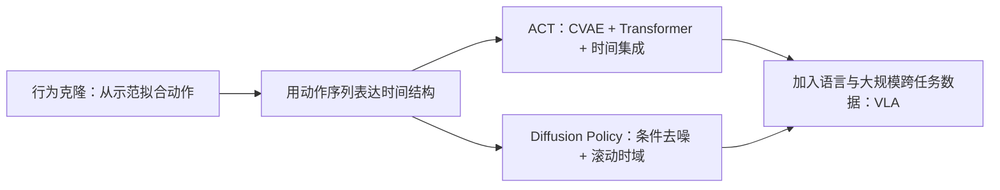

# 第 0 阶段复盘：从 ACT、Diffusion Policy 走向 VLA

> 建议先完成[基础概念](./00-基础概念.md)、[ACT](./01-ACT.md)、[Diffusion Policy](./02-Diffusion-Policy.md)。本篇把两个方法放入同一框架，并给出带解析的自测。时间紧时，至少读第 1、3、5 节。

## 1. 一个统一的研究问题

两篇论文都在解决：给定机器人可见的观察 $o_t$，怎样生成**物理上可执行、时间上连贯**的一段动作 $A_t$，并在环境变化后继续修正？可以抽象为条件策略 $p_\theta(A_t\mid o_t)$，但二者并非同一个算法的两个实现细节。

*图 1：知识结构，不表示后来的所有 VLA 都直接继承了这两篇方法。*

| 维度 | ACT | Diffusion Policy |
| --- | --- | --- |
| 论文目标 | 低成本遥操作示范驱动的精细双臂操作 | 视觉运动行为克隆中的复杂动作分布建模 |
| 典型输入 | 四路图像 + 双臂 14 维关节位置 | 最近若干步视觉/状态观察，依任务配置 |
| 动作接口 | 双臂绝对关节目标 | 随任务变化的连续位置/速度等控制命令 |
| 模型怎样生成动作块 | Transformer 策略一次输出；CVAE 潜变量辅助训练 | 从动作噪声出发，多次条件去噪 |
| 多模态的处理 | CVAE 在训练中表征示范变化，部署设 $z=0$ | 从条件动作分布采样，可生成不同模式 |
| 新观察如何进入 | 可每个时刻重查，重叠预测做时间集成 | 执行 $T_a$ 步后重新生成预测 |
| 主要推理代价 | 每步查询策略与融合候选动作 | 一次生成需多轮去噪；可用 DDIM 减步 |
| 共通局限 | 依赖示范覆盖，遇到未见状态和感知失败仍会失效 | 依赖示范覆盖，且推理延迟更显著 |

**不要跨论文直接比较成功率。**两者的机器人、数据、控制接口、初始化和成功判据均不同。若要比较“CVAE 一次生成”和“扩散多步生成”的贡献，必须用同一实验平台重新训练与评估。

## 2. 用同一个插入任务看两种设计

设机器人要把电池插入卡槽。观察包括相机画面与关节状态；动作是未来若干步的关节目标。专家示范中可能有两种局部策略：先轻推左边缘再压右边缘，或反过来。

**单步回归**可能逐时刻输出看似接近专家均值的动作，但缺少完整阶段的一致性。**ACT**在当前观察下直接给出一整段动作，使这段动作有局部连续性；CVAE 在训练中解释两种示范变化，而时间集成让相邻预测交接平滑。**Diffusion Policy**从随机动作序列开始，在观察条件下去噪成一条具体路径，只执行前几步，再看电池是否滑动并重规划。

如果卡槽突然移动，ACT 旧 chunk 的时间集成可能拖慢响应；Diffusion Policy 在执行窗口结束前也无法获取新观察。谁恢复得更快，取决于具体的重查/执行频率、延迟与数据中有无纠错示范，**不能仅看生成模型名称推断**。

## 3. 三个经常被忽略的研究判断

### 3.1 Action chunk 不是免费的“长时规划”

chunk 给出短期一致的动作，却未必理解长期任务目标。它一般不显式预测未来环境状态。若任务要求经过十几个阶段、遇到失败还要选择新子目标，仅把 $k$ 加大可能让策略更难感知新状态。长期任务还需要任务分解、记忆、价值评估或世界模型等能力。

### 3.2 多模态表达能力不等于成功率

能够产生左、右两种路径，只说明模型能表示不止一个模式；它仍可能选错模式，或在物理接触中失败。评估需区分：动作分布覆盖、单条轨迹可行性、闭环任务成功率，以及失败后恢复。ACT 固定 $z=0$ 的部署尤其提醒我们：**训练目标具有生成性，不代表部署中正在随机采样。**

### 3.3 控制栈决定“好动作”的含义

14 维绝对关节位置、7 维末端位姿和速度命令的误差度量不同。同一个动作块在 10 Hz 策略 + 125 Hz 插值控制，与 50 Hz 直接关节目标跟踪时，物理行为会不同。推理延迟、动作归一化、坐标系和安全约束都应作为实验配置报告，而非论文附属小字。

## 4. 若自己设计一个公平实验

先选定同一机器人和任务，如一个固定相机的桌面 Push-T。用相同示范训练以下模型：单步 BC、chunk 回归、ACT 风格 CVAE chunk、扩散 chunk。**固定**图像输入、训练/验证轨迹划分、动作接口、动作频率、预测窗口、执行窗口、成功判据和随机初始状态；如需比较模型容量与训练预算，可再分别做受控实验。

至少报告：任务成功率及置信区间、轨迹长度、每次策略推理延迟、每秒控制命令数、碰撞/失稳次数、扰动恢复率；并区分“相同训练算力”和“相同推理延迟”两个不同的公平性问题。这样才能判断收益来自**动作生成方式**、**chunking**、还是**控制栈**。

## 5. 自测题与参考解析

**Q1. 为什么 BC 的验证损失下降，真机仍可能失败？**

验证集通常仍是专家分布中的独立样本。真机滚动轨迹由策略自身动作诱导，轻微偏差可能把下一观察带出训练分布。还要考虑视觉遮挡、动作延迟和接触状态变化。验证损失能衡量示范拟合，不能单独替代闭环成功率。

**Q2. “预测 100 步”是否意味着机器人 100 步不看相机？**

不意味着。预测窗口与执行窗口不同。ACT 使用时间集成时可每步重新查询；Diffusion Policy 只执行 $T_a$ 步再重新规划。应查看论文的实际部署循环，而不是只看模型输出张量形状。

**Q3. ACT 有 CVAE，为什么还说部署可为确定性？**

CVAE 编码器训练时看到专家未来动作并产生 $z$。测试时这部分被丢弃，论文设 $z=0$。在输入相同且没有其他随机源时，策略输出相同；这和测试时采样不同 $z$ 是两种部署方法。

**Q4. Diffusion Policy 中的 $K$ 与 $T_p$ 有何区别？**

$K$ 是生成一个动作块时内部去噪网络运行的次数；$T_p$ 是输出动作块覆盖的机器人未来步数。把 $K$ 降低可能加快推理，却可能改变样本质量；把 $T_p$ 改变会改变动作时间结构，两者作用不同。

**Q5. 把机器人连续动作离散为 token，是否必然损失性能？**

不必然。它可能便于与语言模型统一建模，但量化精度、token 数量、解码延迟、动作频率和训练数据规模共同决定结果。第 0 阶段只说明连续动作生成的两种可行路径；下一阶段读 RT-1/RT-2 后再比较离散路线。

**Q6. 这两篇工作与世界模型的边界在哪里？**

它们主要学 $p(A_t\mid O_t)$：给定观察生成动作。世界模型通常关注 $p(s_{t+1}\mid s_t,a_t)$、$p(o_{t+1}\mid o_{\le t},a_{\le t})$ 或潜空间转移。动作序列模型可以与世界模型结合，但不能因为用了扩散或预测未来动作，就称其为世界模型。

## 6. 进入下一阶段前的最小输出

合上笔记，用自己的话在一页纸上写出：

1. BC 的训练分布与部署分布为何不同；
2. ACT 的训练计算图、推理计算图和时间集成；
3. Diffusion Policy 的加噪训练、去噪推理与滚动时域执行；
4. 两者对多模态、延迟和数据覆盖的处理与不足。

若这四点能讲清，就可以进入 RT-1/RT-2，研究语言条件和动作 token 是怎样接入机器人策略的。原始材料：[ACT](../papers/ACT_2304.13705.pdf) · [Diffusion Policy](../papers/Diffusion_Policy_2303.04137v5.pdf)。
