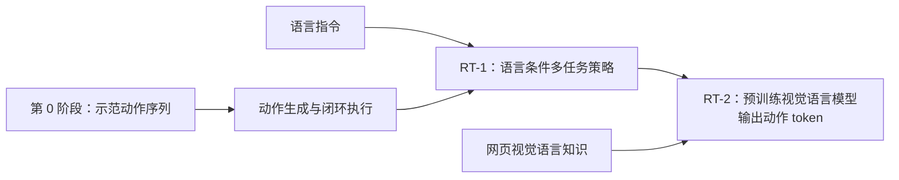

# 第 0 讲：从动作策略到语言条件机器人模型

> 前置阅读：[第 0 阶段总结](../../00-foundations/notes/03-对照与自测.md)。本讲为后续 [RT-1](./01-RT-1.md) 与 [RT-2](./02-RT-2.md) 建立共同问题。论文原文：[RT-1](https://arxiv.org/html/2212.06817v2)、[RT-2](https://arxiv.org/html/2307.15818v1)。

## 1. 为什么从 ACT / Diffusion Policy 继续往前？

第 0 阶段研究的是 $p_\theta(A_t\mid o_t)$：从相机与本体感觉产生可执行动作序列。ACT 用 CVAE 和动作块，Diffusion Policy 用条件去噪。它们提醒我们：**动作表示、时序、闭环控制本身就是困难问题**。但多数实验里的任务与训练设置较专门，通常不靠自然语言在数百个任务之间选择行为。RT 系列把任务说明 $\ell$ 纳入条件：

$$\pi_\theta(a_t\mid I_{\le t},\ell),\qquad a_t\rightarrow\text{机器人低层控制器。}$$

语言在这里不是装饰性标签。指令“把红杯放到托盘里”和“把蓝杯放到托盘里”共享抓取、移动等运动结构，却要求不同视觉指代。多任务训练让模型在同一动作接口上学习这种共享与区分。RT-1 进一步考察任务、物体、背景的组合泛化；RT-2 则问：能否利用网页视觉语言数据里的语义知识？

*图 1：研究问题的递进。箭头表示学习线索，不表示 RT-2 直接在 RT-1 权重上继续训练。*

## 2. 三种“泛化”不能混用

**视觉/环境泛化：**训练时在厨房台面，测试时出现新背景、光照或干扰物；问题是能否仍定位目标并执行已有技能。**组合/任务泛化：**训练见过“拿苹果”“放杯子”，测试“把苹果放入杯子旁的盘子”；新的是对象、动作或指令的组合，未必是新控制原语。**运动技能泛化：**例如训练只见过抓放，却要从零完成系绳、拧螺丝。这需要新的接触动力学与动作轨迹，网页知识通常无法直接提供。论文的 zero-shot 一词应附上其**评测分布**，不能读成任意新技能零样本。

RT-1 的大量语言指令是与机器人示范配对的任务规格；RT-2 的网页数据可带来“哪个对象能当锤子”“数字/符号代表什么”等语义关联。后者只有通过机器人数据中的执行行为，才学到把识别结果变成某种可行运动。[RT-1 §5–6](https://arxiv.org/html/2212.06817v2#S5)、[RT-2 §3–5](https://arxiv.org/html/2307.15818v1#S3)

## 3. “VLA”一词的层次

按功能定义，视觉 $I$、语言 $\ell$、动作 $a$ 构成 $I,\ell\mapsto a$，RT-1 已是视觉语言动作策略。RT-2 论文更强调另一层：从**已有网页预训练的 VLM**出发，用文本生成接口预测离散机器人动作，并把网页任务与机器人任务一起继续训练。因此不要说“RT-1 不懂语言，RT-2 才有语言”。准确说法是：**RT-1 把语言嵌入用于条件控制；RT-2 试图把 VLM 学到的视觉语言知识迁移到控制。**[RT-1 §5.1](https://arxiv.org/html/2212.06817v2#S5.SS1)、[RT-2 §3](https://arxiv.org/html/2307.15818v1#S3)

## 4. 离散动作是桥梁，也是瓶颈

两个模型都要把连续末端/底盘命令转成可分类或可生成的离散值。对有界控制维度 $x\in[l,u]$，理想化的均匀量化为

$$b(x)=\operatorname{clip}\!\left(\left\lfloor 256\frac{x-l}{u-l}\right\rfloor,0,255\right).$$

反量化的单格间隔约 $(u-l)/256$。这个式子解释了“256 bins”的信息损失，但**不是论文公开的逐维归一化实现细节**。训练时分类交叉熵易与 token 预测统一；执行时还须映射回物理命令、满足机器人控制约束。离散化精度、动作频率、推理延迟与空间误差之间存在实际权衡。RT-1 用动作分类头；RT-2 把 bin 变成 VLM 词表中的输出 token。这是下一讲最重要的接口差别。

## 5. 读论文时用同一张核查表

| 问题 | RT-1 | RT-2 |
| --- | --- | --- |
| 图像与文字在哪里融合？ | 句向量通过 FiLM 调制视觉编码器 | 预训练 VLM 处理图像与文本提示 |
| 机器人数据是什么？ | 大规模同类机器人示范为主，另研究混合数据 | 与 RT-1 相同机器人数据，另保留网页视觉语言样本 |
| 输出什么？ | 对离散动作维度分类 | 在语言模型输出空间生成动作 token |
| 如何看待新任务？ | 已见技能和对象的重组、环境扰动 | 额外考察来自网页知识的语义迁移 |
| 关键约束？ | 数据采集、控制实时性、动作覆盖 | 同样受动作数据约束，且大模型推理更贵 |

下一步：读 [RT-1 讲义](./01-RT-1.md)，先亲手画出“六帧图像→48 个视觉 token→动作”的路径。
