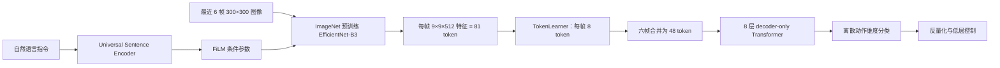

# 第 1 讲：RT-1——语言条件多任务机器人策略

> 建议先读[过渡讲义](./00-从动作策略到语言条件.md)。原文：[本地 PDF](../papers/RT-1_2212.06817v2.pdf)、[论文 HTML](https://arxiv.org/html/2212.06817v2)、[项目页与视频](https://robotics-transformer1.github.io/)。优先核对 Fig. 2–4、Table 1–3、7 与 §5–6。

## 1. 要解决的矛盾：更大的多任务策略必须实时闭环

机器人模仿学习若逐任务训练一个策略，示范成本与部署维护会随任务数增加。RT-1 希望一个模型吸收许多真实机器人轨迹，在自然语言指令下执行多种操作，并处理新组合、干扰物和场景改变。然而机器人需要持续感知和修正：把大 Transformer 直接用于高分辨率图像会拖慢控制。RT-1 因此同时设计**大规模多样化数据**和**低延迟 token 路径**。其 35M 参数模型在约 3 Hz 执行动作；论文规定模型本身的推理预算小于 100 ms，剩余时间要给系统其他延迟。[论文 §1、§5.1](https://arxiv.org/html/2212.06817v2#S5.SS1)

形式上，一条训练轨迹为 $\tau=(\ell,I_{0:T},a_{0:T})$，策略学 $\pi_\theta(a_t\mid I_{t-5:t},\ell)$。这里用六帧图像历史表达最近变化，语言 $\ell$ 指定要做什么，动作 $a_t$ 是给机器人控制系统的命令。这个简写省略了实际系统中的模式切换、控制器及采样细节，不应误作原论文逐行实现。[论文 Fig. 3](https://arxiv.org/html/2212.06817v2#S5.SS1)

## 2. 数据：744 条指令意味着什么？

论文训练集约 **13 万条真实示范**，由 **13 台机器人**用 **17 个月**收集。Table 1 合计 **744 条语言指令**；作者把带动词和一个或多个名词的指令计作 task，再按动词归为 skill。例如“pick iced tea can”“move Pepsi can near RXBAR”是两条指令，许多指令共享抓取、移动等运动结构。因此 744 不等于 744 种完全独立的动力学技能。[论文 §5.2、Table 1](https://arxiv.org/html/2212.06817v2#S5.SS2)

数据覆盖拿取、移动到物体旁、放正、撞倒、开关抽屉、放入容器等，也扩大了物体和场景变化。语言标签把“动作意图”和视觉目标关联起来：同一环境画面，换一句指令可能对应不同轨迹。训练仍是从示范模仿，并没有让模型在线探索获得新技能。这里的瓶颈并非只在网络参数量：如果训练指令缺少某类动作，模型未必能单凭词义生成对应可执行轨迹。[论文 §5.2、§7](https://arxiv.org/html/2212.06817v2#S7)

## 3. 模型：从图像和语言到 48 个视觉 token

*图 1：根据论文 Fig. 3 重画。语言经 FiLM 进入视觉编码器，Transformer 接收的是已经受语言调制的视觉 token。*

**早期融合。**指令先经预训练 Universal Sentence Encoder 得到句向量 $e_\ell$。FiLM 用该向量产生特征的通道尺度与偏置，概念上可写作 $\operatorname{FiLM}(h,e_\ell)=\gamma(e_\ell)\odot h+\beta(e_\ell)$。作用是让视觉编码器优先提取与当前任务有关的信息，而非在全部视觉 token 生成后才融合语言。FiLM 被初始化为近似恒等变换，避免刚插入预训练 EfficientNet 时破坏已有视觉特征。注意这里的 USE 是**语言表征编码器**；RT-1 并非从网页图文生成模型直接迁移控制知识。[论文 §5.1](https://arxiv.org/html/2212.06817v2#S5.SS1)

**视觉 token 压缩。**每帧 EfficientNet 末层 $9\times9\times512$，展平为 81 个位置 token。TokenLearner 学习空间加权聚合，把它们压到 8 个。六帧从 $6\times81=486$ 个视觉位置变为 $6\times8=48$ 个。自注意力的两两交互数在粗略复杂度上随 token 数平方增长，因此压缩可以显著减轻后续 Transformer 工作；真实延迟还受 CNN、内存、硬件和实现影响。论文报告 TokenLearner 带来约 2.4 倍加速，重叠时间窗口中的图像特征缓存又带来约 1.7 倍加速，不能把两个数字无条件相乘当成全部系统加速。[论文 §5.1、附录 C.1](https://arxiv.org/html/2212.06817v2#A3.SS1)

**Transformer。**8 层 decoder-only Transformer 使用位置编码处理 48 个视觉 token，输出动作维度的离散预测。视觉与语言模块约 16M 参数，Transformer 约 19M，合计约 35M。这里的 decoder-only 表示采用因果遮罩的 Transformer 架构，**不意味着部署时必须像句子一样逐个动作维度串行生成**；论文与 Gato 比较时明确指出 RT-1 移除了自回归动作生成以满足速度要求。[论文 §5.1、§6.1](https://arxiv.org/html/2212.06817v2#S6.SS1)

## 4. 动作接口与损失：离散化之后仍要执行物理控制

动作有 7 个机械臂变量：末端 $x,y,z$、roll/pitch/yaw 和夹爪开度；3 个底盘变量：$x,y,yaw$；另有离散模式选择：控制臂、控制底盘或终止。连续维度在各自允许范围内均匀分为 **256 个 bin**。对每个目标维度做类别交叉熵，整体可以概念化为

$$\mathcal L_{\rm BC}(\theta)=-\sum_{t}\sum_{j}\log p_\theta\bigl(b(a_{t,j})\mid I_{t-5:t},\ell\bigr),$$

其中 $j$ 遍历需预测的动作变量；具体的模式门控和监督遮罩以原论文实现为准。这个目标是监督模仿，不是预测环境下一个状态的世界模型，也不是最大化在线回报的 RL。离散化使分类训练直接可用，但高精度插入、旋转和接触可能对 bin 宽度敏感。实际执行还依赖反量化、低层控制、机器人标定及反馈。[论文 §5.1](https://arxiv.org/html/2212.06817v2#S5.SS1)

在线流程是“获取最近图像历史 → 按指令生成动作 → 执行 → 再观察”，约 3 Hz。**3 Hz 是策略决策频率，不是电机伺服频率。**长时域任务还可以把多个短技能串接；RT-1 本身没有从高层目标独立规划 50 步的机制。[论文 §5.1、§6.4](https://arxiv.org/html/2212.06817v2#S6.SS4)

## 5. 实验：每个百分比的评测范围

基线 Gato、BC-Z、BC-Z XL 在论文对比中都使用作者的机器人数据，故 Table 2 主要比较给定数据下的架构与训练设计，而非“原论文公开版本 Gato 对原论文 RT-1”的跨系统排名。RT-1 评测总量超过 3000 次真实试验。[论文 §6.1](https://arxiv.org/html/2212.06817v2#S6.SS1)

| Table 2 条件 | RT-1 成功率 | 任务集边界 |
| --- | ---: | --- |
| Seen tasks | 97% | 从训练指令中抽样的 **200 多条**，物体位置、时间等仍变化 |
| Unseen tasks | 76% | **21 条**留出指令；相关物体和技能至少各在训练中出现过，测试新组合 |
| Distractors | 83% | **30 个**有干扰物设置 |
| Backgrounds | 59% | **22 个**新背景/厨房/台面设置 |

上表不能解释为“对 744 条指令逐一测试成功率 97%”，也不能把 76% 解读为未知运动原语。环境鲁棒性 59% 提醒我们模型仍显著受分布变化影响。[论文 §6.1–6.2、Table 2](https://arxiv.org/html/2212.06817v2#S6.SS2)

**数据多样性消融。**Table 7 在保留 97% 轨迹但仅保留 75% 指令时，seen 由 97 降到 86、distractor 由 83 降到 42；在保留 100% 指令但只留 51% 轨迹时，seen 为 71、distractor 为 39。作者据此强调指令多样性的重要性。注意两组删数据方式、剩余样本分布和被删任务不同；这是一项具体系统中的消融，**不构成“任何场景下多样性总比数据量重要”的定律**。[论文 §6.5、Table 7](https://arxiv.org/html/2212.06817v2#S6.SS5)

**长时域。**论文结合外部 SayCan 高层规划器，把 RT-1 作为低层技能执行器，展示多达 50 个阶段的任务。解释性能时要区分规划、技能选择与低层执行的贡献。论文还探索模拟数据和其他机器人数据的混合，说明架构可吸收异质数据，但不意味着不同机器人的动作空间已经天然统一。[论文 §6.3–6.4](https://arxiv.org/html/2212.06817v2#S6.SS3)

## 6. 能力边界与下一步

作者明确指出：作为模仿学习方法，RT-1 受示范质量与范围约束；新指令泛化主要是已见概念的重组，**无法直接泛化到完全未见的运动**；实验操作类型仍不够灵巧。[论文 §7](https://arxiv.org/html/2212.06817v2#S7)

RT-1 最值得带走的结论是：统一多任务策略可以通过**语言条件 + 大规模多样化机器人数据 + 足够快的视觉 token 化**在真实环境形成可测的泛化。它留下的核心问题是：如果机器人示范昂贵，而网页含海量视觉语义知识，我们能否把这些知识纳入策略？这正是 [RT-2](./02-RT-2.md) 的问题。
