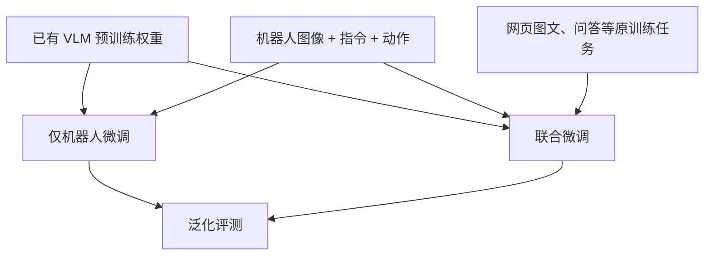

# 第 2 讲：RT-2——将网页视觉语言知识接到机器人动作

> 原文：[本地 PDF](../papers/RT-2_2307.15818v1.pdf)、[论文 HTML](https://arxiv.org/html/2307.15818v1)、[项目页](https://robotics-transformer2.github.io/)。建议先看论文 Fig. 2–4，再读本文；最后核对 Table 7–8。前置：[RT-1](./01-RT-1.md)。

## 1. 核心问题：机器人动作数据少，网页语义数据多

RT-1 已证明语言条件的多任务策略可以利用大量真实轨迹，但收集十几万条机器人示范仍昂贵，且对象与场景总有覆盖不足。视觉语言模型（VLM）在网页图文、问答、描述任务上学到广泛对象、属性、关系和常识。RT-2 问：**若把机器人动作也写成 VLM 可生成的 token，能否让视觉语言预训练帮助真实控制？**[论文 §1、§3](https://arxiv.org/html/2307.15818v1#S3)

论文不是单一架构，而是把两类已有 VLM 改为控制模型：PaLI-X **5B、55B** 与 PaLM-E **12B**。这些模型已经具备视觉语言预训练，再用语言标注的机器人示范适配动作。机器人数据基本沿用 RT-1 的真实厨房移动机械臂数据，以便比较。由此，RT-2 的核心贡献是**接口与训练配方**，不只是“参数比 RT-1 大”。[论文 §3.1、§4](https://arxiv.org/html/2307.15818v1#S3.SS1)

## 2. 动作作为 token：技术桥梁究竟在哪？

RT-2 输出的是一次控制所需的动作向量。按论文 §3.2，其字段顺序为终止标志、末端位置三维增量、末端旋转三维增量、夹爪开度，共 **8 个字段**。7 个连续变量在各自范围内均匀量化成 256 个 bin；终止标志是离散命令。这里的“动作 token”不是自然语言里的“向左移动”一句话，而是量化后的数字或专用符号。[论文 §3.2](https://arxiv.org/html/2307.15818v1#S3.SS2)

*图 1：根据论文 §3.2–3.3 重画。文本生成接口承担动作预测；解码约束是物理执行前的必要保护。*

输入被格式化成类似问答：`Q: what action should the robot take to [task instruction]? A:`，再附相机图像。监督目标是动作字段构成的 token 串。PaLI-X 词表中 0–1000 的整数各有 token，所以可复用其中 256 个数字 token；PaLM-E 则把原词表中使用频率最低的 256 个 token 改作动作 bin。机器人提示下解码时，输出词表受约束，只允许合法动作 token；普通视觉语言任务仍能输出自然语言。[论文 §3.2](https://arxiv.org/html/2307.15818v1#S3.SS2)

若动作字段序列为 $z_1,\ldots,z_m$，典型自回归监督可写为

$$\mathcal L_{\rm act}(\theta)=-\sum_{k=1}^{m}\log p_\theta(z_k\mid I,\ell,z_{<k}).$$

这是对论文机制的简化表达，不代表所有训练任务共用完全相同的模板。它说明了为何 VLM 文本生成能力可以直接承载控制输出，也揭示代价：多个字段逐 token 生成，延迟与格式有效性成为问题。更关键的是，“数字 token”只提供**表示接口**；模型仍必须从机器人示范学会这些 bin 对应何种运动后果。文本模型懂“打开抽屉”的字面含义，并不自动会施加合适的力、走合适轨迹。

## 3. 预训练、机器人微调、联合训练是三件不同的事

**预训练**：PaLI-X/PaLM-E 已从大规模网页图文及视觉问答等任务学到视觉语言表征。**仅机器人微调**：继续用机器人图像、指令、动作训练，得到可执行策略，但可能削弱原有视觉语义能力。**联合微调（co-fine-tuning）**：继续训练时混合机器人样本和原视觉语言任务样本，让模型同时维护问答/描述能力与动作预测能力。[论文 §3.1–3.2](https://arxiv.org/html/2307.15818v1#S3.SS2)

从多任务优化视角，可把采样后的目标抽象为

$$\mathcal L=\lambda\,\mathbb E_{D_{\rm robot}}[\mathcal L_{\rm act}]+(1-\lambda)\,\mathbb E_{D_{\rm web}}[\mathcal L_{\rm VL}],$$

其中 $\lambda$ 表示**采样权重的概念化比例**，不是原论文公开的唯一损失权重。附录 B 中 PaLI-X 的训练混合约 **50% 机器人数据**，PaLM-E 约 **66% 机器人数据**。这些百分比是联合微调批次构成，不表示预训练数据里也有相同比例机器人数据。[论文附录 B](https://arxiv.org/html/2307.15818v1#A2)

*图 2：Table 8 的训练策略对比逻辑。要判断网页数据持续参与是否有效，应比较同一参数量下“仅机器人微调”和“联合微调”。*

RT-2 附录还列出某些训练设置中的辅助预测：根据图像预测指令、手臂位置、两帧间时间距离和成功与否。这提醒我们原始训练配方比单一句子“图片到动作”更丰富；但主线仍是机器人动作任务与网页视觉语言任务的联合训练。[论文附录 B](https://arxiv.org/html/2307.15818v1#A2)

## 4. 推理：大模型成为控制器时，延迟无法忽略

55B 模型不在普通机载 GPU 上直接运行。作者采用多 TPU 云服务，经网络给机器人返回动作，约 **1–3 Hz**；5B 版本约 **5 Hz**。这是在所用系统中的闭环频率，不是模型在任何硬件上的保证。低频对慢速抓放可能可接受，对高速接触和动态避障就可能是瓶颈。模型尺度带来的语义能力必须与网络、推理及控制延迟一起评价。[论文 §3.3](https://arxiv.org/html/2307.15818v1#S3.SS3)

把 RT-2 与第 0 阶段的 ACT/DP 对照时还要注意：RT-2 这里输出一次控制动作，而 ACT/DP 重点建模动作块/轨迹；它们可能服务不同控制频率与任务，因此不能仅凭架构名称比较操作精度。后来 VLA 研究重新重视连续动作、chunk 和高频控制，正源于这类约束。

## 5. 实验：什么证据支持知识迁移？

论文约 **6000 条真实机器人评测轨迹**。比较的 RT-1、VC-1、R3M、MOO 基线使用相同机器人数据；差别在模型预训练与融合方式。RT-2 的已见任务成功率与 RT-1 相近，差距主要体现在新物体、新背景、新环境。后者还分 easy/hard，不能把一个平均数推广到任意陌生场景。[论文 §4.1、Fig. 4、附录 Table 6](https://arxiv.org/html/2307.15818v1#S4.SS1)

**联合训练与规模消融（附录 Table 8）。**在未见物体/背景/环境六类条件的平均成功率上，PaLI-X 5B 从零训练为 **9%**，预训练后仅机器人微调为 **42%**，联合微调为 **44%**；PaLI-X 55B 的机器人微调为 **52%**，联合微调为 **63%**。这些结果支持预训练和规模有帮助、联合训练在 55B 设置带来明显收益。但 5B 联合训练平均只高 2 个百分点，且某些子类别低于仅机器人微调；不能说联合训练在每个设置、每个任务上都提高成功率。[论文附录 Table 8](https://arxiv.org/html/2307.15818v1#A8.SS3)

**语义能力评测（附录 Table 7）。**作者构造符号理解、推理、人物识别任务。该表平均成功率：RT-1 **17%**，RT-2-PaLI-X-55B **60%**，RT-2-PaLM-E-12B **40%**。比如按文字/数字标记选择对象，或根据语义关系决定拿哪个物体。这里的主要新能力是**把既有抓放等运动技能应用于新语义条件**，不是学会全新运动原语；各任务集合和成功标准仍需看附录具体说明。[论文 §4.2、附录 Table 7](https://arxiv.org/html/2307.15818v1#A8.SS2)

**Chain-of-thought 展示。**论文另外将一个 PaLM-E 变体微调数百步，让输出先写 `Plan:` 再写 `Action:`，展示选石头作临时锤子等案例。它提供了语言中间步骤可与动作联合生成的定性证据，却不是大规模严谨验证“模型可靠地进行长程规划”。不要与 RT-1 + SayCan 的外部高层规划混为一谈。[论文 §4.4](https://arxiv.org/html/2307.15818v1#S4.SS4)

## 6. 研究判断：RT-2 的能力及其边界

论文最有说服力的链条是：同一机器人数据 → 预训练 VLM 适配动作 → 在未见视觉和语义评测中更好；同尺寸的微调/联合微调消融进一步支持网页样本持续参与训练的作用。不过模型结构、参数量、训练混合和推理部署都可能影响结果，不能把所有收益唯一归因于“动作 token”这一设计。

作者明确写道，**网页预训练没有给机器人带来新的运动动作**；物理技能仍受示范分布限制。大模型计算成本高、控制频率受限，可用的 VLM 权重也限制复现。[论文 §5](https://arxiv.org/html/2307.15818v1#S5)

这一阶段应形成的研究问题是：怎样在继承网页语义泛化的同时，提升动作精度、频率、跨机器人适配与可复现性？接下来的 Open X-Embodiment、Octo、OpenVLA、OpenVLA-OFT 和 π 系列，分别从数据、开放模型与连续动作建模推进这些问题。最后读[对照与自测](./03-对照与自测.md)。
