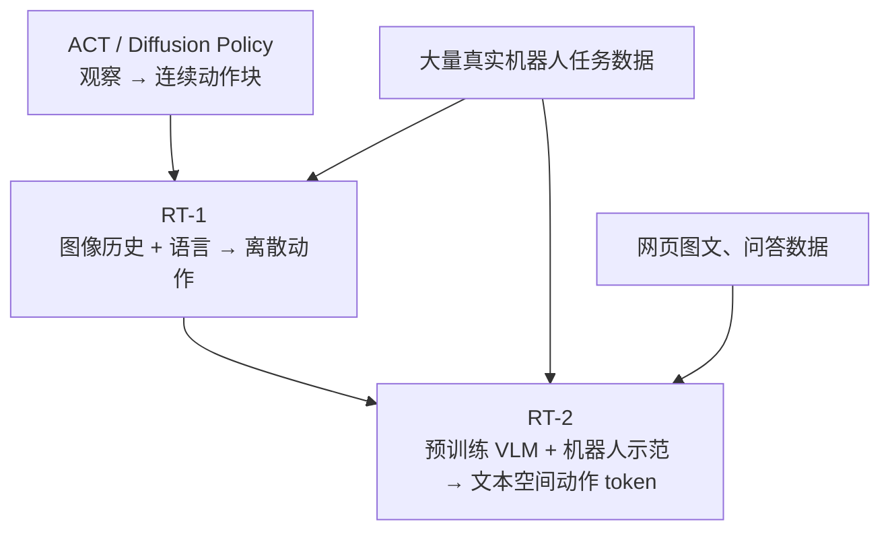

# 第 1 阶段复盘：RT-1、RT-2 与动作生成主线

> 请先读[RT-1](./01-RT-1.md)与[RT-2](./02-RT-2.md)。本篇提供一张对照表、三条实验解释原则，以及带解析的自测。原文：[RT-1](https://arxiv.org/html/2212.06817v2)、[RT-2](https://arxiv.org/html/2307.15818v1)。

## 1. 一张图看清核心变更

*图 1：概念演化图。RT-1 和 RT-2 的共同点是机器人行为克隆；RT-2 的新增资源是已有 VLM 的视觉语言知识。ACT/DP 不是两者的必然祖先。*

| 比较轴 | 第 0 阶段 ACT / Diffusion Policy | RT-1 | RT-2 |
| --- | --- | --- | --- |
| 主要目标 | 精细、连贯的连续动作生成 | 单策略执行大量语言指令且保持实时性 | 将网页视觉语言知识迁移到机器人控制 |
| 指令 | 通常固定任务，无自然语言主接口 | USE 句向量经 FiLM 条件化视觉编码 | 图像与任务文本进入预训练 VLM |
| 动作 | ACT 的关节目标 chunk；DP 的连续轨迹分布 | 各维量化为 256 bin，动作分类 | 各维量化后使用词表 token，自回归生成动作字段 |
| 数据优势 | 面向给定精细任务的示范与视觉反馈 | 13 万示范，744 语言指令 | 复用机器人数据及网页视觉语言任务 |
| 典型泛化 | 同任务扰动、示范动作分布内变化 | 已见概念新组合、新物体与环境扰动 | 额外的符号、语义、视觉概念迁移 |
| 关键限制 | 数据与动作频率、任务范围 | 不会全新运动，背景扰动仍难 | 仍不会全新运动，推理成本与频率更严峻 |

这个表的 ACT/DP 列只是第 0 阶段所读论文的典型实验定位，**不代表动作块和语言条件不能结合**。后续连续动作 VLA 正在结合它们。

## 2. 读实验的三条原则

**第一，确认动作能力和语义能力的测试分别是什么。**当模型按“有营养的食物”选择食物并抓取，语义选择可能是新增能力；抓取技能仍可能是训练已有。要证明新运动技能，应设计训练完全缺少该运动原语、测试新接触序列的实验，而非仅换名词或背景。[RT-2 §5](https://arxiv.org/html/2307.15818v1#S5)

**第二，保留评测分母和对照条件。**RT-1 的 97/76/83/59% 对应四种不同设置；RT-2 Table 8 的 9/42/44/52/63% 是不同规模与训练配方在一组泛化类别上的平均。不能把不同表格里的数字放在同一条排名轴上。RT-1 的 Gato/BC-Z 比较也让基线使用相同数据；RT-2 则让 RT-1/VC-1/R3M/MOO 使用相同机器人数据，这样才能较好控制数据差异。[RT-1 §6.1](https://arxiv.org/html/2212.06817v2#S6.SS1)、[RT-2 §4](https://arxiv.org/html/2307.15818v1#S4)

**第三，性能与工程预算要一起评价。**RT-1 通过 TokenLearner 与缓存以约 3 Hz 控制；RT-2 55B 通过云端 TPU 达到约 1–3 Hz。采样周期、网络延迟、低层伺服、动作量化误差与任务动力学决定这一频率是否够用。语义成功率更高不自动表示机械操作更精细。[RT-1 §5.1](https://arxiv.org/html/2212.06817v2#S5.SS1)、[RT-2 §3.3](https://arxiv.org/html/2307.15818v1#S3.SS3)

## 3. 自测：先尝试回答，再看解析

### 问题 1：RT-1 为什么把语言注入 EfficientNet，而不只在 Transformer 末端拼接？

**解析：**FiLM 使视觉特征提取本身受任务影响。比如同一张台面图中有杯子和罐子，指令改变时，网络可在早期突出不同区域/属性。恒等初始化保留 ImageNet 预训练特征。该设计是论文中的工程选择；它并不证明所有任务都必须早期融合。[RT-1 §5.1](https://arxiv.org/html/2212.06817v2#S5.SS1)

### 问题 2：TokenLearner 从 81 减到 8，会不会“丢掉 73 个固定位置”？

**解析：**不是简单保留 8 个固定网格。TokenLearner 学习对 81 个位置加权聚合出 8 个任务相关 token，因此各聚合 token 可包含多个原始位置的信息。但压缩仍可能丢细节；对细粒度接触任务，这是需要通过实验验证的取舍。六帧最终得到 48 token，减少注意力计算。[RT-1 §5.1](https://arxiv.org/html/2212.06817v2#S5.SS1)

### 问题 3：RT-1 已用语言，为什么 RT-2 仍有研究意义？

**解析：**RT-1 的语言由 USE 提取句向量，模型主要从机器人示范学习图像和指令到动作的对应。RT-2 从大规模网页预训练的 VLM 出发，并在训练中混入原图文任务，使新视觉语义概念可迁移到已有运动技能的选择与执行。比较点不是“有无语言”，而是知识来源、融合方式和输出接口。[RT-2 §3](https://arxiv.org/html/2307.15818v1#S3)

### 问题 4：动作 token 化是否意味着 RT-2 能仅靠文本知识学会开新型锁？

**解析：**不能。token 化只建立生成接口。要会开新型锁，还需要识别结构、推断接触状态、产生新运动序列，并处理操作误差。论文明确承认运动能力受机器人数据中的技能分布约束。网页知识可能帮助决定“应该找哪把钥匙”，却不提供真实接触轨迹。[RT-2 §5](https://arxiv.org/html/2307.15818v1#S5)

### 问题 5：如何从 RT-2 Table 8 判断“联合训练有效”？

**解析：**应在**同一规模**下比较仅机器人微调与联合微调。55B 的均值 52→63，支持明显增益；5B 为 42→44，证据较弱且各子项不一致。5B 的 9→42 则主要反映预训练的重要性。把 5B scratch 与 55B co-fine-tuning 直接比较，混入参数量和训练策略两个变量。[RT-2 Table 8](https://arxiv.org/html/2307.15818v1#A8.SS3)

### 问题 6：论文说 RT-1 执行“50 步任务”，可以称它拥有 50 步自主规划能力吗？

**解析：**不准确。论文通过 SayCan 生成高层技能序列，RT-1 执行低层步骤。系统可完成长时域任务，但规划能力不能全归于 RT-1。RT-2 的 `Plan:` 文本案例则是模型内生成解释/中间步骤的定性示范，与系统化长程规划评测仍有距离。[RT-1 §6.4](https://arxiv.org/html/2212.06817v2#S6.SS4)、[RT-2 §4.4](https://arxiv.org/html/2307.15818v1#S4.SS4)

## 4. 带着三个问题进入下一阶段

1. **数据统一：**不同机器人、不同相机、不同动作空间的数据怎样合并而不抹去本体差异？下一阶段的 Open X-Embodiment 与 Octo 主要回答这一层。
2. **开放复现：**RT-2 展示网页 VLM 到控制的迁移，但权重与大规模数据可得性有限。OpenVLA 如何提供更可检验的路线？
3. **动作质量与频率：**离散单步 token 方便接入语言模型，却不一定适合高频精细操作。OpenVLA-OFT、π 系列如何重新设计动作块或连续动作生成？

**本阶段完成标志：**合上笔记，能在白纸上画出 RT-1 与 RT-2 的训练/推理计算图，解释上面两个关键表格的比较逻辑，并指出“语义迁移”和“运动技能迁移”的证据要求不同。
