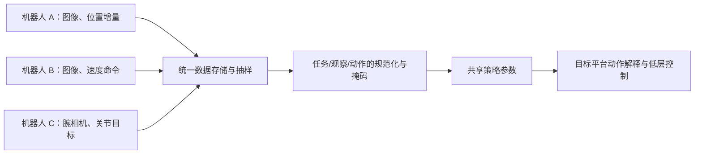

# 第 0 讲：跨本体机器人学习到底要统一什么？

> 前置：[第 1 阶段对照](../../01-rt-series/notes/03-对照与自测.md)。本讲是理解 [OXE / RT-X](./01-Open-X-Embodiment.md) 和 [Octo](./02-Octo.md) 的共同框架。原文入口：[OXE 论文](https://arxiv.org/abs/2310.08864)、[Octo 论文](https://arxiv.org/abs/2405.12213)。

## 1. “Embodiment”不是机器人型号的同义词

本阶段可把本体 $e$ 理解为机器人的形态与控制接口：机械臂数量、关节与夹爪、相机和传感器位置、工作空间、坐标系、动作控制模式、控制频率等。即使都叫“机械臂”，一台的动作 $[\Delta x,\Delta y,\Delta z,\Delta r,\Delta p,\Delta y,g]$ 是相机坐标系下的末端增量，另一台的七维数组可能是基座坐标系下的速度或绝对目标；直接拼接训练会让相同数字表达不同物理含义。[OXE 论文 §IV-A](https://arxiv.org/html/2310.08864v9#S4.SS1)

形式化地，每个数据源 $D_e$ 的观察、任务、动作空间可各自不同：

$$D_e=\{(o_t^{(e)},\ell^{(e)},a_t^{(e)},o_{t+1}^{(e)})\},\qquad a_t^{(e)}\in\mathcal A_e.$$

我们希望学一个共享参数的策略，在目标平台 $e_*$ 上利用其他平台的经验。**共享参数不保证共享动作语义**；一般还需输入适配 $T_e^{\rm obs}$、动作适配 $T_e^{\rm act}$、平台条件或至少平台特定反归一化/控制器。一个抽象写法是 $a^{(e)}=(T_e^{\rm act})^{-1}(\pi_\theta(T_e^{\rm obs}(o),\ell))$。这个式子是概念模型，OXE 和 Octo 的实际适配机制不同。

*图 1：数据能被共同读取、模型能接收它们、输出能被正确执行，是三层不同要求。*

## 2. 三种“统一”，难度递增

**存储格式统一。**同样用 episode/step 保存图像、动作、语言、时间信息，解决可读取、可并行加载的问题。OXE 采用 RLDS 序列化格式；它可以容纳不同模态，却不自动保证字段语义一致。[OXE 论文 §III-A](https://arxiv.org/html/2310.08864v9#S3.SS1)

**表示接口统一。**把各数据源选一个相机视角、把控制投影成七维末端动作、逐数据集归一化，便于共享模型输出头。OXE/RT-X 采取粗对齐：保留各来源原本的绝对/相对/速度等含义及坐标系，没有完成严格物理对齐。同一 token 或数值在两个机器人上可能产生不同运动。[OXE 论文 §IV-A](https://arxiv.org/html/2310.08864v9#S4.SS1)

**行为语义统一。**模型学到“拿起杯子”在不同平台上该如何实现，同时尊重工作空间、夹爪与动力学差异。这需要真正的跨域迁移证据，不由前两层自动推出。论文中的机器人共享预训练尤其值得追问：测试机器人是否在训练混合中出现？任务是否出现？仅换场景，还是需要新的动作接口？

## 3. 何谓正迁移与负迁移？

固定目标机器人 $e_*$、同一评测和相近模型架构，比较只用目标域数据训练 $\pi_{e_*}$ 与用多机器人数据训练 $\pi_{\rm mix}$。若目标任务成功率改善，叫**正迁移**；下降则是**负迁移**。正式写成 $\Delta J(e_*)=J(\pi_{\rm mix};e_*)-J(\pi_{e_*};e_*)$。这个差值必须连同**容量、训练步数、采样权重、目标域数据量**一起报告：大数据混合可能压低目标域采样率，小模型容量也可能不足。[OXE 论文 §V-A](https://arxiv.org/html/2310.08864v9#S5.SS1)

例如目标域只有数千示范时，其他机器人可提供抓取、物体识别与视觉运动规律；若目标域已有大量示范，且混合中动作含义冲突，额外数据反而可能稀释学习。OXE 的结果正好同时包含这两面，不能只记“跨机器人训练一定更好”。

## 4. 数据混合是训练算法的一部分

把第 $i$ 个数据源按权重 $w_i$ 抽样，训练目标为 $\mathcal L(\theta)=\sum_i w_i\,\mathbb E_{(o,\ell,a)\sim D_i}[-\log p_\theta(a\mid o,\ell)]$（离散动作的概念式）。$w_i$ 决定每批中哪些平台、任务频繁出现，与各数据集文件大小不必一致。小数据集上采样可增强多样性，却可能让噪声被重复学习。Octo 明确筛除缺乏图像、非末端增量控制、过度重复或图像质量差的数据，并按多样性再调权重。[Octo 论文 §III-B](https://arxiv.org/html/2405.12213v2#S3.SS2)

这个视角也解释为何比较“35 万 vs 80 万轨迹”的模型时不能把所有差异归功于架构：数据质量、样本权重、控制类型和评测平台都同时改变。

## 5. 术语卡：读后文时保持准确

| 术语 | 本阶段的严格读法 |
| --- | --- |
| OXE | 开放数据资源；包含许多来源数据集和机器人，不是单一策略模型 |
| RT-X | 在跨机器人混合数据上训练的 RT-1-X / RT-2-X 实验策略族；不能与 OXE 数据集画等号 |
| Octo | 从 OXE **筛选子集**训练的开放通用策略，另提供新接口微调方案 |
| Zero-shot | 在特定评测设定下不再训练；Octo 的主 zero-shot 测试使用预训练中已有的机器人设置与任务类型 |
| Few-shot adaptation | 用少量目标域示范继续微调；不是“模型完全没见过任何相关动作也能直接控制” |

下一步读[OXE / RT-X 讲义](./01-Open-X-Embodiment.md)，特别留意完整资源与实际训练混合的差别。
