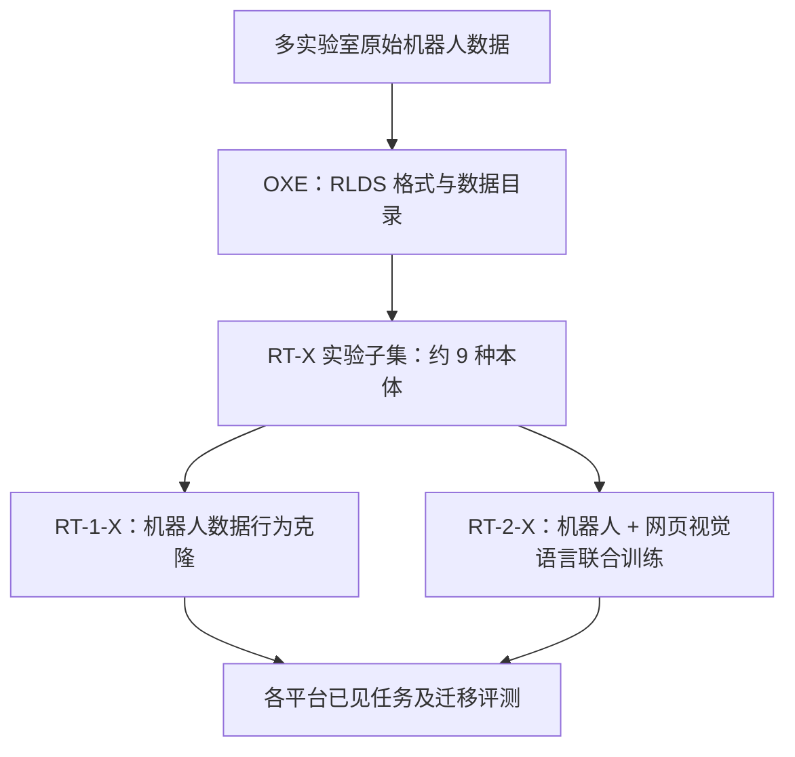

# 第 1 讲：Open X-Embodiment 与 RT-X——跨机器人数据怎样产生迁移？

> 阅读前先掌握[跨本体学习基础](./00-跨本体学习基础.md)。原文：[本地 PDF](../papers/Open_X_Embodiment_2310.08864v9.pdf)、[arXiv HTML v9](https://arxiv.org/html/2310.08864v9)、[项目页](https://robotics-transformer-x.github.io/)。优先核对 Fig. 1–4、Table I–II 和 §III–VI。数据与代码入口见[官方 GitHub](https://github.com/google-deepmind/open_x_embodiment)。

## 1. 论文同时贡献什么？先拆开三层

**第一层是开放数据资源。**不同实验室的机器人数据被整理进统一仓库，便于读取和比较。**第二层是训练策略 RT-X。**作者采用此前的 RT-1、RT-2 架构，分别得到 RT-1-X 和 RT-2-X，检验跨本体混合数据的效果。**第三层是跨平台评测。**论文在多个实机平台测试已见分布、未见设置和其他平台带来的技能迁移。不要把“OXE 数据集覆盖 22 种本体”写成“每个 RT-X 模型训练并评测了 22 种机器人”。[论文摘要与 §III–V](https://arxiv.org/html/2310.08864v9#S3)

*图 1：本仓库重绘的资源—模型—评测关系。OXE 是数据基础设施，RT-X 是用其中一部分数据训练的模型族。*

## 2. 数据规模、格式与统计口径

论文 v9 报告的 OXE 资源汇集 **60 个既有数据集**、**22 种机器人本体**、**超过 100 万条真实轨迹**。作者还报告 527 类技能和 160,266 项任务；这两项来自论文的语言标注分析及分类口径，不应等同于 527 种完全不同的动力学运动。来源跨多个实验室，但动作质量、视角、任务覆盖极不均衡；Franka 类数据较多，pick-and-place 类技能占主导。[论文 §III-A–B、Fig. 1](https://arxiv.org/html/2310.08864v9#S3.SS2)

数据使用 [RLDS 的 episode/step 格式](https://github.com/google-research/rlds)并序列化存储，能容纳图像、动作、语言及其他模态，支持并行加载。**RLDS 是容器规范，不是万能语义翻译器。**同叫 `action` 的字段可能原本是末端绝对位置、相对增量或速度；同叫相机图像，也可能是不同位姿和镜头。跨源训练前仍须查看每个来源的特征描述、频率、坐标系与使用限制。具体数据清单及获取方式以[OXE 官方仓库](https://github.com/google-deepmind/open_x_embodiment)为准；仓库可能持续更新，本文数字固定指所读论文版本。[论文 §III-A、§IV-A](https://arxiv.org/html/2310.08864v9#S4.SS1)

从工程角度，一条样本可以想象为 `episode → steps → {images, action, language, metadata}`。但**不是每条轨迹都有完整语言、深度或同样数量的相机**。不能把字段存在与否、时间同步、标注一致性留给网络自己“自动处理”。后来的 Octo 会通过数据筛选、零填充、掩码和目标图像条件来应对部分缺失。[Octo 论文 §III-B](https://arxiv.org/html/2405.12213v2#S3.SS2)

## 3. RT-X 怎样粗对齐不同机器人？

为了让一个策略有共同输入输出，作者为每个来源选择一个主相机视角并统一图像尺寸，把动作映射到 **七维末端动作**：$x,y,z,\text{roll},\text{pitch},\text{yaw},\text{gripper}$（某些来源对应这些量的变化率）。动作先按数据源归一化，再离散化；执行时需要按目标平台反归一化。这使同一个动作输出头在形式上可用于多个本体。[论文 §IV-A](https://arxiv.org/html/2310.08864v9#S4.SS1)

设来源 $d$ 中某一动作量的统计范围为 $[l_d,u_d]$，可概念化为 $\tilde a^{(d)}=(a^{(d)}-l_d)/(u_d-l_d)$，再将 $\tilde a$ 映成离散 bin。这个式子只是说明**逐来源归一化**为何允许共享输出范围；不是论文逐维统计细节。部署到平台 $d$ 时还要经过逆变换和其原有控制器。作者明确指出：不同数据源的坐标系**未做严格对齐**，有些动作是绝对量，有些是相对量或速度。因此数值空间的同一 bin 不保证同一物理含义。[论文 §IV-A](https://arxiv.org/html/2310.08864v9#S4.SS1)

RT-1-X 保留高效机器人策略主线：语言经 USE/FiLM 调制视觉编码，Transformer 预测离散动作；论文的跨本体配置使用 15 帧图像历史，不能无条件套用第 1 阶段原始 RT-1 的 6 帧配置。RT-2-X 则使用预训练 PaLI-X 视觉语言模型，机器人动作写成文本 token，联合混合网页视觉语言样本与机器人样本。两者都是行为克隆式动作预测，**没有学习一个显式世界状态转移模型**。[论文 §IV-B–C](https://arxiv.org/html/2310.08864v9#S4.SS3)

## 4. 训练混合范围：22 种本体并未全部进入 RT-X 实验

完整 OXE 有 22 种本体，但该论文 RT-X 实验使用当时可用的约 **9 种本体**的机器人混合，数据源包括 RT-1、Bridge、QT-Opt 等；作者明确说后续资源扩张快于本次实验。Octo 论文回顾 RT-X 训练子集时给出的约 **35 万条 episode**，与 OXE 完整资源的百万级轨迹不是一回事。[OXE 论文 §IV-C](https://arxiv.org/html/2310.08864v9#S4.SS3)、[Octo 论文 §IV](https://arxiv.org/html/2405.12213v2#S4)

RT-1-X 仅用这份机器人混合训练；RT-2-X 还约按一比一混入原 VLM 网页数据。两者控制频率依平台约 3–10 Hz：RT-1-X 在本地运行，RT-2-X 由云服务提供推理。这再次提醒：若比较两者，应同时考虑参数量、网页预训练、数据配方和部署方式，不能把差异都归为“跨本体数据”。[论文 §IV-C](https://arxiv.org/html/2310.08864v9#S4.SS3)

## 5. 实验一：何时正迁移，何时反而变差？

论文总计约 **3600 次真实机器人评测试验，跨 6 种机器人**。在目标平台数据较少的五个设置里，RT-1-X 对原始单平台方法在 **4/5** 个设置上更好；Fig. 3 报告平均成功率相对提高约 50%。这支持共享经验可以帮助低数据平台，但具体收益随平台和任务变化。[论文 §V-A、Fig. 3](https://arxiv.org/html/2310.08864v9#S5.SS1)

在数据较多的平台，Table I 呈现重要反例：

| 平台/地点 | 单平台 RT-1 | RT-1-X | RT-2-X 55B |
| --- | ---: | ---: | ---: |
| Bridge / Stanford | 40% | 27% | 50% |
| Bridge / Berkeley | 30% | 27% | 30% |
| Google Robot | 92% | 73% | 91% |

RT-1-X 的架构容量约 35M，面对更杂的训练混合可能欠拟合或出现目标域信息稀释；它在这三项都低于单平台 RT-1。55B 的 RT-2-X 在这些设置中维持或改善成绩。论文据此指出，**数据多样性与模型容量要匹配**。但 RT-2-X 也同时换了预训练来源、架构与参数量，因此 Table I 不能单独识别“仅扩大参数”这一因素的因果贡献。[论文 Table I、§V-A](https://arxiv.org/html/2310.08864v9#S5.SS1)

## 6. 实验二：跨机器人学到新技能的证据链

作者在 Google Robot 上测试某些**原 Google 机器人数据没有、Bridge 的 WidowX 数据里有**的对象与技能。Table II 中，原 RT-2（Google 数据）为 **27.3%**，RT-2-X 55B（加入跨机器人混合）为 **75.8%**；从混合中去掉 Bridge 后降至 **42.8%**。这个“加进来→提高；删掉→回落”的消融，比单一成功案例更能支持 Bridge 数据向 Google 平台迁移。[论文 §V-B、Table II、Fig. 4](https://arxiv.org/html/2310.08864v9#S5.SS2)

同一 Table II 的普通未见物体/背景/环境泛化均值，原 RT-2 为 **62%**，RT-2-X 55B 为 **61%**，二者基本持平。**跨机器人数据的主要新增证据是其他平台所含技能的迁移，不是所有视觉泛化指标都改善。**5B 消融还显示历史图像与网页预训练很重要；其机器人单独微调和网页联合微调相近，论文认为更丰富机器人数据可能减弱后者边际收益。[论文 §V-B–C、Table II](https://arxiv.org/html/2310.08864v9#S5.SS3)

## 7. 如何正确读“跨本体泛化”？

这篇论文证明的主线是：**一个平台缺的任务经验，可从混合中的其他平台获得部分收益；低数据平台尤其可能受益。**它没有系统测试“完全未纳入训练的新型机器人不微调直接成功”，也没有覆盖截然不同的传感与执行方式。作者在讨论中明确把新机器人泛化、何时正迁移等列为开放问题。[论文 §VI](https://arxiv.org/html/2310.08864v9#S6)

研究时应追问：目标平台本身在训练里占多少比重？动作坐标和频率如何映射？模型容量够不够？测试任务是否仅在**目标平台**没出现、却在**别的平台**出现？这些条件决定“跨本体”究竟是共享视觉特征、共享动作原语，还是训练数据范围扩张的结果。

下一讲 [Octo](./02-Octo.md) 进一步问：若希望**公开可复现**且能改输入、动作接口，模型结构该怎么设计？
