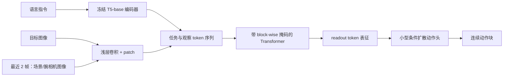

# 第 2 讲：Octo——可开放复现、可适配新接口的通用机器人策略

> 前置：[OXE 与 RT-X](./01-Open-X-Embodiment.md)、[第 0 阶段 Diffusion Policy](../../00-foundations/notes/02-Diffusion-Policy.md)。原文：[本地 PDF](../papers/Octo_2405.12213v2.pdf)、[arXiv HTML v2](https://arxiv.org/html/2405.12213v2)、[项目页](https://octo-models.github.io/)、[官方代码与检查点](https://github.com/octo-models/octo)。优先核对论文 Fig. 1–5、Table I–II、VII 和 §III–V。

## 1. 从“共享训练”到“可迁移的开放起点”

OXE / RT-X 说明混合机器人数据可以跨平台迁移，但输入、输出接口仍较固定，RT-2-X 的大规模权重也不便普遍复现。Octo 的目标更具体：发布一套**开放的预训练策略、数据加载、训练及微调流程**，让研究者在目标机器人上少量示范微调，并能添加新观察（如力/力矩）、新动作空间（如关节目标）。作者公开 **Octo-Small 27M** 和 **Octo-Base 93M** 策略检查点；语言部分另用预训练、冻结的 T5-base 编码器，不能把 27M/93M 简单解释成整个系统所有网络的参数总数。[论文 §I、§III-E、附录 D–E](https://arxiv.org/html/2405.12213v2#S3.SS5)

它从 OXE **筛选 25 个数据集、约 80 万条示范轨迹**训练，而非直接吞下全部 OXE。筛选要求有图像和末端增量动作，并排除过度重复、低分辨率或过于小众的数据；对较多样的来源提高抽样权重，对高度重复的大来源降权。原始 OXE 数据与 Octo 训练混合不是同义词。[论文 §III-B、Fig. 2](https://arxiv.org/html/2405.12213v2#S3.SS2)

## 2. 模型的三层：tokenizer、Transformer、动作头

*图 1：根据论文 Fig. 1 重画。缺失模态以掩码处理；新模态可增加 tokenizer，新动作接口可增加输出头并微调。*

**输入 token 化。**语言经 T5-base（论文写 111M 参数）变成语言 embedding token；场景图、腕相机和目标图像经较浅卷积，再切为视觉 patch token。这个“浅视觉编码 + 大部分容量放在 Transformer”的选择，区别于 RT-1 的较重 EfficientNet 视觉编码器。论文默认使用最近 **2 帧观察**，提供短时运动信息；这不是“预测两个动作”的意思。[论文 §III-A、§III-D、附录 D](https://arxiv.org/html/2405.12213v2#S3.SS1)

**注意力掩码。**任务 token 可供各时间步访问；时刻 $t$ 的观察 token 只看任务和 $0{:}t$ 的观察，不能偷看未来。某数据源没有语言或腕相机时，相应 token 被屏蔽，而不是把零填充当作真实图像理解。额外的 readout token $r_t$ 可以读任务与过去观察，但观察 token 不会反过来读它：因此动作头“取走”一个状态表征，不改变主干的输入表征。这个单向读出设计让添加新的头/任务更容易。具体注意力结构应看[论文 Fig. 1 与 §III-A](https://arxiv.org/html/2405.12213v2#S3.SS1)，代码的 `timestep_pad_mask` 和 `pad_mask_dict` 解释见[官方 README](https://github.com/octo-models/octo#faq)。

**可扩展接口。**新相机/本体状态可加 tokenizer 与位置编码；新动作维度可加输出头；已有 Transformer 权重可作为初始化保留，然后用目标域示范微调。这里的“可扩展”指结构上允许适配，**不代表给模型一个从未见过的传感器或关节定义便能零样本正确执行**。[论文 §III-A、§IV-B](https://arxiv.org/html/2405.12213v2#S4.SS2)

## 3. 为什么 Octo 又回到连续扩散动作？

RT-X 的动作输出离散成 bin；Octo 则借鉴第 0 阶段 Diffusion Policy，在 readout 表征 $e_t$ 条件下预测一段连续动作 $A_t=(a_t,\ldots,a_{t+H-1})$。令噪声动作 $x^K\sim\mathcal N(0,I)$，用小型去噪网络 $\epsilon_\theta(x^k,e_t,k)$ 迭代得到动作块。训练的标准 DDPM 思路可写为

$$\mathcal L_{\rm diff}=\mathbb E_{A,\epsilon,k}\left\|\epsilon-\epsilon_\theta\bigl(\sqrt{\bar\alpha_k}A+\sqrt{1-\bar\alpha_k}\epsilon,\ e_t,k\bigr)\right\|_2^2.$$

这是便于与 Diffusion Policy 对照的噪声预测写法；论文 §III-C 给出其采样更新式与余弦噪声日程。**每次预测只运行一次大 Transformer，迭代去噪发生在小动作头中**，因此不能以“20 次扩散步骤”理解成“20 次整个视觉语言主干前向”。论文附录 D 给出 20 个去噪步骤、三层 MLP 动作头。[论文 §III-C、附录 D](https://arxiv.org/html/2405.12213v2#S3.SS3)

官方[Octo 代码 FAQ](https://github.com/octo-models/octo#faq)指出所发布模型的动作 chunk 长度为 **4**；它可一次执行四步，也可仅执行第一步后重新观测（滚动时域）。后者更利于纠偏，前者减少模型调用但更开环。论文附录 E 说动作分块改善运动连贯性，而在其评测中时间集成未比滚动时域进一步增益。chunk 长度、观测窗口和去噪步数是不同时间尺度，不能混为一谈。[论文附录 E](https://arxiv.org/html/2405.12213v2#A5)

为什么不直接用动作 MSE？同一视觉状态与指令可能有绕左或绕右等多种可行轨迹，MSE 可能均值化出不好执行的动作；离散分类避免均值化，却会量化连续动作。论文的 WidowX 消融（Table II）中，完整 Octo-Small 的聚合指标 **83%**，MSE 头 **35%**，离散动作头 **18%**。这是在特定两个语言任务、两个目标图像任务的 **40 次试验**上的结果；支持该设置下扩散头有效，不是所有机器人任务的普遍比例。[论文 §IV-C、Table II](https://arxiv.org/html/2405.12213v2#S4.SS3)

## 4. 两种任务条件：语言与目标图像

训练时若有语言标签，可使用语言指令；也可选同一轨迹的未来图像作为目标，做 hindsight goal relabeling。作者随机屏蔽语言或目标图像，使策略学会两种条件。没有语言标注的来源则总用目标图像条件。这样 80 万轨迹中没有文字的部分仍可用于控制预训练。目标图像提供“应到达什么视觉状态”的丰富细节，但通常需要获得合适目标图像；语言更易由人发出，却可能含糊。[论文 §III-D](https://arxiv.org/html/2405.12213v2#S3.SS4)

在论文报告的 WidowX 任务上，作者称目标图像条件的成功率比语言条件高 **25%**（阅读 Fig. 4 时应核对具体柱值和计算口径）；这个差异受测试任务和图像信息量影响，不能概括为目标图像总比语言好。作者还指出预训练数据仅约 **56%** 有语言标注、约 **27%** 有腕相机，因此语言 grounding 与腕相机利用受数据覆盖限制。[论文 §IV-A、§V](https://arxiv.org/html/2405.12213v2#S5)

## 5. 训练和微调：预训练先验究竟怎么用？

预训练在筛选的 OXE 混合上进行监督模仿。Octo-Base 的论文训练配置为 TPU v4-128、约 14 小时；公开资源包含 JAX 预训练、微调代码，以及支持 JAX/PyTorch 的数据加载器。[论文 §III-D–E](https://arxiv.org/html/2405.12213v2#S3.SS5)

新设置微调时，论文为每个目标域收集约 **100 条示范**，使用相同训练配方约 **5 万步**，并更新整套可训练的策略参数，而非只训练新动作头；在一张 NVIDIA A5000 上约 **5 小时内**完成。这是论文报告的工作量，不是任意机器的性能保证。若新观察是力/力矩，增加相应 tokenizer；若动作是关节目标，替换/新增动作头，再由目标域示范监督。冻结的 T5 编码器通常不在这套“更新全模型”里；作者附录实验发现改动 T5 并无收益。[论文 §III-C–D、§IV-B、附录 E](https://arxiv.org/html/2405.12213v2#S4.SS2)

为什么这是策略预训练而不只是视觉特征预训练？Octo 的 Transformer 与动作头已经在跨机器人示范上学过 $o,\ell/g\mapsto A$；目标域微调继承的是部分**行为结构**。VC-1 之类视觉特征基线只提供视觉编码先验，动作映射需要重学。[论文 §IV 比较设置](https://arxiv.org/html/2405.12213v2#S4)

## 6. 实验的两种问题，必须分开读

### 6.1 不微调直接执行：覆盖内的 zero-shot

论文在 **9 个机器人设置、4 家机构**开展 zero-shot 与微调评测。zero-shot 主测试选择与预训练数据相匹配的机器人配置、RGB 观察和末端增量控制，并从相应 OXE 来源里选择任务。模型不再训练，但测试仍会变化物体位置、照明、干扰物。论文报告 Octo 相比开放的 RT-1-X 平均成功率高约 **29%**（以论文 Fig. 4 的对比口径为准），与 55B RT-2-X 在若干共测平台相近；RT-X 对比模型只用约 35 万条轨迹，Octo 用 80 万，因而不能把优势唯一归于架构。[论文 §IV-A、Fig. 4](https://arxiv.org/html/2405.12213v2#S4.SS1)

附录 Table VII 更能展示边界：WidowX 上已见任务平均 **85%**，新物体 **80%**，新环境 **40%**，新技能（翻杯、精确插槽）仅 **5%**。每类别是两个任务、共 20 次试验，样本量有限，但趋势清楚：新对象较容易，新接触技能远难于看起来相似的换物体。[论文 Table VII](https://arxiv.org/html/2405.12213v2#A6.SS2)

### 6.2 对新设置少样本微调：另一种泛化

Table I 六个目标设置中，约 100 条示范微调的平均成功率：**Octo 72%**，从头训练的 ResNet+Transformer 策略 **20%**，VC-1 视觉特征基线 **15%**；各设置约 20 次试验。包含新力/力矩输入、关节位置动作、双臂或新机器人配置。这里证明 Octo 是有用的**初始化**，并非这些新接口可不经数据适配直接使用。[论文 §IV-B、Table I](https://arxiv.org/html/2405.12213v2#S4.SS2)

## 7. 消融与局限：不要把“开放”当成“万能”

同一 WidowX 消融中，完整 Octo-Small 为 83%，RT-X 较窄数据混合版本 **60%**，单机器人 Bridge 数据版本 **43%**；这是数据覆盖有益的证据。同时换数据配方会改变总样本数和分布，需谨慎推断纯粹的“数据集个数效应”。模型还在 10M、27M、93M 尺度显示规模收益，但图上的任务数有限。[论文 Table II、Fig. 5](https://arxiv.org/html/2405.12213v2#S4.SS3)

作者报告的失败点包括：腕相机信息未被充分利用，语言条件有时弱于目标图像，新动作原语 zero-shot 表现差。原因可能与训练数据中腕相机/语言缺失有关。当前训练仍基于专家示范的模仿，尚未处理失败轨迹或在线反馈；论文也没有覆盖导航或移动操作等广泛本体。[论文 §V](https://arxiv.org/html/2405.12213v2#S5)

**接到下一阶段：**Octo 说明一个开放机器人预训练策略可以通过模块化接口和连续动作头适配新控制设置。下一阶段 OpenVLA 会重新走“预训练 VLM + 动作 token”路线，重点看其开放性、跨机器人数据和微调方式与 Octo 有何不同。完成本讲后做[对照与自测](./03-对照与自测.md)。
