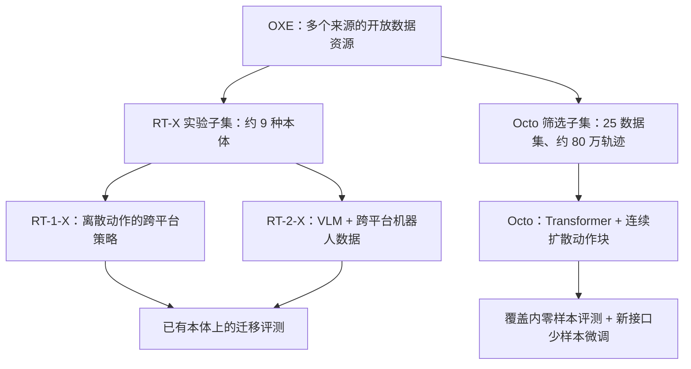

# 第 2 阶段复盘：OXE / RT-X 与 Octo 的关系

> 先读[跨本体基础](./00-跨本体学习基础.md)、[OXE / RT-X](./01-Open-X-Embodiment.md)和[Octo](./02-Octo.md)。本篇把数据资源、实验模型和可微调策略分开比较，并提供带解析的自测。论文：[OXE](https://arxiv.org/abs/2310.08864)、[Octo](https://arxiv.org/abs/2405.12213)。

## 1. 一张关系图

*图 1：资源、训练子集、模型与评测的关系。箭头不表示这些模型的权重相互继承。*

| 维度 | OXE / RT-X | Octo |
| --- | --- | --- |
| 主要研究问题 | 数据能否跨机器人汇集并带来正迁移？ | 开放预训练策略能否直接多机执行、又能高效适配新接口？ |
| 数据 | OXE 完整资源 22 种本体；RT-X 实验仅用子集 | 从 OXE 筛选 25 个数据集、约 80 万轨迹 |
| 观察/任务 | RT-X 主相机视角 + 语言 | 可组合场景/腕相机、语言或目标图像、短历史 |
| 动作 | 共享七维末端接口，经来源归一化与离散化 | 连续动作块，条件扩散头；新动作头可微调 |
| 证据重点 | 低数据平台正迁移；Bridge 技能迁移到 Google Robot | 已见平台免训练执行；新观察/动作/本体约 100 示例微调 |
| 边界 | 动作语义粗对齐，未系统证明未见新机器人零样本控制 | 新技能 zero-shot 仍差，腕相机和语言覆盖不足 |

## 2. 两组数字分别说明什么？

**OXE 的正负迁移。**RT-1-X 在五个低数据平台中胜过原方法的四个，但在 Bridge、Google Robot 等高数据平台上不及单平台 RT-1。RT-2-X 55B 在这些设置更稳。Bridge 数据帮助 Google Robot 执行原平台示范中缺失的技能：RT-2 27.3%、RT-2-X 75.8%、去 Bridge 后 42.8%。这支持跨平台经验有用，但依赖模型容量、目标域基础和具体技能覆盖。[OXE 论文 §V、Table I–II](https://arxiv.org/html/2310.08864v9#S5)

**Octo 的零样本与微调。**主要 zero-shot 任务选自训练混合对应的机器人设置，所以“不再更新权重”不等于“全新本体”。新接口评测则确实使用约 100 条目标示范并微调。Table I 六设置平均 72% 对 20%/15%，说明预训练动作策略比从零训练或只用视觉表征更有用；Table VII 新技能均值仅 5%，提醒我们行为覆盖仍是瓶颈。[Octo 论文 §IV、Table I、VII](https://arxiv.org/html/2405.12213v2#S4)

这两篇的成功率来自不同机器人、任务、评价人数与数据混合，**不能把 RT-2-X 75.8% 与 Octo 72% 排成模型总榜**。前者是特定跨平台技能集，后者是六个微调设置的平均。

## 3. 带解析自测

### 题 1：OXE 已统一 RLDS，为什么论文仍说没有严格对齐动作？

**解析：**RLDS 统一的是 episode/step 等数据组织。RT-X 又把许多动作转换为七维末端接口并逐来源归一化；但不同来源的坐标系、绝对/相对位置、速度控制语义仍不同。相同数值不保证同一物理位移。要严格对齐还需平台元数据、坐标变换、控制周期和动作语义约定。[OXE §III–IV](https://arxiv.org/html/2310.08864v9#S4.SS1)

### 题 2：RT-1-X 在高数据平台下降，是否能证明跨机器人数据有害？

**解析：**只能证明该 35M 架构与特定混合/训练配置在这些平台没取得正迁移。目标域稀释、容量不足、动作冲突、抽样权重都可能影响。RT-2-X 的更大模型表现较稳，也不能单独把原因归结为参数量：预训练和架构同时改变。[OXE Table I](https://arxiv.org/html/2310.08864v9#S5.SS1)

### 题 3：为什么去掉 Bridge 的消融很关键？

**解析：**目标 Google Robot 数据本来没有那组技能，而 Bridge 的另一机器人有。完整跨机器人训练 75.8%，去 Bridge 后 42.8%。这种特定来源的删除使“Bridge 经验贡献”更可信；仍需注意删数据也改变总量及分布，不能把下降精确归因到唯一语义机制。[OXE Table II](https://arxiv.org/html/2310.08864v9#S5.SS2)

### 题 4：Octo 的 readout token 为什么不让观察 token 反向注意到它？

**解析：**readout 负责把已有任务/观察表征提取给动作头。若主干观察 token 不依赖它，微调时增加一个输出头更容易保持已有输入表征路径。它类似可插拔的读取接口，但仍要训练新的动作头并可能整体微调。[Octo §III-A](https://arxiv.org/html/2405.12213v2#S3.SS1)

### 题 5：Octo 的 20 步扩散，是否意味着每次动作预测要运行 20 次 Transformer？

**解析：**不是。论文明确说主干每次预测只运行一次，20 步去噪发生在小扩散头。仍有延迟开销，但其规模不同于重复整个视觉编码和 Transformer。[Octo §III-C、附录 D](https://arxiv.org/html/2405.12213v2#S3.SS3)

### 题 6：Octo 的 zero-shot 和对新动作空间微调能合并为“全新机器人零样本成功”吗？

**解析：**不能。zero-shot 主测试在与预训练匹配的机器人和动作接口上；新关节控制、力传感与双臂等设置使用约 100 条目标示范微调。这是两种不同证据。论文也说明未见技能如翻杯、插槽的 zero-shot 表现很弱。[Octo §IV、Table VII](https://arxiv.org/html/2405.12213v2#S4)

## 4. 面向 OpenVLA 的研究问题

1. OXE/Octo 都用大量机器人数据；OpenVLA 怎样把**网页预训练 VLM**和跨机器人数据结合？
2. RT-X 动作是离散 token，Octo 动作是连续扩散 chunk。若目标是高频精细控制，哪种表示与输出头更适合？需要在相同数据、硬件和控制频率下比较。
3. 从目标域约 100 条示范微调很有用，但我们究竟想测的是新物体、新任务、新本体，还是新动作接口？下一阶段读 OpenVLA 时，应继续把这几种迁移拆开。

**完成标志：**能画出图 1，不把 OXE 数据集、RT-X 实验子集和 Octo 子集混为一谈；能解释 Table I 的负迁移和 Bridge 删除消融；能写出 Octo 从输入 token 到扩散动作块的推理路径。
