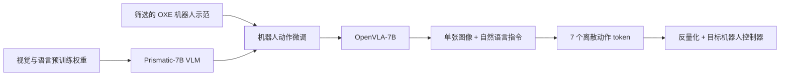
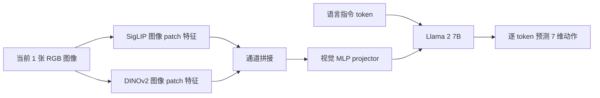

# 第 1 讲：OpenVLA 的模型、动作 token 与训练

> 原文：[本地 PDF](../papers/OpenVLA_2406.09246v3.pdf)、[论文 HTML v3](https://arxiv.org/html/2406.09246v3)、[项目页](https://openvla.github.io/)。前置：[RT-2 讲义](../../01-rt-series/notes/02-RT-2.md)与[跨本体学习基础](../../02-cross-embodiment/notes/00-跨本体学习基础.md)。重点核对原论文 Fig. 2、§3、附录 A。

## 1. 研究问题：把“开放”和“可适配”加入 VLA 主线

RT-2 让预训练视觉语言模型输出离散机器人动作，证明网页视觉语义知识能帮助控制，但模型与完整训练流程难以由普通实验室重现。OpenVLA 的目标是提供**权重、PyTorch 训练流程与微调入口**，使研究者能在跨机器人数据上研究架构、数据配方及目标域适配。其旗舰模型约 **7B 参数**，使用从 OXE 筛选的 **97 万条真实机器人示范**。[论文摘要与 §1](https://arxiv.org/html/2406.09246v3#S1)

要区分三种知识来源：① DINOv2、SigLIP、Llama 2 分别已有视觉/语言预训练；② Prismatic VLM 在这些组件之上完成视觉语言对齐；③ OpenVLA 再用机器人图像、指令、动作微调。原始 OpenVLA 的机器人训练**没有像 RT-2 那样继续混入网页视觉语言样本**，因此它是“使用网页预训练初始化的 VLA”，并非“与网页数据持续联合微调的 VLA”。[论文 §3.1–3.2、§5.1](https://arxiv.org/html/2406.09246v3#S3.SS2)

*图 1：训练与部署的层次。网页知识进入的是预训练组件和 Prismatic，不要把 OXE 机器人训练误写成从零训练。*

## 2. 模型计算图：视觉双编码器为何重要？

OpenVLA 从 Prismatic-7B VLM 开始。对 $224\times224$ 图像 $I_t$，**SigLIP** 提供较强的语义视觉表征，**DINOv2** 增补空间和局部视觉特征；图像 patch 分别通过两支编码器，同位置特征沿通道拼接，再由 MLP projector 映到 Llama 2 的 token embedding 空间。语言指令 $\ell$ 则经 Llama tokenizer 进入 **Llama 2 7B** 主干；主干按自回归方式输出动作 token。原论文 Fig. 2 是结构总图。若想真正读懂输入张量、256 个视觉 token、投影器层数、因果注意力、动作监督位置与推理调用，请接着读新增的[OpenVLA 模型架构逐层拆解](./03-模型架构逐层拆解.md)。[论文 §3.1、Fig. 2](https://arxiv.org/html/2406.09246v3#S3.SS1)

*图 2：OpenVLA 的一次策略预测。DINOv2 与 SigLIP 的“空间/语义”分工是作者的设计动机与实验解释，不应理解为二者在数学上严格只负责某一类信息。*

视觉主干整体约 600M 参数，Prismatic 的 Llama 主干约 7B；“7B”是模型量级称呼，而非只把所有模块简单相加后的精确总数。作者在 BridgeData V2 的前期设计实验里比较过其他 VLM、单/双视觉编码器、224 与 384 分辨率：双视觉编码有助于其测试中的语言指代与空间操作；384 分辨率训练约慢 3 倍，却未在该测试上带来收益，因此最终选 224。**这只是论文测试范围内的选择，不能推出高分辨率对所有精细操作无益。**[论文 §3.4、附录 D](https://arxiv.org/html/2406.09246v3#S3.SS4)

作者还发现，在机器人训练中**更新视觉编码器**优于冻结它；原因可能是网页视觉特征不够关注机械臂末端、夹爪与接触边缘等微小空间差异。故“预训练特征很强”不意味着机器人训练应永远冻结视觉主干。[论文 §3.4、附录 D.3](https://arxiv.org/html/2406.09246v3#A4.SS3)

## 3. 动作 token：量化、词表映射和反量化

每个预测动作是七维末端控制命令（平移三维、旋转三维、夹爪一维），**一次生成一个控制时刻的动作**。每一维连续值分别量化成 256 个整数 bin。与 RT-2/RT-X 使用最小最大范围的粗略思路相比，OpenVLA 使用训练动作该维的 **第 1 与第 99 百分位**作为均匀 bin 区间，降低极端离群动作对分辨率的影响。[论文 §3.2](https://arxiv.org/html/2406.09246v3#S3.SS2)

对某一维 $a_j$，若该维训练分位点是 $q_{0.01,j}$ 与 $q_{0.99,j}$，概念上可以写

$$b_j=\operatorname{clip}\!\left(\left\lfloor 256\frac{a_j-q_{0.01,j}}{q_{0.99,j}-q_{0.01,j}}\right\rfloor,0,255\right),\quad b_j\in\{0,\ldots,255\}.$$

这是解释量化的**示意公式**，边界取整方式以代码实现为准。执行时要按目标数据源/机器人保存的统计信息把 bin 反量化，交给对应低层控制器；[官方推理示例](https://github.com/openvla/openvla#quickstart)中的 `unnorm_key` 就用于选取目标数据源的动作反归一化统计。若选错 key，七个 token 仍然合法，物理命令却可能尺度错误。位于分位区间外的真实动作会被截断到边缘 bin；量化也引入不可避免的有限精度。[论文 §3.2](https://arxiv.org/html/2406.09246v3#S3.SS2)

Llama tokenizer 只留约 100 个新增特殊 token，不够覆盖 256 个动作 bin。作者遂**复用词表中最不常用的 256 个 token**表示动作值，七个动作维度按规定顺序输出七个符号。训练只在目标动作 token 上计算自回归交叉熵：

$$\mathcal L_{\rm act}=-\sum_{j=1}^{7}\log p_\theta\!\left(z_j\mid I_t,\ell,z_{<j}\right).$$

这里的 $z_j$ 是动作第 $j$ 维的词表 token。图像与语言是条件，**损失并非让模型复述输入提示**。用同一 256 符号给七维赋值，并不表示这七维共享物理单位；它们的顺序与各自归一化统计仍须保持一致。[论文 §3.2](https://arxiv.org/html/2406.09246v3#S3.SS2)

这也解释了与 Octo 的本质区别：Octo 用扩散头一次生成连续动作块，OpenVLA 用 LLM 输出离散的**单步**动作。前者的多峰连续建模和后者的网页预训练语义并非互斥目标，但原论文尚未把两者结合。[Octo 讲义](../../02-cross-embodiment/notes/02-Octo.md)、[OpenVLA §6](https://arxiv.org/html/2406.09246v3#S6)

## 4. 训练数据：97 万不是“全部 OXE”

OpenVLA 论文撰写时，完整 OXE 已扩展到 **70 多个来源数据集、200 多万条轨迹**；这与我们上一阶段阅读的 OXE v9 所报告的早期资源统计不同。OpenVLA **筛出约 97 万条轨迹**，限定为有至少一个第三视角图像、单臂末端控制的操作数据，并沿用 Octo 的大部分来源抽样权重，再加入一些较晚出现的来源。[论文 §3.3、附录 A](https://arxiv.org/html/2406.09246v3#S3.SS3)

数据源权重决定训练中各来源被看到的比例，并非原始轨迹数的自然比例。举例，附录 A 给 Bridge、Fractal、Kuka 等不同权重；DROID 初期约 10% 权重，但动作 token 准确率较低，作者在**最后三分之一训练**移除 DROID 并重分配权重。这是一个明确的数据清洗/调度决策，不应把“97 万条训练轨迹”理解为每轮同等抽样每个来源、全程配方不变。[论文 §3.3、Table 3](https://arxiv.org/html/2406.09246v3#A1)

| 模型/资源 | 论文中的示范范围 | 比较时注意 |
| --- | ---: | --- |
| 完整 OXE（OpenVLA 论文当时口径） | 200 多万 | 数据资源，不是 OpenVLA 全部训练集 |
| RT-2-X | 约 35 万 | 第 2 阶段 RT-X 实验子集 |
| Octo | 约 80 万 | 自己筛选的 25 数据集，扩散动作头 |
| OpenVLA | 约 97 万 | 有单臂末端控制与第三视角的筛选混合 |

模型、数据量、清洗方式同时变化，因此若 OpenVLA 胜过 RT-2-X 或 Octo，**不可能只从总成绩判断“DINOv2 一项造成全部提升”。**论文做了局部消融，但完整因果拆分仍受计算成本限制。[论文 §5.1、附录 D](https://arxiv.org/html/2406.09246v3#S5.SS1)

## 5. 训练工程与实际计算预算

作者最终对机器人数据训练约 **27 个 epoch**，动作 token 训练准确率超过 95%；固定学习率为 $2\times10^{-5}$。这与常见 VLM 微调只过一两轮数据不同，但高 token 准确率仅说明**离线标签拟合**，不保证闭环任务同等成功率：机器人执行会遇到自回归分布偏移、视觉遮挡、动作延迟及量化误差。[论文 §3.4](https://arxiv.org/html/2406.09246v3#S3.SS4)

旗舰预训练在 **64 张 A100 上约 14 天**，论文报告约 **21,500 A100-hours**。bf16 推理约需 **15 GB** 显存，在单张 RTX 4090 上约 **6 Hz**；这是模型推理频率测量，不保证任意机器人控制栈在同硬件上达到完整闭环 6 Hz。[论文 §3.5](https://arxiv.org/html/2406.09246v3#S3.SS5)

开放的实际意义在于[官方代码](https://github.com/openvla/openvla)提供检查点、PyTorch 训练与 Hugging Face 推理、微调及远端服务入口；复现实验仍须获得对应数据、计算资源、机器人硬件与动作统计。代码的持续更新也可能与 v3 论文设置有差异，复现时固定提交、数据配方和检查点版本。[论文 §4](https://arxiv.org/html/2406.09246v3#S4)

## 6. 本讲速查与思考题

用一句话总结计算图：**图像 → SigLIP/DINOv2 patch 特征拼接 → projector；语言 → Llama token；两者进入 Llama 2 → 七个量化动作 token → 目标平台反量化与执行。**

1. 若动作分布有长尾，1%/99% 分位数区间提高常见动作分辨率的同时，牺牲了什么？答：区间外动作会饱和，极端但必要的动作可能被截断。
2. 把“拥有 97 万条机器人示范”和“联合训练网页数据”画等号为何错误？答：OpenVLA 的网页知识来自已有视觉语言预训练；机器人阶段只在机器人数据上训练。[论文 §3、§5.1](https://arxiv.org/html/2406.09246v3#S5.SS1)
3. 为什么动作 token 离线准确率 95% 无法证明机器人成功率 95%？答：连续控制闭环会累积状态分布偏移，且像素/动作标签误差对任务成功并非均匀影响。

接下来读[实验与微调](./02-实验与微调.md)，重点追踪每个百分比的任务范围和模型变体。
