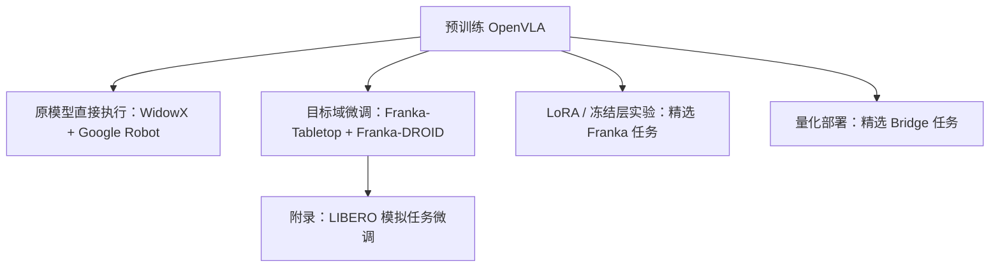

# 第 2 讲：OpenVLA 的证据、微调、部署与局限

> 原文：[本地 PDF](../papers/OpenVLA_2406.09246v3.pdf)、[论文 HTML v3](https://arxiv.org/html/2406.09246v3)、[官方代码](https://github.com/openvla/openvla)。先读[模型与训练](./01-模型与训练.md)。本讲将“原模型直接执行”“目标域微调”“参数高效微调”“量化推理”作为四类不同问题看待。

## 1. 一张证据地图：哪个实验回答哪个问题？

*图 1：论文证据结构。LoRA/量化实验还用了较小的模型变体，详见第 4 节；箭头表示研究路径而非所有分支复用完全相同的旗舰检查点。*

“out-of-the-box”表示在目标评测前**不额外更新模型参数**；若测试机器人/任务类型在预训练数据里存在，就不能改称“完全新本体零样本”。“微调”则明确使用目标任务示范。两者都可能测试新的物体、背景与语言组合，但泛化轴不同。[论文 §5.1–5.2](https://arxiv.org/html/2406.09246v3#S5)

## 2. 原模型直接执行：29 项任务的 16.5 个百分点

作者在 **WidowX BridgeData V2** 上评测 17 项任务、每项 10 次，共 170 次/模型；在 **Google Robot** 上评测 12 项任务、每项 5 次，共 60 次/模型。共 29 个任务，并设置相同的任务与初始状态做 A/B 对照。基线为 RT-1-X、Octo 和 55B 的 RT-2-X；这两个机器人平台都在机器人预训练数据的覆盖范围内。[论文 §5.1、Fig. 3–4](https://arxiv.org/html/2406.09246v3#S5.SS1)

| 同一论文中的测试 | RT-1-X | Octo | RT-2-X | OpenVLA | 分母 |
| --- | ---: | ---: | ---: | ---: | --- |
| WidowX / BridgeData V2 | 18.5% | 20.0% | 50.6% | **70.6%** | 17×10 次；部分任务允许 0.5 部分成功分 |
| Google Robot | 33.3% | 26.7% | 78.3% | **85.0%** | 12×5 次 |

数值出自[论文附录 Table 4、Table 6](https://arxiv.org/html/2406.09246v3#A2)。论文摘要的“比 RT-2-X 高 **16.5% absolute**”是把两平台各自多次试验合并后的**绝对成功率差**，不是“成功率乘 1.165”；也不是对世界上所有机器人任务的综合平均。Google Robot 两模型误差区间重叠，作者称性能相近；提升主要在本次 WidowX 测试中。[论文 §5.1](https://arxiv.org/html/2406.09246v3#S5.SS1)

**测试轴。**WidowX 任务含视觉变化（背景/干扰物/颜色）、运动变化（物体位置或朝向）、物理变化（物体大小/形状）、语义变化（新对象、概念和指令），还有同场景换指令的语言 grounding。RT-2-X 在论文 Fig. 3 的**语义泛化**一类高于 OpenVLA；作者推测持续混入网页样本更能保留预训练知识，但参数、数据、清洗与视觉编码器亦同时不同。这提示“总体胜出”与“每一类都胜出”是两回事。[论文 §5.1、附录 B.1](https://arxiv.org/html/2406.09246v3#A2.SS1)

作者将胜出归于更多机器人示范（OpenVLA 97 万 vs RT-2-X 35 万）、更细致的数据清洗和双视觉编码器等**共同作用**。Appendix C 特别讨论 Bridge 的零动作处理。不能从跨模型总成绩单独推出“7B 比 55B 更有表达能力”或“DINOv2 独自贡献 16.5 个百分点”。[论文 §5.1、附录 C–D](https://arxiv.org/html/2406.09246v3#A3)

## 3. 目标域微调：什么时候预训练帮助最大？

作者对新的 Franka 机器人设置收集 **每任务 10–150 条示范**，共 7 个任务：Franka-Tabletop 的 6 项与 Franka-DROID 的 1 项。原模型先前在多机器人数据上学过动作映射，此处对目标设置**完全微调**。Tabletop 控制约 5 Hz，DROID 约 15 Hz；总测试约 129 次/方法。[论文 §5.2、Fig. 5、附录 B.3](https://arxiv.org/html/2406.09246v3#S5.SS2)

比较不仅有微调 Octo，还有从零训练的 Diffusion Policy（DP）和一个“matched DP”。完整 DP 使用**两步图像历史、本体状态、连续动作 chunk 与滚动时域**；matched DP 则被限制成与 OpenVLA 更相近的单张图像、无本体感觉、单步相对位置输出。后者用于控制输入输出差异，但它也删掉了 DP 的重要设计，所以不能用 matched DP 的分数评价“原论文 Diffusion Policy 方法的上限”。[论文 §5.2 脚注与比较设置](https://arxiv.org/html/2406.09246v3#S5.SS2)

实验呈现的规律比单一总分更有价值：在**窄的单指令任务**，完整 DP 竞争力很强，部分任务优于 OpenVLA；在**多对象、多指令、需把语言落到正确物体**的任务，微调的 OpenVLA 与 Octo 更有优势，OpenVLA 总体平均最高。对照 OpenVLA(scratch)，即直接从 Prismatic VLM 在小目标数据上学习动作，可见大规模机器人预训练的贡献。作者还观察到 DP 在一些精细任务的轨迹更平滑、准确。[论文 §5.2、Fig. 5、Table 7](https://arxiv.org/html/2406.09246v3#A2.SS3)

这解释了第 4 阶段 OpenVLA-OFT 的研究动机：**语言 grounding 与动作精度并非同一个指标**。原始 OpenVLA 的语义理解和目标域适配强，却仍是单图像、单步离散动作；连续 chunk、历史和时序平滑可能改善灵巧操作。[论文 §6](https://arxiv.org/html/2406.09246v3#S6)

## 4. LoRA：看训练参数，也看实际显存和模型变体

完全微调第 3 节任务使用 **8 张 A100、每任务约 5–15 小时**。论文在两个精选 Franka-Tabletop 任务（共 **33 次 rollout** 的统计）比较只训最后层、冻结视觉、sandwich 和 LoRA。Table 1 的结果如下：[论文 §5.3、Table 1](https://arxiv.org/html/2406.09246v3#S5.SS3)

| 方法 | 均值成功率 | 可训练参数 | batch 16 显存 |
| --- | ---: | ---: | ---: |
| 全参数微调 | 69.7% | 7,188.1M | 163.3 GB（两 GPU FSDP） |
| 仅末层 | 30.3% | 465.1M | 51.4 GB |
| 冻结视觉 | 47.0% | 6,760.4M | 156.2 GB（两 GPU FSDP） |
| LoRA，rank 32 | **68.2%** | **97.6M，约 1.4%** | **59.7 GB** |

LoRA 把对线性层的更新限制为低秩 $\Delta W=BA$（$B\in\mathbb R^{d_{out}\times r}$、$A\in\mathbb R^{r\times d_{in}}$），减少**需要训练的参数及优化器状态**。但冻结的基座权重和中间激活仍占显存，故“只训练 1.4%”绝不等于“只用 1.4% 显存”。论文配置下 rank 32 的 59.7 GB 仍非普通 24 GB GPU 的直接保证；批大小、量化和实现方式会改变所需显存。[论文 §5.3](https://arxiv.org/html/2406.09246v3#S5.SS3)

**关键口径：**论文 Table 1 的 LoRA 比较、Table 2 的量化比较，脚注说明使用**较小的 OXE 机器人数据混合与单 SigLIP 视觉编码器**的 OpenVLA 变体，而不是完整 97 万轨迹、双 DINOv2/SigLIP 的旗舰配置。表格证明对应变体上的计算—表现权衡；不能把 59.7 GB、68.2% 直接写成旗舰模型的完整测量值。[论文 §5.3 脚注](https://arxiv.org/html/2406.09246v3#S5.SS3)

## 5. 量化推理：少显存可能改变控制频率

同一较小模型变体在 **8 个 Bridge 任务、每设置 80 次 rollout** 上测试 bf16、int8、int4。Table 2 中：bf16 **71.3% / 16.8 GB**，int8 **58.1% / 10.2 GB**，int4 **71.9% / 7.0 GB**。最值得理解的不是“8 bit 算术一定比 4 bit 差”，而是**该部署上的 int8 速度较慢**：A5000 上仅约 1.2 Hz，而 int4 约 3 Hz；非阻塞控制继续以原节奏运行时，动作延迟改变机器人轨迹。[论文 §5.4、Table 2](https://arxiv.org/html/2406.09246v3#S5.SS4)

论文附录 D.4 又使用阻塞控制消除推理速度差异，此时三种精度的成功率误差区间重叠，支持延迟而非单纯数值精度造成前述 int8 下降。**离线 token 准确率、单次模型吞吐、机器人实际闭环成功率是三个指标**；量化要三者一起测。[论文附录 D.4、Table 11](https://arxiv.org/html/2406.09246v3#A4.SS4)

## 6. v3 附录的 LIBERO：可复现实验，但范围要说准

论文 v3 增加了四组 LIBERO 模拟任务：Spatial、Object、Goal、Long，每组 10 个任务。作者重新渲染高分辨率示范、过滤 no-op 与失败示范，并在相同清洗数据上对比各方法；每组**分别**微调模型，而非一个策略同时训练四组。OpenVLA 用 LoRA；Table 12 四组均值 **76.5%**，Octo 微调 **75.1%**，从零训练 DP **72.4%**。OpenVLA 并非每组第一：Object 的 DP 更高，Goal 的 Octo 更高。这些是**目标套件监督微调后的模拟表现**，不是从真实机器人预训练直接 zero-shot 操作 LIBERO。[论文附录 E、Table 12](https://arxiv.org/html/2406.09246v3#A5)

再现时尤其应记录作者的数据处理。单步模型若学到大量停顿/no-op，执行中可能长时间不动；附录将 no-op 清理列为关键步骤。若换用原版 LIBERO 图像和未清理示范，不能期待论文 Table 12 数字直接复现。[论文附录 E.1](https://arxiv.org/html/2406.09246v3#A5.SS1)

## 7. 论文自己承认的边界

原始 OpenVLA 只接收**单张第三视角图像**，无观察历史、腕相机或本体感觉输入；动作是单步七维离散量。高频双臂精细操作，例如 ALOHA 的 50 Hz 控制，不在原论文已验证能力内。作者还指出测试任务成功率通常低于 90%，并把更高推理吞吐、动作 chunk、输入扩展、网页数据联合训练与 VLM 尺度研究留给后续。[论文 §6](https://arxiv.org/html/2406.09246v3#S6)

“OpenVLA 是开放 VLA”也应准确理解为：**OpenVLA 的模型权重、机器人训练流程和相关数据入口开放**；其基础组件 DINOv2、SigLIP、Llama 2 的全部原始预训练数据与代码并不因此变为公开。论文在脚注中明确说明了这点。[论文 §1 脚注](https://arxiv.org/html/2406.09246v3#S1)

## 8. 自测与下一阶段问题

1. **为何 Table 1 的“1.4% 参数”不能推算“24 GB 显存肯定够”？**因为基础模型权重、激活和 batch 仍占内存；论文 batch 16 的实测是 59.7 GB，且是模型变体。
2. **为何 16.5% absolute 不等于语义泛化也赢 16.5？**它是两平台 29 项任务的汇总差值；语义类别 RT-2-X 反而较强。
3. **为何不能说 OpenVLA 已在新 Franka 设置上 zero-shot 成功？**论文 Franka 结果使用 10–150 条目标示范微调。
4. **若要改善精细连续控制，最直接应比较什么？**在同数据与硬件条件下比较单步离散动作与连续动作 chunk、观察历史、控制频率和端到端延迟。它们正是下一阶段 OpenVLA-OFT 将追踪的设计轴。

完成本阶段时，应能用一页纸复原 Fig. 2 的计算图，并为 Fig. 3–5、Table 1–2 分别写出数据来源、模型版本、测试平台、分母和适用结论。
