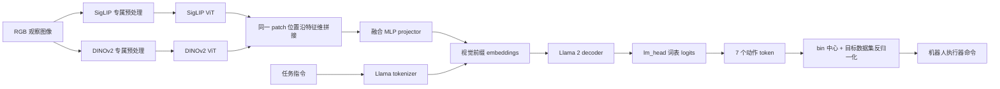

# 补充讲义：OpenVLA 模型架构逐层拆解

> 阅读目标：能从一次 `predict_action` 输入画到七维物理动作，并解释每个张量的序列维、特征维、监督位置和计算瓶颈。依据 [OpenVLA 原论文 Fig. 2、§3](https://arxiv.org/html/2406.09246v3)、[官方视觉编码器](https://github.com/openvla/openvla/blob/main/prismatic/models/backbones/vision/dinosiglip_vit.py)、[HF 模型实现](https://github.com/openvla/openvla/blob/main/prismatic/extern/hf/modeling_prismatic.py)与[动作 tokenizer](https://github.com/openvla/openvla/blob/main/prismatic/vla/action_tokenizer.py)。代码链接指向持续更新的 `main`，精确复现须固定提交。

## 1. 一张总图先固定“谁做什么”



**关键区别**：图像不是先被描述成文字；融合后的 patch 向量以 *embedding* 直接进入语言模型。原始 OpenVLA 没有独立的连续动作头，七个值由 Llama 的词表预测头逐个产生。SigLIP、DINOv2 的特点是设计动机，不能把它们机械地划分成“前者只懂语义，后者只懂几何”。[论文 §3.1–3.2](https://arxiv.org/html/2406.09246v3#S3)

## 2. 从像素到 256 个融合 patch token

原始模型每次使用**一张 224×224 的第三视角 RGB 图像**。同一图像分别走两套预处理；代码里的 `DinoSigLIPImageTransform` 返回 `{"dino": ..., "siglip": ...}`，因此“同一幅图”不等于“共用相同的像素归一化张量”。两支 ViT 的 patch size 都是 14：$224/14=16$，于是每支有 $16\times16=256$ 个 patch 位置。代码取视觉 Transformer 倒数第二层的 patch 特征，并要求两支的 patch 数一致。[视觉编码器源码](https://github.com/openvla/openvla/blob/main/prismatic/models/backbones/vision/dinosiglip_vit.py)、[OFT 论文附录 A-A 对 256 patch 的确认](https://arxiv.org/html/2502.19645#A1)

令批量大小为 $B$，两支特征维为 $d_S,d_D$。则

$$S\in\mathbb R^{B\times256\times d_S},\qquad D\in\mathbb R^{B\times256\times d_D},\qquad F=\operatorname{concat}_{\text{channel}}(S,D)\in\mathbb R^{B\times256\times(d_S+d_D)}.$$

这里拼的是**特征维**，所以仍是 256 个位置，**不是 512 个视觉 token**。如果误把两路沿序列维拼成 512，后续上下文长度、注意力成本和位置对应关系都会理解错。代码的核心语句就是 `torch.cat([dino_patches, siglip_patches], dim=2)`。[视觉编码器源码](https://github.com/openvla/openvla/blob/main/prismatic/models/backbones/vision/dinosiglip_vit.py)

为什么保留局部 patch，而不是每张图压成一个全局向量？末端控制依赖物体、夹爪、接触边缘和目标容器的空间关系。保留 16×16 的 token 网格，使 LLM 可以通过注意力把指令词与局部视觉证据关联；代价是序列更长。原论文测到 384px 对其任务未带来性能收益而训练约慢 3 倍，所以选 224px；这个结果不保证小物体任务也如此。[论文 §3.4](https://arxiv.org/html/2406.09246v3#S3.SS4)

## 3. Projector：必须澄清的“两层 / 三层”差异

视觉 patch 的宽度 $d_S+d_D$ 与 Llama 的隐状态维度 $d_L$ 不同，projector 对每个 patch **独立、共享参数**地做映射：$V_i=P(F_i)\in\mathbb R^{d_L}$。它负责**模态对齐与特征重表达**，不会把 256 个 patch 压成单一 token，也不是动作输出头。

原始 [OpenVLA 论文 §3.1](https://arxiv.org/html/2406.09246v3#S3.SS1)称 Prismatic 有“小型两层 MLP projector”；但 [OFT 论文附录 A-A](https://arxiv.org/html/2502.19645#A1)称融合视觉主干对应“三层 MLP”，而[官方 `PrismaticProjector` 的融合分支](https://github.com/openvla/openvla/blob/main/prismatic/extern/hf/modeling_prismatic.py)具体是：

$$d_F \xrightarrow{\mathrm{Linear}}4d_F\xrightarrow{\mathrm{GELU}}4d_F\xrightarrow{\mathrm{Linear}}d_L\xrightarrow{\mathrm{GELU}}d_L\xrightarrow{\mathrm{Linear}}d_L.$$

这里有 **3 个 Linear 和 2 个 GELU**。同文件里的*非融合视觉*分支才是 2 个 Linear。我们以 OpenVLA 发布代码中融合分支的计算图为准；原论文和后续论文的层数表述存在差异，不能把“两层”当成无需核对的精确架构参数。训练前应核对实际 checkpoint 配置的 `use_fused_vision_backbone` 与模型模块。这个差异不会改变“每个融合 patch 映到语言隐空间”的核心机制。

## 4. 视觉与语言怎样排成同一条序列

文本首先被 tokenizer 变成 token ID；Llama 的输入 embedding 表把 ID 映到 $d_L$ 维。官方 HF 实现将视觉投影结果**插入 BOS 之后**：

```text
<BOS> | V_1 ... V_256 | 指令与提示词 token ... | 待预测动作位置
```

在代码里等价于 `cat([input_embeddings[:, :1], projected_patch_embeddings, input_embeddings[:, 1:]], dim=1)`。视觉 token 没有词表 ID，但拥有和文本相同宽度的向量，因而可参加同一套 Llama self-attention。视觉位置的训练 label 填 `IGNORE_INDEX=-100`，前缀文本也被屏蔽；损失只施加于动作目标 token。[HF 模型 `forward`](https://github.com/openvla/openvla/blob/main/prismatic/extern/hf/modeling_prismatic.py)、[OpenVLA 论文 §3.2](https://arxiv.org/html/2406.09246v3#S3.SS2)

注意力仍是 Llama 的**因果注意力**。动作位置可以看到完整视觉与语言前缀，以及此前的动作 token；不能看到后续真实动作。图像虽然在输入时一次给定，但它进入的是 token 序列前缀；这与把图像输入到独立 cross-attention 模块不同。原始训练采用 teacher forcing：用向右移动的真实动作 token 作为前缀，预测下一个动作 token；测试时则把刚预测的 token 反馈进去。[OFT 论文附录 A-B1](https://arxiv.org/html/2502.19645#A2)

设文本前缀为 $x$，量化目标为 $(z_1,\dots,z_7)$，则第 $j$ 维输出概率为

$$p_\theta(z_j\mid I, x,z_1,\ldots,z_{j-1}).$$

例如预测旋转维度时，模型已看到本次动作中先前的平移维度。**这只是输出因子分解方式**，不是机器人已经执行了那些平移；整个七维动作生成完毕后才送往机器人控制器。训练若只看 token accuracy，容易忽略闭环时一个关键维度出错的任务代价。[论文 §3.2、§3.4](https://arxiv.org/html/2406.09246v3#S3)

## 5. 动作表示：统计、量化、词表与物理量

原始目标动作是一个时刻的 7 维命令：通常写作三维末端平移、三维末端旋转和一维夹爪。不同数据源对坐标系、单位、末端姿态参数化、夹爪值与控制频率的定义不必相同；“都为 7 维”**不能推出动作可直接互换**。数据标准化和目标域反归一化是策略语义的一部分。[论文 §3.2–3.3](https://arxiv.org/html/2406.09246v3#S3)

每一维使用该训练数据的 1% 与 99% 分位点确定有效区间，映到 $[-1,1]$，再被裁剪并落入离散 bin。训练标签最终是一个词表 ID 序列，而非连续值。代码的 `ActionTokenizer` 默认建立 256 个边界点，用 `np.digitize` 后映射到词表末端不常用的 token；反解时查 bin center。**边界点数、区间数和输出 token 种类在实现中容易混淆**：代码有 256 个边界点、255 个中心点，索引到末端时会裁剪；论文概括为“256-bin 离散化”。复现应直接对照源码，不要仅凭一个简化的 `floor(256x)` 公式反写 tokenizer。[动作 tokenizer 源码](https://github.com/openvla/openvla/blob/main/prismatic/vla/action_tokenizer.py)

词表映射没有给每个物理维度单独开 256 个 token。相同 bin 符号可出现在七个位置，而位置告诉模型它表示哪一维。推理路径为

$$\text{词表 logits}\to z_{1:7}\to\hat a^{\mathrm{norm}}_{1:7}\to\hat a^{\mathrm{physical}}_{1:7}.$$

最后一步依赖 `unnorm_key` 选中的数据集统计与掩码；夹爪等特殊维度可能有不同约定。把目标机器人的 key、动作语义、控制器接口逐项核对，是部署前的必要检查。错误的 key 可以产生格式正确但尺度或坐标含义错误的动作。[官方推理代码](https://github.com/openvla/openvla/blob/main/prismatic/models/vlas/openvla.py)、[官方快速开始](https://github.com/openvla/openvla#quickstart)

## 6. 一次训练样本与一次推理的逐步走读

| 环节 | 训练时 | 推理时 |
| --- | --- | --- |
| 观察 | 读图像和指令，图像经两套预处理 | 取当前观察，按同样方式预处理 |
| 视觉 | 两支 ViT 得到 256+256 对齐 patch 特征，沿通道融合，再经 projector | 同左；一次调用通常处理一张当前图像 |
| 序列 | BOS、视觉 embeddings、文本提示、右移后的真实动作 token | BOS、视觉 embeddings、文本提示、已生成动作 token |
| 注意力 | 因果 mask；动作目标位置不能看未来 | 因果 mask，逐 token 生成 7 次 |
| 输出 | Llama `lm_head` 给词表 logits，动作位置交叉熵 | 取 7 个词表 token，反解、反归一化 |
| 环境交互 | 无闭环；标签来自示范数据 | 执行一个动作，再重新观测与查询 |

一个常见误解是“视觉编码器运行 7 次”。实际上自回归生成的七次是**解码依赖**；具体缓存和实现影响每轮重算多少视觉前缀，但自回归串行依赖无法并行消除。OpenVLA-OFT 下一阶段会改用空动作位置并行预测、一次输出动作块。另一个误解是“7B 只指 Llama，故视觉网络完全无关计算”——视觉编码器虽比 Llama 小，仍对图像处理和多视角扩展有成本。[原论文 §3.5](https://arxiv.org/html/2406.09246v3#S3.SS5)、[OFT 论文 §III–IV](https://arxiv.org/html/2502.19645#S3)

## 7. 读源码的最短路线与复盘题

1. 在[视觉编码器](https://github.com/openvla/openvla/blob/main/prismatic/models/backbones/vision/dinosiglip_vit.py)里找两个 `get_intermediate_layers`、`torch.cat(..., dim=2)` 与 `num_patches`，确认 256 而非 512。
2. 在[HF 模型](https://github.com/openvla/openvla/blob/main/prismatic/extern/hf/modeling_prismatic.py)里找 `PrismaticProjector` 融合分支、BOS 后插入视觉 embeddings 的 `torch.cat`、视觉 label 的 `IGNORE_INDEX`。
3. 在[动作 tokenizer](https://github.com/openvla/openvla/blob/main/prismatic/vla/action_tokenizer.py)里找 `np.linspace`、`np.digitize`、bin center 与词表反向映射。
4. 在[OpenVLA 推理接口](https://github.com/openvla/openvla/blob/main/prismatic/models/vlas/openvla.py)里找 `predict_action`、`unnorm_key` 和输出维度的反归一化。

**自测 A**：双视觉编码器各输出 256 个 patch，进入 Llama 的视觉 token 是多少？**答**：256，两个特征在同一 patch 位置沿通道拼接。

**自测 B**：训练时“模型看到真实前六维动作”是否意味着推理时机器人先执行前六维？**答**：不是。那是 teacher forcing 的序列条件；执行的是七维完整命令。

**自测 C**：projector 和 action head 有何不同？**答**：projector 将视觉特征映到 Llama 输入隐空间；原始 OpenVLA 的动作输出用 Llama 词表头，没有独立连续动作头。

**自测 D**：为何 OpenVLA 的动作接口比 `np.ndarray(7,)` 更复杂？**答**：数组形状不定义物理单位、坐标系、统计归一化、夹爪约定与执行频率，必须连同目标机器人和数据源约定理解。

下一步：[第 4 阶段 OpenVLA-OFT](../../04-openvla-oft/README.md)会逐项改动这里的输出表示、注意力 mask 和时间维度。
