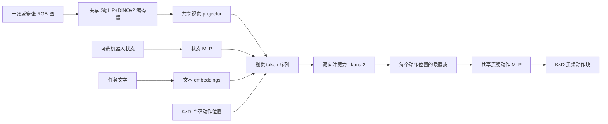

# 第 1 讲：OpenVLA-OFT 的架构与训练目标

> 先读[OpenVLA 架构逐层拆解](../../03-openvla/notes/03-模型架构逐层拆解.md)。本讲依据 [OFT 论文 §III–IV、附录 A-A/A-B](https://arxiv.org/html/2502.19645)，图为本仓库重绘。文中 $K$ 是每次输出的动作时步数，$D$ 是每步动作维度。

## 1. 问题从哪里来

原版 OpenVLA 将单个 7 维动作表示为七个离散词表 token，按

$$p(a_{t,1:D}\mid o_t,\ell)=\prod_{j=1}^{D}p(z_{t,j}\mid o_t,\ell,z_{t,<j})$$

逐个预测。若还要输出未来 $K$ 步，原方案近似需要 $KD$ 个串行生成位置，延迟随 chunk 长度增加。论文在 A100 上测原版单步动作约 0.24 秒；这适合低频操作，却难以直接生成高频双臂机器人的长动作序列。[论文 §III、Table II](https://arxiv.org/html/2502.19645)

OFT 是一套**目标域微调配方**，建立在原始 OpenVLA 权重之上，包含：并行解码与动作分块、连续动作表示、L1 回归目标。对需要更强语言指代的 ALOHA 实验，额外引入 FiLM，称 OFT+。不要把 OFT+ 的 FiLM 写成所有 OFT 实验默认都有。[论文 §IV–V、附录 A-A](https://arxiv.org/html/2502.19645)



*图 1：OFT 的主路径。空动作位置提供待填写的输出槽位；连续动作头读每个槽位的隐藏态。多图与状态是可选输入配置，FiLM 属于 OFT+。*

## 2. 从因果生成变成并行解码

原版训练在动作位置输入右移后的真值 token，即 teacher forcing；因果 mask 保证第 $j$ 个位置只能依赖较早动作。测试时七个 token 必须串行回填。OFT 则给动作区放入**空动作 embeddings**；它们的内容相同，但位置编码不同，使每个槽位对应不同时间和动作维度。解码器改用**双向注意力**，让所有槽位在一次前向中交换信息，最后同时读出 $KD$ 个预测。[论文 §IV-B、附录 A-B1](https://arxiv.org/html/2502.19645)

为帮助理解，可把两种计算图画成：

```text
原版：条件 -> z1 -> z2 -> ... -> zD          （D 次依赖）
OFT ：条件 + [q1 q2 ... qKD] -> [h1 ... hKD] -> 动作块（1 次前向）
```

这里“双向”主要是**动作槽位不再遵守自回归未来屏蔽**。代码所用的具体 attention mask 和位置编号应以固定版本的[官方 HF 实现](https://github.com/moojink/openvla-oft/blob/main/prismatic/extern/hf/modeling_prismatic.py)为准；概念上不能误以为通过 Llama 原封不动的 causal mask 就能实现所有输出槽同时相互通信。并行预测的代价是放弃显式链式分解 $p(a_1)p(a_2\mid a_1)\cdots$；它仍可通过共享隐藏层和注意力建模槽位相关性，但输出头给出的逐维点预测不等于显式联合概率分布。[论文 §IV-B、附录 A-B1](https://arxiv.org/html/2502.19645)

**为什么需要空动作槽位？** 如果只把视觉和文字过一遍 Llama，再用一个全局隐藏向量预测整个 $KD$ 数组，模型得自己把时间和维度结构塞进同一向量。OFT 给每个动作元素一个位置，Llama 的隐藏态保留该元素对应的时序与任务条件，再共享连续值头。这个结构让改 $K$ 和 $D$ 的输出接口更直接，但适配新维度仍需重新训练或微调，绝非任意维度零样本通用。[论文 §IV-B](https://arxiv.org/html/2502.19645)

## 3. 分块的速度收益和闭环代价

输出张量为 $A_{t:t+K-1}\in\mathbb R^{K\times D}$。原版 OpenVLA 的 $K=1,D=7$；LIBERO 中 OFT 取 $K=8,D=7$，即一次输出 56 个标量；ALOHA 取 $K=25$，动作空间是双臂关节目标，不能继续按原版“7 维末端位姿”理解。[论文 §V-A、§VI-A](https://arxiv.org/html/2502.19645)

动作块的吞吐为 $K/T_{\rm query}$，其中 $T_{\rm query}$ 是一次模型调用到得到完整块的时间。若 $K=8$ 且调用耗时约 0.073 秒，则每秒“产生”约 109 个动作值对应的时步，**不是**机器人每 9 毫秒重新看图、重新规划一次。论文实验执行完整 chunk 再重查模型；chunk 内按既定序列开环执行。因此较大的 $K$ 可降低每步摊销推理成本，却增长遇到扰动时无新视觉反馈的窗口。$K$ 需要同时按任务接触变化、执行频率、网络/推理延迟来选。[论文 §V-A、Table II](https://arxiv.org/html/2502.19645)

| 指标 | 数学口径 | 容易误读的地方 |
| --- | --- | --- |
| 一次查询延迟 | $T_{\rm query}$ | 决定新观察到首个新动作块的等待 |
| 动作吞吐 | $K/T_{\rm query}$ | 计算产生的动作时步数，不是闭环观测频率 |
| 机器人执行频率 | 控制器执行动作的 Hz | 可高于策略重新规划频率 |
| 重规划周期 | 通常是 $K/f_{\rm control}$ 加系统延迟 | 长 chunk 可能削弱扰动响应 |

## 4. 连续动作头与 L1 目标

OpenVLA 原版把连续动作先量化到 token，Llama `lm_head` 给词表 logits，以交叉熵训练。OFT 直接读取各空动作位置的最后层隐藏态 $h_{k,j}$，送入**四层、ReLU 的共享 MLP 动作头**，输出归一化连续值 $\hat a_{k,j}\in[-1,1]$ 的估计。论文的训练损失为均值绝对误差：

$$\mathcal L_{L1}=\frac{1}{KD}\sum_{k=1}^{K}\sum_{j=1}^{D}\left|\hat a_{k,j}-a^{*}_{k,j}\right|.$$

这里 $a^*$ 已按目标数据统计归一化。训练时损失对 MLP 与被 LoRA 更新的主干传梯度；推理时输出再按对应动作统计反归一化。论文用 LoRA 适配 OpenVLA，是因为目标域样本量远小于预训练规模，并非 OFT 的定义必须是 LoRA。[论文 §IV-A/B、附录 A-B2/A-D](https://arxiv.org/html/2502.19645)

L1 的优点是**不再受 256 级量化精度限制，且只需单次前向**。但它的点预测在条件分布真正多峰时可能给出模式间不理想的值；严格地说，在逐维独立的绝对误差下，最优预测与条件中位数有关，不能泛化为“模型学会整个多模态分布”。论文也明确把多模态演示视为局限。[论文 §VIII](https://arxiv.org/html/2502.19645)

作为对照，论文还训练连续动作扩散头：先给动作加噪，网络学噪声预测，推理时用 DDIM 逐步去噪。其噪声预测头同为四层 MLP，主要配置为训练/推理 50 步。扩散可表达多峰，但每个去噪步增加推理成本；少步采样可能牺牲表现。这里的“扩散”是**对照实验**，最终 OFT 配方选择 L1。[论文 §IV-B、附录 A-B2、Table II](https://arxiv.org/html/2502.19645)

## 5. 多图像、机器人状态与 FiLM 分别改变什么

原版每次只看一张第三视角图。OFT 可让多张图像共用 SigLIP/DINOv2 与 projector：每视角约 256 个视觉 token，**两个视角是 512 个序列 token**，这与同一图像的双编码器“沿通道拼接后仍 256 token”完全不同。状态向量由一个两层 GELU MLP 映到语言宽度，作为一个附加 token 拼入序列。增加视角会增加视觉计算与 Llama 序列成本，因而不能把并行解码的速度收益当成免费。[论文 §IV-B、附录 A-A/A-B3](https://arxiv.org/html/2502.19645)

OFT+ 的 FiLM 针对 ALOHA 的语言指代失效：从任务文本 embedding 的均值计算 $\gamma,\beta$，对两支视觉 ViT 每个 block 的特征按通道调制：

$$\hat F=(1+\gamma)\odot F+\beta.$$

$\gamma,\beta$ 在所有空间 patch 上共享相应通道系数，FiLM 插在 self-attention 后、前馈层前；每个视觉 block 有自己的投影器。它是**使视觉处理在早期就受语言条件影响**，而不只是把语言 token 与视觉 token 在 Llama 里后融合。论文仅在 ALOHA 使用 FiLM，LIBERO 无 FiLM 也有良好语言跟随。[论文 §IV-C、附录 A-C/A-D](https://arxiv.org/html/2502.19645)

## 6. 训练与执行的极简伪代码

```text
# 训练：使用示范中的 obs_t、instruction 与未来 K 步目标动作
v = concat_per_view(projector(concat_channels(SigLIP(image), DINOv2(image))))
s = proprio_projector(robot_state)                 # 有状态时才加入
q = empty_action_embeddings(K * D)                # 按位置区分
h = bidirectional_Llama([v, s, text, q])
a_pred = action_MLP(h[action_slots]).reshape(K, D)
loss = mean(abs(a_pred - normalized_expert_chunk))

# 推理
chunk = denormalize(a_pred, target_robot_statistics)
execute(chunk, controller_frequency)
observe_again_and_replan()
```

这段是帮助把论文方法串起来的概念伪代码。具体 prefix 插入顺序、attention mask、动作槽 ID 和正则化均须查对应[官方训练脚本](https://github.com/moojink/openvla-oft/blob/main/vla-scripts/finetune.py)及[模型代码](https://github.com/moojink/openvla-oft/blob/main/prismatic/extern/hf/modeling_prismatic.py)。尤其不能把 ALOHA 的**绝对关节角目标**误套用 OpenVLA 预训练的相对末端位姿反归一化。[论文 §VI-A](https://arxiv.org/html/2502.19645)

## 7. 检查理解

1. **只有并行解码，没有 chunking，速度为何已变快？** 七个动作位置从七次串行变为一次前向；但每次仍只输出一个时步。
2. **为什么 $K=8$ 不等于八次闭环决策？** 八步基于同一观测共同预测；论文执行完整块后才更新观测。
3. **连续 L1 相比离散 CE 改了哪三件事？** 输出空间从词表 bin 到实数，头从词表 logits 到 MLP，损失从 token CE 到数值 L1。
4. **OFT+ 为什么不是“多加一个语言 token”那么简单？** FiLM 让语言改变两支 ViT 每层视觉特征，而非只在 Llama 的输入序列尾部参与融合。

下一篇：[消融实验、部署与研究判断](./02-消融实验与部署.md)。
