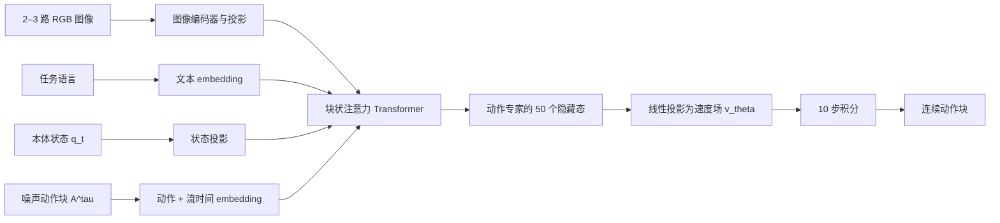

# 第 1 讲：π₀ 的双专家架构、flow matching 与训练配方

> 依据 [π₀ 论文 v4 §III–VI、附录 A-B/A-D](https://arxiv.org/html/2410.24164v4)；原文在[本地 PDF](../papers/pi0_2410.24164v4.pdf)。先回顾[OpenVLA 架构](../../03-openvla/notes/03-模型架构逐层拆解.md)和[OFT 的连续 L1 头](../../04-openvla-oft/notes/01-OFT架构与训练目标.md)。本讲把机器人时间 $t$ 与生成过程时间 $\tau$ 严格分开。

## 1. 问题定义：从单步点值转向条件动作块分布

原版 OpenVLA 每次输出一个离散单步动作；OFT 以并行槽位输出连续动作块，但 L1 主要学习条件点预测。π₀ 希望在继承网页视觉语言表征的同时，对灵巧操作的**连续动作块条件分布**建模。它从 PaliGemma 3B VLM 初始化视觉语言主干，额外加入约 300M 参数的动作专家，总量约 3.3B。训练目标是 $p(A_t\mid o_t)$，其中 $A_t=[a_t,\ldots,a_{t+H-1}]$，论文任务的 $H=50$；观察 $o_t$ 含 2–3 张图像、语言指令与本体状态。这里 $H=50$ 是**预测长度**，不等于必须开环执行完整 50 步。[论文 §IV](https://arxiv.org/html/2410.24164v4#S4)

*图 1：一次 π₀ 动作块采样。观察前缀在十次速度场求值中保持不变，可缓存其注意力 K/V。*

## 2. 两组 Transformer 权重为何仍是“一个模型”

π₀ 的“action expert”容易被误读成外接独立扩散策略。论文实现为**同一 Transformer 计算图中的两组专家权重**：图像和文本 token 路由到较大的 PaliGemma 初始化 VLM 权重；未在 VLM 预训练中出现的状态与带噪动作 token 路由到较小的动作专家权重。两组权重在 self-attention 计算中交互。动作专家不是“让语言模型先生成一句动作描述，再由另一个模型翻译”；动作 token 直接接收多模态条件的注意力信息。[论文 §IV、附录 A-B](https://arxiv.org/html/2410.24164v4#S4)

原论文给出主干约 3B、专家约 300M。较小专家的目的不仅是降参数，还因为每次生成块要重复计算多个流积分步：把反复执行的后缀做轻，可以显著降低采样延迟。论文的 PaliGemma/Gemma 主干宽度 2048，动作专家宽度 1024；两者的中间 MLP 宽度不必相等，交互发生在注意力机制中。模型并不是将原版 OpenVLA 的 Llama 7B 直接换一个动作头，预训练骨干、参数量与动作训练方式都改变了。[附录 A-B](https://arxiv.org/html/2410.24164v4#A2)

### 块状因果注意力：完整信息流比一句“双向”重要

论文把序列分成三个 block：$B_1=[\text{图像},\text{语言}]$，$B_2=[q_t]$，$B_3=[a_t^\tau,\ldots,a_{t+H-1}^\tau]$。**块内双向**，每块只能看本块和更早块：

| 查询 block \ 可见 key block | 图像与语言 $B_1$ | 状态 $B_2$ | 带噪动作 $B_3$ |
| --- | :---: | :---: | :---: |
| 图像与语言 $B_1$ | ✓ | × | × |
| 状态 $B_2$ | ✓ | ✓ | × |
| 动作 $B_3$ | ✓ | ✓ | ✓ |

这是一种**块级因果、块内双向**掩码。视觉语言前缀不能反看新加入的状态和动作，减小相对 PaliGemma 预训练的分布变化；状态不看噪声动作，十步采样时也可缓存；动作块内所有时刻相互看见，利于建模跨时刻相关性。它不同于原版 OpenVLA 对动作维度逐 token 的因果解码，也不同于把所有模态一律全双向。[附录 A-B](https://arxiv.org/html/2410.24164v4#A2)

## 3. Flow matching：训练速度场，而非直接回归动作

令专家演示块为 $A$，同形状高斯噪声为 $\epsilon\sim\mathcal N(0,I)$，从噪声到数据构造线性路径

$$A^\tau=\tau A+(1-\tau)\epsilon,\qquad 0\le\tau\le1.$$

对这条固定样本路径求导，目标速度是 $\frac{dA^\tau}{d\tau}=A-\epsilon$。将状态、图像、语言与 $A^\tau,\tau$ 输入模型，最小化

$$\mathcal L_{\rm FM}=\mathbb E_{A,o,\epsilon,\tau}\left[\left\|v_\theta(A^\tau,o,\tau)-(A-\epsilon)\right\|_2^2\right].$$

这里预测的是在**生成时间 $\tau$**上应走的速度场；并不是机器人关节速度，也不是下一控制时刻的动作。$\tau=0$ 时为纯噪声，$\tau=1$ 时为动作数据。每个动作时步有一个 action token；动作向量与正弦时间编码 $\phi(\tau)$ 经 MLP 融合成专家输入，最后层专家隐藏态经线性层投影回动作维度的速度场。[论文 §IV、附录 A-B](https://arxiv.org/html/2410.24164v4#S4)

**为什么不直接让网络输出 $A$？** L1/L2 点回归在相同观测对应多个合理操作轨迹时会倾向某种中心解。flow matching 从不同初始噪声出发，学习从噪声分布到条件动作分布的传输；理论上能表达多峰。但是否真正出现有用的多样样本仍要看数据、训练、采样与评测，不能仅由目标函数推断闭环表现。作者对 $\tau$ 使用偏向低 $\tau$（更噪）区域的 beta 采样，而非简单均匀采样。[论文 §IV、附录 A-B](https://arxiv.org/html/2410.24164v4#A2)

推理从 $A^0\sim\mathcal N(0,I)$ 起步，使用 10 次 Euler 步，$\delta=0.1$：

$$A^{\tau+\delta}=A^\tau+\delta v_\theta(A^\tau,o,\tau).$$

十次是**一次动作块采样内部**的生成步骤，非十次机器人动作，也非十次新相机观察。观察前缀的 attention K/V 可复用，每步主要重算动作后缀。论文附录在 RTX 4090 上报告三路图像时图像编码 14 ms、观察前向 32 ms、十次动作前向共 27 ms，本机总 73 ms；离板 Wi-Fi 再加约 13 ms 为 86 ms。这些是模型与网络特定条件下的测量，不是所有机器人控制器的实时保证。[附录 A-D Table I](https://arxiv.org/html/2410.24164v4#A4)

## 4. 机器人 50 Hz、H=50 和重规划 25 步并不矛盾

论文指出 20 Hz 的 UR5e/Franka 在执行 16 步后约 0.8 秒重查模型；其他 50 Hz 机器人执行 **25 步**后约 0.5 秒重查。模型可预测 50 步，但只用前 25 步，再用新观察生成下一块。这说明**动作生成视野**、**实际执行子段**、**底层执行频率**是三个独立参数。开环执行子段越长，遇到突发接触或遮挡时越晚重新规划。论文曾试 temporal ensembling，但在其设置中降低表现，因此选择开环片段；不能据此断言所有任务的 ensembling 都无效。[附录 A-D](https://arxiv.org/html/2410.24164v4#A4)

## 5. 两层预训练和一次后训练

第一层预训练是 PaliGemma 已有的互联网图像语言知识；第二层是 π₀ 在真实机器人数据上继续训练 VLA。论文机器人混合包括其自采约 **10,000 小时**灵巧操作、7 种机器人配置与 68 个较宽泛任务，再加 OXE 等开放数据。作者按机器人时间步统计：自采约 903M time steps，其中单臂 106M、双臂 797M；开放来源在采样混合中约占 9.1%。采样权重和原始时步数不同，不能简单用 903M 与 OXE 数据集大小比重估训练概率。[论文 §III、§V-A](https://arxiv.org/html/2410.24164v4#S5)

机器人预训练追求广覆盖，包括不完美但有恢复行为的演示；后训练使用更高质量、策略更一致的目标任务数据，让模型行为更流畅和稳定。只用后训练数据可能缺少错误恢复经验；只用广泛预训练数据则可能不够精细。这个观点是作者根据任务表现作出的经验解释，数据质量、任务范围和步骤数共同变化，不能当作严格分离的因果定理。[论文 §V-A、§VII](https://arxiv.org/html/2410.24164v4#S5)

有一处需要特别澄清：论文 §III 说预训练混合包含完整 OXE，§V-A/Fig. 4 又具体描述采用 OXE 子集（“OXE Magic Soup”）及 Bridge/DROID 等。讲义以**实际配方所在 §V-A**为准，不把“完整 OXE”当成可由本文验证的精确训练清单。[论文 §III 与 §V-A](https://arxiv.org/html/2410.24164v4)

## 6. 实验应怎样解读

作者在直接提示、语言跟随、少量目标任务数据后训练，以及洗衣、餐桌清理、组装盒子等长任务中评估 π₀。Fig. 7 的直接执行结果优于 OpenVLA、Octo 等基线；Fig. 11 展示目标任务微调的数据效率；Fig. 13 展示复杂任务后训练结果。但模型大小、私有数据规模、机器人频率、动作表示均不相同，跨方法总成绩不是“只替换 flow matching 就能提高多少”的控制实验。论文有 π₀-small 无 VLM 初始化对照，但它仅约 470M，架构也不同，因而对 VLM 预训练的单独归因有限。[论文 §VI](https://arxiv.org/html/2410.24164v4#S6)

读 [Fig. 8 语言实验](https://arxiv.org/html/2410.24164v4#S6)时，还要区分给模型**完整任务描述**，由**人提供中间子任务命令**，或由**外部高层 VLM 提供命令**。π₀ 的低层策略能执行语言片段，并不意味着它已像 π₀.₅ 一样在同一模型内原生学习高层子任务生成。

## 7. 自测

1. **π₀ 的 50 个动作 token 是否表示 50 个离散词表 ID？** 不是。它们是 50 个连续带噪动作槽，动作专家预测每槽的 flow 速度。
2. **生成时间 $\tau$ 与机器人时间 $t$ 的关系？** $t$ 标识真实控制时间与动作块起点，$\tau$ 是从噪声到动作的采样进度。
3. **为何状态 block 不能看动作 block？** 状态对一次动作块采样固定，可缓存其 K/V，并避免随噪声变化。
4. **为何 H=50 却每 25 步重规划？** 模型可预测 50 步，系统选择只执行其中一部分再观测。
5. **π₀ 与 OFT 的核心动作建模区别？** OFT 的连续 L1 头给点预测；π₀ 的专家学习条件速度场并从噪声迭代采样动作块。

下一篇：[π₀.₅ 的混合训练与高低层推理](./02-pi05-架构与训练.md)。
