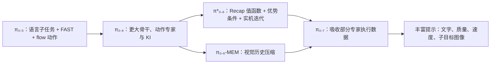

# 第 6 阶段：从真实经验到可引导的泛化

这一阶段以两篇论文回答两个相连的问题：**一个已有 VLA 如何靠真实执行变得更快、更稳？**以及**多个任务专家积累的经验如何回流到一个通用模型，并让人用语言、图像和质量要求引导它？**前者是 π*₀.₆ 的 Recap，后者是 π₀.₇ 的多模态上下文训练。[π*₀.₆ 原论文](https://arxiv.org/html/2511.14759v2) · [π₀.₇ 原论文](https://arxiv.org/html/2604.15483v2)

## 速读路线

| 顺序 | 用时 | 内容 | 读完应回答 |
| --- | ---: | --- | --- |
| 预备 | 15 分钟 | [π₀.₅ 讲义](../05-pi-series/notes/02-pi05-架构与训练.md)第 1–3 节 | 高低层文本、FAST、flow 专家怎样相连？ |
| 1 | 90 分钟 | [π*₀.₆：Recap 讲义](./notes/01-Recap与pi-star-06.md) | 稀疏成败反馈如何变成逐步策略改进？ |
| 2 | 90 分钟 | [π₀.₇：架构、数据与运行](./notes/02-pi07-架构与训练.md) | 提示的每个分量、记忆编码和子目标世界模型各解决什么？ |
| 3 | 45 分钟 | [证据对照、边界与自测](./notes/03-实验对照与研究问题.md) | 哪些实验支持“经验学习”和“泛化”，哪些说法超出证据？ |

## 原论文与官方入口

| 资源 | 建议核对处 |
| --- | --- |
| [π*₀.₆ 本地 PDF v2](./papers/pi-star-0.6_2511.14759v2.pdf) · [arXiv HTML v2](https://arxiv.org/html/2511.14759v2) · [官方文章](https://www.pi.website/blog/pistar06) | §III–VI，特别是式 (1)–(5)、图 3、图 7–12、算法 1 |
| [π₀.₇ 本地 PDF v2](./papers/pi-0.7_2604.15483v2.pdf) · [arXiv HTML v2](https://arxiv.org/html/2604.15483v2) · [官方文章](https://www.pi.website/blog/pi07) | §III–IX，特别是图 2–3、图 6–18、算法 1、附录架构与世界模型 |

笔记中的 Mermaid 图是教学重绘；实验图和图中具体数值请直接看 PDF。论文中的“zero-shot”按**具体任务/机器人组合及数据排除规则**理解，不等于模型从未接触相关物体、原子技能或其他本体。

本地文件核验：π*₀.₆ v2 为 **18 页**，SHA-256 `9F4F5A3070AD9549EA7687EA54BAA19858820DBCC0834CC805212D68FD6C8CB3`；π₀.₇ v2 为 **25 页**，SHA-256 `54843C88FBABF6BCE53AB2EE94CAFC9A55C3D5639F7B74C5E8AD24485FE6863B`。

## 一句话地图

*图：研究关系示意。π₀.₇ 的主干继承 π₀.₆-MEM；它**使用 π*₀.₆ 的部分训练轨迹**，不能说直接把某个 π*₀.₆ 专家权重改名为 π₀.₇。* [π*₀.₆ §V](https://arxiv.org/html/2511.14759v2) · [π₀.₇ §IV、VI-A](https://arxiv.org/html/2604.15483v2)
