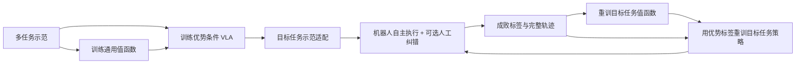

# 第 1 讲：π*₀.₆ 如何从真实执行经验中学习

> 主线依据：[π*₀.₆ 论文 v2 §III–VI、算法 1](https://arxiv.org/html/2511.14759v2)；[本地 PDF](../papers/pi-star-0.6_2511.14759v2.pdf)。先复习[π₀.₅ 的 FAST 与 flow 双输出](../../05-pi-series/notes/02-pi05-架构与训练.md)。本讲把**预训练得到的通用底座**、**目标任务示范适配**、**实机经验迭代**分开。

## 1. 为什么模仿学习到这里还不够

行为克隆只在示范者访问过的状态上学习动作。机器人部署后会访问自己的错误状态：咖啡杯偏了、衣服滑出夹爪、纸箱没立起来。即使示范动作质量高，模型也未必知道这些错误如何恢复；示范者的速度上限亦可能成为策略上限。π*₀.₆ 论文选择真实机器人反复尝试，记录完整失败和成功，必要时让遥操作专家接管纠错。奖励只需每次 episode 的成败标签，不要求逐帧人工打分。[论文 §I、IV](https://arxiv.org/html/2511.14759v2)

**核心目标**是让具有复杂连续动作分布的 flow VLA 用上这些带成败的轨迹。直接对 flow 模型运行常规 PPO 不方便：其动作 chunk 的精确 log likelihood 并不易计算，真实机器人收集严格 on-policy 样本也很贵。Recap（RL with Experience and Corrections via Advantage-conditioned Policies）选择先学值函数，再把“这个动作相对参考策略是否有利”作为条件喂给原有 VLA，用条件生成替代对 VLA 直接做策略梯度。[论文 §III–IV](https://arxiv.org/html/2511.14759v2)

*图 1：Recap 的批量迭代。每轮收集一批轨迹再更新值函数与策略；不是边执行边同步更新参数。* [论文算法 1、§VII](https://arxiv.org/html/2511.14759v2)

## 2. 底座 π₀.₆ 与星号的含义

π₀.₆ 相对 π₀.₅ 扩充多机器人预训练数据；VLM 改用 **Gemma 3 4B**，flow 动作专家增至 **860M** 参数，机器人阶段同时用离散 FAST 目标和连续 flow 目标，采用 Knowledge Insulation（KI）：动作专家可读取 VLM 激活，但连续动作损失的梯度不回流 VLM；VLM 主要由离散交叉熵监督。它仍有视觉/状态输入、语言任务和可生成的文字子任务；动作专家以 **50 Hz** 控制双臂的关节/夹爪，语言子任务低频更新。[论文 §V-A](https://arxiv.org/html/2511.14759v2)

π*₀.₆ 在这个底座上加入**二值优势指示器** $I_t$ 作为文字条件，例如 `Advantage: positive` 或 `Advantage: negative`。训练序列中它位于子任务文字之后、FAST 与连续动作之前。因此在论文的因子分解里，优势条件改变动作生成，子任务文字预测仍从原始任务和观察产生；不要误解为值函数直接输出下一段机器人动作。另有一套**独立值函数网络**，使用相似架构但较小的 **Gemma 3 670M** VLM 骨干，不与动作策略共享同一个输出头。[论文 §V-A–C](https://arxiv.org/html/2511.14759v2)

| 路径 | 输入/输出 | 用途 |
| --- | --- | --- |
| VLM/离散头 | 图像、状态、任务、子任务 → 文字及 FAST 动作 token | 高层语义和稳定的离散监督 |
| flow 专家 | VLM 激活、带噪动作、flow 时间、优势文字条件 → 连续动作速度场 | 生成连续动作 chunk |
| 独立 critic | 图像、任务等 → 201 个回报区间的概率 | 给数据中的动作估计优势；主要在训练/更新时使用 |

**不要把星号理解为“仅把 π₀.₆ 的输出筛选一下”**：论文既在大规模示范上预训练价值条件策略，也在目标任务的实机轨迹上迭代更新模型。训练阶段同时使用好、坏动作；执行时请求 `positive` 条件。[论文 §IV–V](https://arxiv.org/html/2511.14759v2)

## 3. 从一次成败标签得到逐时刻训练信号

论文的奖励是时间惩罚加失败惩罚。若成功终止，终止奖励为 0；失败终止，为 $-C_{\mathrm{fail}}$；其他每步为 $-1$。于是成功轨迹在 $t$ 的回报约为**负剩余步数**，成功越快值越高；失败轨迹值更低。跨任务训练时按任务最大长度归一化到大约 $(-1,0)$。这样一次 episode 级成败就可回填出每个时刻的监督目标，但目标质量依赖轨迹标签和时间定义。[论文式 (5)、§V-C](https://arxiv.org/html/2511.14759v2)

值函数不直接回归一个标量，而预测 $B=201$ 个离散回报 bin 的分布 $p_\phi(V\mid o_t,\ell)$，用实际后续回报落入的 bin 做交叉熵；期望值 $V_\phi(o_t,\ell)=\sum_b p_\phi(b\mid o_t,\ell)v_b$ 用于后续优势估计。分布式头保留回报不确定性/多峰形态，但**论文并未因此保证值函数在分布外状态正确**。它用 Monte Carlo 轨迹回报训练，不是一个可任意查询动作的 off-policy Q 函数。[论文 §IV-A、式 (1)](https://arxiv.org/html/2511.14759v2)

若以 $N$ 步跨度评估数据中动作序列，优势的教学写法是

$$\hat A_t=\sum_{j=t}^{t+N-1}r_j+V_\phi(o_{t+N},\ell)-V_\phi(o_t,\ell).$$

它衡量“实际经过这段动作后的结果”相对当前预期有多好。若在同一状态成功规避了抓取失败，后继值可能升高；若夹爪空抓，后继值下降。这里的估计与参考行为分布绑定；把多轮示范、旧策略、当前策略混合后，所谓 $V^{\pi_{\mathrm{ref}}}$ 事实上近似**数据混合行为**的价值，不能宣称是严格当前策略的无偏值。[论文 §III、IV-A/B](https://arxiv.org/html/2511.14759v2)

## 4. 为什么“条件化”能起到策略提取作用

令 $I=1$ 表示“动作优势超过任务阈值 $\epsilon_\ell$”。理想条件分布 $\pi_{\mathrm{ref}}(a\mid o,\ell,I=1)$ 偏向那些在同一观察条件下与改善相关的动作。论文由正则化策略改进与贝叶斯重写得到近似目标

$$\hat\pi(a\mid o,\ell)\propto\pi_{\mathrm{ref}}(a\mid o,\ell)\left[\frac{\pi_{\mathrm{ref}}(a\mid o,\ell,I=1)}{\pi_{\mathrm{ref}}(a\mid o,\ell)}\right]^\beta.$$

当 $\beta=1$，形式上成为 $\pi_{\mathrm{ref}}(a\mid o,\ell,I=1)$。它的直觉是：同一底层行为分布里，给“好动作”条件就提高其概率，同时受数据支持约束。**这是理想分布及论文中的推导；有限样本、估值误差、阈值二值化和函数逼近不会自动带来部署改进保证。**[论文 §III–IV-B、式 (2)](https://arxiv.org/html/2511.14759v2)

实现中对每条数据计算 $I_t=\mathbf1[\hat A_t>\epsilon_\ell]$，同时训练带 $I_t$ 和不带 $I_t$ 的动作条件分布；随机丢掉指示器，使两种路径都可用。离散 FAST/文字目标用交叉熵，连续动作仍用 flow matching。人的接管动作被**强制标作正优势**，这是“专家纠错较好”的工程假设，而不是 critic 严格算出的结论。预训练的任务阈值按论文取该任务值预测的 **30% 分位**；阈值用于权衡保守性与质量，不能简单等同零优势分界。[论文 §IV-B、V-B/D](https://arxiv.org/html/2511.14759v2)

这种设计与 AWR 不同：AWR 用优势对样本加权，低优势轨迹贡献减小；Recap 则让低质量数据仍训练 `negative`/无指示器分支，正条件策略学习从数据里区分质量。与 PPO 比，它无需在每个连续 chunk 上直接获取精确策略比值。默认推理取正条件，论文有少量 classifier-free guidance（CFG）实验以 $\beta>1$ 加强条件，但过强引导可导致激进行为；**不能把 CFG 的增益当作默认 Recap 结果**。[论文 §IV-B、VI-B/C、附录 A-E](https://arxiv.org/html/2511.14759v2)

## 5. 完整训练程序与容易混淆的细节

1. **多任务预训练**：先用大量跨机器人示范训练 critic，再用其估出的优势指标训练通用 π*₀.₆。预训练已有“offline RL 风格”的条件学习，星号不是等到目标任务才出现。
2. **目标任务 SFT**：收集该任务示范，将这些示范的 $I$ 固定为 True，产生初始目标任务策略。
3. **实机采集**：让策略自主做任务；部分尝试由专家监视和纠错。保存完整轨迹及成败，失败也有信息价值。
4. **每轮重新估值并训练**：对累积数据微调值函数、重新计算动作指示器，再训练目标任务策略。论文实现中每轮从各自的**预训练 checkpoint**出发而非接上一轮权重，旨在减少迭代漂移。[论文算法 1、§V-D](https://arxiv.org/html/2511.14759v2)

这叫**迭代离线更新**：收集时用固定策略，数据入库后再训练。自主轨迹可来自旧策略，故具有 off-policy 性质；论文所用价值估计又是数据回报的 Monte Carlo 估计，而非严格的 off-policy 校正 Q 学习。读到“RL”时要看清它具体指奖励、值函数、优势条件和批量迭代四层。[论文 §IV-A/B、VII](https://arxiv.org/html/2511.14759v2)

## 6. 实验给出的证据及其边界

评测含做 espresso、叠衣服、组装纸箱等涉及液体、软物体与多阶段控制的任务。论文比较监督 π₀.₆、仅离线 RL 预训练、再加目标任务 SFT、以及完整 Recap；指标有**成功率**与**每小时成功完成次数（throughput）**。后者同时受速度和成功率影响：提高 throughput 不一定代表二值成功率同幅提高。对多样衣物和 espresso，实机迭代相对“离线 RL + SFT”将 throughput 提升到两倍以上，失败比例约减半；简单衣物任务成功率已接近上限，主要改善速度。[论文 §VI-C、图 7–8](https://arxiv.org/html/2511.14759v2)

对衣物和箱子进行两轮迭代，箱子任务成功率继续提升，长任务需要更多经验；论文也在衣物任务用同一批数据比较 AWR 与 PPO，Recap throughput 更高。一个特定“衣领朝上且居中”的失败模式，通过每轮 600 条自主轨迹、两轮训练达到 97% 成功率；这是**针对该初始化与评分规则**的结果，不能当成一般零样本成功率。[论文 §VI-C、图 9–12](https://arxiv.org/html/2511.14759v2)

**局限**：仍需人工成败标注、可选接管和场景重置；探索主要来自现有策略随机性与人为纠错；critic 可误判；真实任务分布和训练场景范围有限。需要判断因果时，应分别做“无奖励优势”“无接管”“无旧策略轨迹”“只选成功轨迹”等消融，而不只看最终视频。[论文 §VII](https://arxiv.org/html/2511.14759v2)

## 7. 读完立即自检

1. **只有终局成败，如何训练每时刻 critic？** 用时间惩罚与失败惩罚得到每时刻到终点的回报，离散成 201 bin 做交叉熵；这是轨迹回报监督。
2. **为什么负样本也进入策略训练？** 它提供失败状态、动作及负条件的分布信息；正条件在执行时被选择。负样本过多仍可能产生估值与数据混合问题。
3. **人工接管与 RL 各承担什么？** 接管为严重错误提供纠正/探索路径；自主结果和时间反馈帮助优化细致质量与速度。
4. **π*₀.₆ 是否在测试时每步调用 critic？** 主方法是训练 critic 产生优势标签，再以正条件执行已训练策略；不可将其描述成在线 MPC 或每步动作 rerank。
