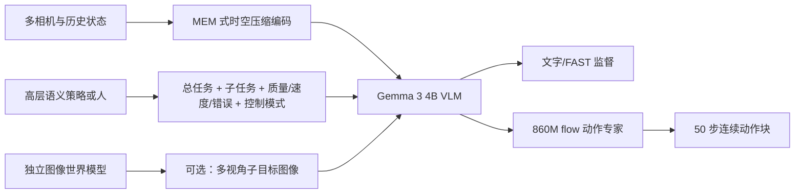
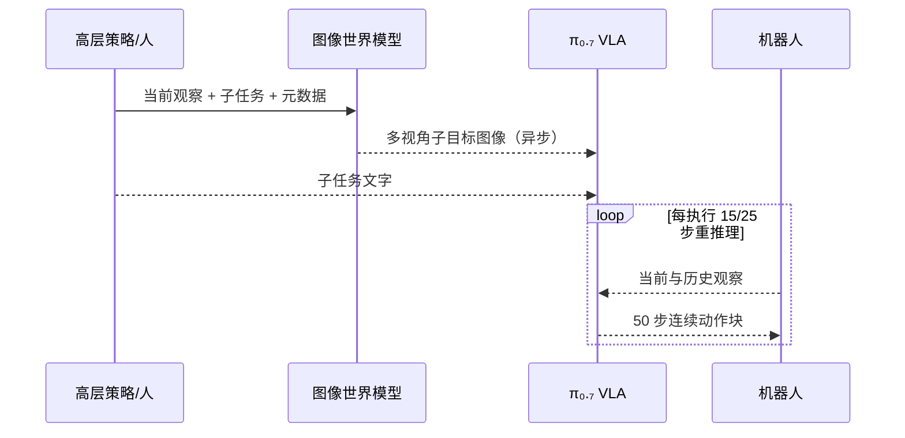

# 第 2 讲：π₀.₇ 的可引导通用策略

> 依据 [π₀.₇ 论文 v2 §III–IX、附录 A](https://arxiv.org/html/2604.15483v2)与[本地 PDF](../papers/pi-0.7_2604.15483v2.pdf)。本讲的关键是区分**低层 VLA 本身**、**高层子任务策略**和**产生图像子目标的独立世界模型**。π₀.₇ 与[π*₀.₆](./01-Recap与pi-star-06.md)有关联，但研究问题不同。

## 1. 研究命题：让一个通用策略容纳不同质量、不同本体与不同目标

若把优秀示范、笨拙示范、失败轨迹、旧模型自主执行轨迹混在一起，普通行为克隆学到的是混合分布；在同一视觉状态和任务文字下，它可能输出迟疑、绕路甚至失败动作。π₀.₇ 的做法是给训练样本增加足以解释**执行方式与质量**的上下文 $\mathcal C_t$，使模型学习 $p(A_t\mid o_{t-T:t},\mathcal C_t)$。部署时再指定想要的速度、质量、控制模式和可选子目标，而不必为每一项熟悉任务分别后训练。[论文 §III–V](https://arxiv.org/html/2604.15483v2)

$$\mathcal C_t=\{\ell_t,\hat\ell_t,g_t,m_t,c_t\},$$

其中 $\ell_t$ 是总任务，$\hat\ell_t$ 是当前语义子任务，$g_t$ 是未来场景图像，$m_t$ 是 episode 速度/质量/错误元数据，$c_t$ 是关节或末端控制模式。训练中某些分量随机缺失，运行时才可灵活组合；这并不意味着所有组合都被同等充分地评测。[论文 §V](https://arxiv.org/html/2604.15483v2)

*图 1：概念级架构。图像世界模型输出目标图像；真正输出机器人动作的是 VLA 的 flow 专家。* [论文图 2–3、§IV–VI](https://arxiv.org/html/2604.15483v2)

## 2. 模型架构逐层拆解

**视觉历史与本体状态。** 模型约 5B 参数：Gemma 3 4B VLM（含约 400M 视觉编码器）、860M Transformer 动作专家，并继承 π₀.₆-MEM 的历史编码思想。最多四个观察相机（前、双腕、可选后视），每相机最多六帧历史；还可接最多三个相机的目标图像。图像先缩放到 $448\times448$；历史按 1 秒跨度取样，经时空压缩后每一路历史最终占用接近单帧的固定 token 数，避免历史长度直接线性推高 VLM 上下文长度。与 π₀.₆ 将本体状态离散成文字不同，π₀.₇ 将每个历史状态做**线性投影**成骨干宽度的 token。训练时历史帧整体以 0.3 概率丢弃，后视图也有 0.3 丢弃概率。[论文 §IV、VI-B](https://arxiv.org/html/2604.15483v2)

**注意力结构。** 观察图像 token 内部双向注意；目标图像 token 内部双向注意，且可读观察；后续文本按因果顺序读取前缀。动作专家的 50 个动作 token 彼此双向可见，可读 VLM 激活；它们形成一个完整动作块的联合去噪，不是逐动作自回归。连续 flow 时间经 adaptive RMSNorm 注入专家层。具体 mask 请核对论文附录图，切勿把“目标图像可读观察”误写成“目标图像由 VLA 自己先生成”。[论文 §VI-B、附录 A-B](https://arxiv.org/html/2604.15483v2)

**双重动作监督和 KI。** 骨干仍用 FAST 离散动作 token 的交叉熵稳定训练；专家用 flow matching 预测连续动作，能读骨干表示，但动作专家梯度被 stop-gradient 阻断，不直接改写骨干。这与 π₀.₆ 的 Knowledge Insulation 训练配方相通；论文将动作似然写为目标便于解释，连续 flow 部分是近似目标而非显式闭式 log likelihood。[论文 §III、VI-B](https://arxiv.org/html/2604.15483v2)

**实时拼接。** 一次生成 50 步 chunk，部署只执行其中 15 或 25 步就重新推理。训练还模拟 0–12 步推理延迟，使用 RTC（real-time chunking）条件帮助新旧 chunk 平滑衔接；50 Hz 机器人中 12 步对应 240 ms。不要把 50 步 chunk、执行步数和去噪次数混在一起：论文部署用 **5 次去噪**生成一个 chunk。[论文 §VI-B、VII](https://arxiv.org/html/2604.15483v2)

## 3. 丰富提示逐项看：具体标注与反事实风险

| 上下文 | 来源与监督 | 部署作用 | 失效风险 |
| --- | --- | --- | --- |
| 总任务 $\ell$ | 人给任务 | 指定终局语义 | 抽象任务不足以指定下一步 |
| 子任务 $\hat\ell$ | 人工分段描述；高层策略或真人运行时提供 | 指定当前策略，如“拉开冰箱门” | 错误子任务会把低层引向错误目标 |
| 子目标图像 $g$ | 训练时真实未来帧，也用模型生成图像；运行时由世界模型给出 | 给抓取位置/物体配置更细视觉目标 | 生成图像幻觉、视角错位和训练/测试分布差 |
| 速度/质量/错误元数据 $m$ | 时长分桶、人工质量分和错误段标签 | 从混合质量数据中请求较快较好的行为 | 标签主观，速度与质量可能冲突 |
| 控制模式 $c$ | 关节动作或末端动作标识 | 指定目标机器人控制接口 | 名称匹配不代表动力学和安全接口匹配 |

速度以 **500 步宽度分桶**（如 1750–2250 归成 2000），质量为 **1–5 分**，错误是动作段级人工粗标注。训练中目标图像只加在 **25% 样本**；有图像的样本再以 30% 概率丢子任务文字。episode 元数据整体 15% 概率丢弃，各分量另有 5% 丢弃；控制模式不丢。这个“条件 dropout”让同一网络既能用丰富提示，也能在缺某个提示时运行，并支持元数据上的 CFG。[论文 §V-C–E](https://arxiv.org/html/2604.15483v2)

注意条件变量不是魔法质量开关：模型能利用它，是因为训练集中同一/相近任务确有不同速度、质量、失败方式的动作轨迹，条件与行为之间可学习。部署元数据设质量 5、无错误，速度取该任务 episode 时长**第 15 百分位**，等于要求快于多数训练轨迹；还可对元数据做中等强度 CFG。若数据没覆盖某种高质量行为，提示不会凭空创造物理技能。[论文 §V-C、VII](https://arxiv.org/html/2604.15483v2)

## 4. 子目标图像与世界模型的接口

语句“打开冰箱门”留下抓哪边、门应开到哪一角度等几何歧义。论文使用多视角未来图像 $g_t^*$ 描绘近未来完成子任务时的状态。独立世界模型以当前观察、子任务文字和元数据为条件生成这些图像；它基于 **BAGEL** 图像理解/编辑/生成模型初始化，并用机器人分段的终点帧作真实目标，还混入网页、第一视角人类视频等数据。VLA 训练时既看真实未来图，也看世界模型生成图，减轻真实目标与推理生成图之间的分布差。[论文 §V-B、VI-C](https://arxiv.org/html/2604.15483v2)

训练时用“未来真帧”是**训练监督**，推理时绝不能读取尚未发生的真实未来。运行时图像可由世界模型异步生成，每当语义子任务改变或距上次目标图已过 4 秒时更新。高层子任务可以由同架构训练的语义策略给出，或由人类逐步口头指导；VLA 持续读取最新可用子任务和目标图像。这里的世界模型侧重**条件图像子目标生成**，论文没有把 VLA 变成基于完整物理 rollout 的搜索式规划器；生成图的动力学可达性也不能先验保证。[论文 §IV–V、VII](https://arxiv.org/html/2604.15483v2)

*图 2：运行时信息流。异步模型各自更新时间不同；VLA 使用最近可用条件。* [论文算法 1](https://arxiv.org/html/2604.15483v2)

## 5. 数据、训练目标与“继承专家”的准确说法

训练数据包含多平台多场景示范、低质量示范与失败、自主评测轨迹、人工接管、开放机器人数据，以及人类第一视角视频、网页视觉问答/定位/属性、文本和视频描述任务。作者特别把 **π*₀.₆ 的 RL 执行数据**作为 π₀.₇ 的训练数据之一，使通用模型从一些目标任务专家的行为中吸收能力。论文说明一般化评测任务中的自主执行数据从训练集中排除；然而“某任务完全未见”仍难严格定义，因为相关动作片段可能出现在其他任务中。[论文 §VI-A、X](https://arxiv.org/html/2604.15483v2)

所以π₀.₇ 的所谓“开箱”是**这个通用 checkpoint 不再为那些熟悉的高难任务各自后训练**；并非这些任务或其专家轨迹对其预训练从未可见。它与 π*₀.₆ 的关系是“主干承接 π₀.₆-MEM、训练数据吸收部分专家经验”，不是单纯从某个任务专用 π*₀.₆ 权重继续微调。[论文 §IV、VI-A、IX-A](https://arxiv.org/html/2604.15483v2)

## 6. 实验怎样验证这些设计

**高难熟悉任务。** 通用 π₀.₇ 无任务专用后训练，在 espresso、纸箱、衣物等任务上与任务专用 π*₀.₆ 专家比较；论文报告接近或在部分任务的 throughput 上超过专家。移除自主评测数据或移除元数据的消融均降低相关任务表现，因此“更多数据”和“质量上下文”共同重要，不能只把增益归于骨干尺寸。[论文 §IX-A、图 6–7](https://arxiv.org/html/2604.15483v2)

**语言与组合。** 对未专门收集过的新长任务，人可以实时给详细步骤；之后用口头指导轨迹训练高层子任务策略，实现不再需要实时指导的运行。这与直接只给一句模糊总任务的 zero-shot 水平是两种条件。另有较短新任务可直接按语言或目标图像完成。[论文 §IX-B/D、图 14–17](https://arxiv.org/html/2604.15483v2)

**跨本体。** 某些任务的训练机器人和测试机器人不同；UR5e 叠衣物没有该机器人上的叠衣训练，策略改用符合新机械臂位置的垂直抓取。世界模型子目标在该设置改善表现。但这是**有 UR5e 平台其他训练数据的任务迁移**，而非从未见过 UR5e 形态与控制接口。[论文 §IX-C、图 12–13](https://arxiv.org/html/2604.15483v2)

**混合质量和多样性。** 衣物任务按质量/速度取 top 30%、50%、80%、全部数据，分别有/无元数据训练；无元数据时加入低质量数据可退化，有元数据则随数据变多继续改善。另把最高任务多样性的 20% 与随机 20% 分别移除：前者对未见短任务伤害更大，表明量相同时任务多样性有额外作用。论文讨论承认新任务/新本体组合成功率常在 **60–80%**，低于熟悉任务；“emergent”是作者对这些有限实验的解释，不等于无边界普适性。[论文 §IX-E、X、图 18](https://arxiv.org/html/2604.15483v2)

## 7. 读完立即自检

1. **为什么目标图像只在部分训练样本出现？** 目标图使动作预测容易变成逆动力学问题，过度依赖会削弱无图像时的策略；dropout 保留多种提示模式。
2. **质量 5 与 `mistake=false` 是否是奖励函数？** 不是。它们是训练轨迹的条件标签；该模型主要通过条件行为建模与混合数据学习，而非对每条动作做 Recap 优势更新。
3. **世界模型输出动作吗？** 不；它给近未来场景图像。动作由 VLA 的 flow 专家生成。
4. **“无后训练”与“无数据”有何区别？** 前者指该通用 checkpoint 无需再为这些熟悉任务单独训练，后者涉及训练集排除，须看每个实验的具体任务/场景/本体划分。
