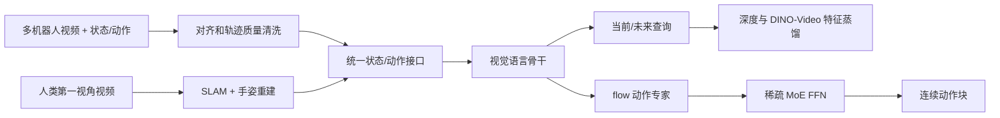
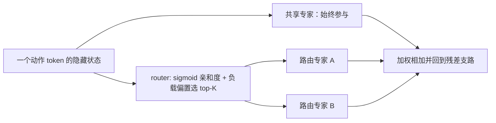

# 第 1 讲：LingBot-VLA 2.0 的数据、动作空间和模型架构

> 主资料：[LingBot-VLA 2.0 论文 v1 §3–4](https://arxiv.org/html/2607.06403v1)与[本地 PDF](../papers/LingBot_VLA_2_0_2607.06403v1.pdf)。1.0 背景依据[原论文 v4](https://arxiv.org/html/2601.18692v4)。阅读时可以把[π₀ 的 flow 动作专家](../../../05-pi-series/notes/01-pi0-架构与训练.md)与[跨本体数据基础](../../../02-cross-embodiment/notes/00-跨本体学习基础.md)放在手边。

## 1. 系列脉络：1.0 解决什么，2.0 加了什么

LingBot-VLA 1.0 的中心问题是：**真实双臂机器人数据扩大以后，通用 VLA 的预训练和任务适配怎样变化？**它使用约 **20,000 小时**、**9 种双臂配置**的真实机器人数据。模型基于 Qwen2.5-VL 视觉语言骨干与独立动作专家的 Mixture-of-Transformers（MoT）式结构，通过层间共享注意力让视觉语言表示引导 flow matching 连续动作块；训练动作块长度为 **50**。其重点还有高效训练工程与 GM-100 大规模实机评测。论文的评测含每任务后训练，故“通用预训练能力”与“适配后的结果”不能混说。[1.0 §4–5](https://arxiv.org/html/2601.18692v4)

2.0 的题目是 *From Foundation to Application*。它不是只把 1.0 的模型扩大，而是同时改变三类约束：**数据覆盖**从双臂为主扩展到更多本体与人类第一视角视频；**动作接口**要描述手臂、灵巧手、腰、头和移动底座；**训练目标**加入当前与未来的几何/视频特征监督。方法上还把动作专家的 FFN 改为 token 级稀疏 MoE。[2.0 摘要、§2–4](https://arxiv.org/html/2607.06403v1)

| 维度 | LingBot-VLA 1.0 | LingBot-VLA 2.0 |
| --- | --- | --- |
| 预训练主要数据 | 约 20,000 小时真实机器人，9 种双臂配置 | 约 50,000 小时机器人、20 种配置，另约 10,000 小时人类第一视角视频 |
| 视觉语言骨干 | Qwen2.5-VL 路线 | 官方发布的 2.0 权重/配置采用 Qwen3-VL-4B 路线；论文重点讨论系统配方 |
| 动作建模 | MoT 式视觉语言骨干 + flow 专家 | 扩展身体部位表示，动作专家内部引入稀疏 MoE |
| 几何/时间监督 | 当前视觉查询对齐深度表示 | 当前与未来查询分别对齐深度和 DINO-Video 表示 |
| 主要研究侧重 | 大规模双臂预训练及后训练效率 | 多本体、全身动作与预测性表示的实用效果 |

表中 2.0 骨干的具体发布配置来自[官方代码仓库](https://github.com/Robbyant/lingbot-vla-v2)，会随检查点与代码版本变化；论文主结论依赖的是上述数据、动作与辅助监督设计。不要把 1.0 的 **MoT** 和 2.0 的 **MoE** 当作同一个概念：MoT 指视觉语言与动作通路之间的分路/交互；MoE 指动作专家**内部 FFN**按 token 稀疏选子专家。[1.0 §4](https://arxiv.org/html/2601.18692v4) · [2.0 §4.1](https://arxiv.org/html/2607.06403v1)

*图 1：2.0 的教学抽象。两路 teacher 在训练时给表示监督；部署时主路径仍是观察和语言到连续动作。* [2.0 图 1、§3–4](https://arxiv.org/html/2607.06403v1)

## 2. 数据规模背后：不是把 60,000 小时直接拼接

**机器人轨迹。** 论文称原始池约 90,000 小时，过滤成约 **50,000 小时**，覆盖 20 种配置。过滤不仅看画面清晰度，也检查状态/动作的速度、加速度、jerk，去掉异常不连续；若某条 episode 超过 95% 的时间几乎无状态或动作变化，也丢掉。为发现视频与本体状态错位，作者用 URDF 将机器人状态投影到图像平面、回放并人工核对；模糊、遮挡、丢帧、多视角不同步的数据也筛掉。原因很直接：若图像是 $t$ 时刻、动作标签其实是 $t+\Delta$，再大的模型也会学到错误的条件控制。[2.0 §3.1.1、图 3](https://arxiv.org/html/2607.06403v1)

**第一视角人类视频。** 原始池约 20,000 小时，保留约 **10,000 小时**。先用 VLM 排除第三人称、只是走路、没有明确手物交互、画面中突出出现非操作者手等视频。对无动作标注的视频用第一视角 SLAM 恢复相机轨迹、手姿估计恢复 MANO 手部参数，再将手运动转到世界坐标；也过滤有效手姿比例不足 20%、SLAM 不稳、手运动突变或违反人体运动范围的片段。对于已有手轨迹标签的数据，做时间对齐与坐标标准化。[2.0 §3.1.2](https://arxiv.org/html/2607.06403v1)

人类手轨迹储存在世界系，训练抽样时转到当前相机系。若 $p^W_\tau$ 为未来手位置，$T^{C_t\leftarrow W}$ 为当前时刻世界到相机变换，则

$$p^{C_t}_\tau=T^{C_t\leftarrow W}p^W_\tau.$$

这个定义让目标动作相对**当前相机视角**表示，减少佩戴式相机自运动对学习的干扰。但第一视角手运动仍与机器人关节控制不同：手部重建有噪声，人体可达空间、动力学和末端执行器都不相同，因此它更多是扩充交互/动作先验，不等于可以原样下发给机器人。[2.0 §3.1.2、式 (1)](https://arxiv.org/html/2607.06403v1)

**语言标注。** 论文用 Qwen3.6-27B 给片段自动分子任务，并产生简短的子任务指令和整段任务指令。闭集共有 **15 个操作动词**（move、fold、pour、wipe 等）和 **3 个辅助标签**（transit、idle、other），但主要对象是开放词表。切分时一次抓取、搬运、释放通常合成同一子任务，换物体、换动作类型或持续停顿才切边界。图 5 显示 `move` 和 `transit` 出现频率极高，长尾的 `cut/fold/stir` 很少；这意味着只报告数据总小时数无法说明精细技能覆盖。自动标注效率高，但语义边界错误仍可能成为训练噪声。[2.0 §3.2、表 2、图 5](https://arxiv.org/html/2607.06403v1)

## 3. 55 维统一表示：维度统一不代表语义统一

论文把机器人状态与动作映射到 **55 维**规范向量：14 维手臂关节、14 维末端位姿、2 维夹爪、12 维灵巧手关节、4 维腰、2 维头、3 维移动信号，另 **4 维保留**。末端位姿每侧 7 维是 XYZ 加旋转四元数。单臂、无灵巧手或无移动底座的平台对应字段填充；不同平台实际总自由度、频率仍不一样，见原论文表 1。[2.0 §3.1.3、图 4、表 1](https://arxiv.org/html/2607.06403v1)

| 部分 | 维数 | 核对点 |
| --- | ---: | --- |
| 双臂关节最大槽位 | 14 | 不是所有机器人都有两条 7 DoF 手臂 |
| 双臂末端位姿最大槽位 | 14 | 每侧位置 3 + 四元数 4，坐标系与旋转约定须一致 |
| 双夹爪 | 2 | 灵巧手平台另占手关节槽位 |
| 灵巧手关节 | 12 | 未提供的字段填充，不能被误当可控关节 |
| 腰、头、移动 | 4 + 2 + 3 | 控制频率、模式和动力学不因对齐维度而相同 |
| 保留 | 4 | 论文未把它们当已训练可控身体部位 |

加总是 $14+14+2+12+4+2+3+4=55$。**仅补零并不足以跨本体迁移**：要核对动作模式是关节目标、末端位姿还是相对增量；关节顺序、单位、坐标系、夹爪开合定义、归一化统计和有效维度 mask 也须匹配。用户部署模型时，官方[机器人配置和数据文档](https://github.com/Robbyant/lingbot-vla-v2)比“55 维”这一个数字更关键。[2.0 §3.1.3](https://arxiv.org/html/2607.06403v1)

## 4. 动作专家 MoE：路由发生在每个动作 token

2.0 将动作专家 Transformer 块中的 FFN 换为稀疏 MoE。给第 $\ell$ 层动作 token 表示 $u_{\ell,t}$，输出是一个**始终激活的共享专家**加上 top-$K$ 被路由专家的加权和：

$$m_\ell(u)=E^{(s)}_\ell(u)+\lambda\sum_{j\in\mathcal R(u)}g_{\ell,j}(u)E^{(r)}_{\ell,j}(u).$$

每个子专家是较窄的 SwiGLU MLP。路由 logit $z_j=u^\top e_j$ 经 sigmoid 得独立亲和度 $s_j$；选择专家时用 $s_j+b_j$ 排序，混合权重却用**未加偏置**的 $s_j$ 在已选集合内归一化。偏置 $b_j$ 随各专家被选 token 数相对平均负载的偏差更新：过载时下降、欠载时上升。这种“无辅助损失”负载均衡意在避免平衡项直接干扰动作回归目标。[2.0 §4.1、式 (2)–(8)](https://arxiv.org/html/2607.06403v1)

*图 2：示意 top-K=2，并不声明论文所有配置都固定为 2。路由由 token 特征决定，论文没有预先规定“某专家专管某机器人/某身体部位”。* [2.0 §4.1](https://arxiv.org/html/2607.06403v1)

论文图 7 比较了**激活参数量相近**的 dense 0.6B 与总量更大但单次激活约 0.6B 的 MoE 1.6B，后者训练损失和 GM-100 验证动作误差更低。这支持计算预算下 MoE 的优化/表示效率，尚不能仅凭验证动作误差推出真实任务完成率同幅提升，也不能把 MoE 单独归因为表 5 的全部增益。[2.0 §4.1、图 7](https://arxiv.org/html/2607.06403v1)

## 5. 双查询蒸馏：预测的是教师特征，不是未来 RGB

2.0 在视觉/文字 token 后加入两个可学习查询 $Q_t$、$Q_{t+T}$。前者对应当前观察，后者对应动作块末端的未来观察。训练时有两类教师目标：**LingBot-Depth** 的几何深度表征 $D_t,D_{t+T}$；**DINO-Video** 的因果视频表征 $Z_t,Z_{t+T}$。两路投影后的目标为

$$\mathcal L_{\mathrm{depth}}=\|P_D(Q_t)-D_t\|_1+\|P_D(Q_{t+T})-D_{t+T}\|_1,$$

$$\mathcal L_{\mathrm{video}}=\|P_Z(Q_t)-Z_t\|_F^2+\|P_Z(Q_{t+T})-Z_{t+T}\|_F^2.$$

其学习压力是“仅从当前可见条件与动作相关上下文中形成兼具当前几何和未来变化的信息表示”。未来帧只用于**训练时抽取监督目标**；部署时并不知道真实未来。DINO-Video 从 DINOv3 初始化，加入分块因果时间注意力和 3D-RoPE，在约 **500 万视频片段**上学习；视频教师的特征在时间 $t$ 只看过去/当前帧。论文在 LARYBench 的四项指标中三项最好，但那是教师模型自身的表征评测，不能替代 VLA 的机器人成功率消融。[2.0 §4.2、表 3](https://arxiv.org/html/2607.06403v1)

**与世界模型的关系要精确。** π₀.₇ 使用独立图像生成模型在运行时给 VLA 一个显式子目标图；LingBot-VLA 2.0 训练内部查询去预测未来的**潜在深度/视频特征**。前者是运行时额外条件，后者主要是表示训练辅助目标；二者都引入未来信息，但论文没有把 LingBot 的查询拿来枚举动作、滚动模拟和搜索规划。[π₀.₇ §V-B](https://arxiv.org/html/2604.15483v2) · [LingBot 2.0 §4.2](https://arxiv.org/html/2607.06403v1)

## 6. 读完立即自检

1. **60,000 小时能否直接解释成功率？** 不能；数据经过不同的筛选/重建，且动作接口、骨干、MoE、辅助目标同时变化，尚需逐因素对照。
2. **MoT 与 MoE 的层次分别是什么？** 前者处理视觉语言与动作通路之间的结构关系；后者是动作通路内部 FFN 的稀疏容量分配。
3. **双查询是否依赖真实未来帧推理？** 不；真实未来帧是训练标签，推理时模型根据当前条件形成预测表示。
4. **统一 55 维之后，可否把灵巧手权重直接接到任意机器人？** 不；接口语义、有效维、控制频率与归一化必须对齐，且论文没有证明任意新本体零样本可靠。
