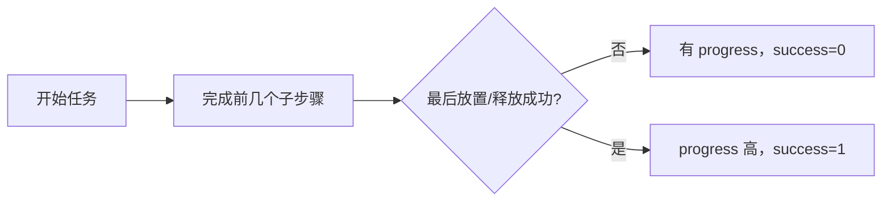

# 第 2 讲：LingBot-VLA 2.0 的实验、消融和证据边界

> 主资料：[2.0 论文 v1 §5–6](https://arxiv.org/html/2607.06403v1)、[本地 PDF](../papers/LingBot_VLA_2_0_2607.06403v1.pdf)。读这讲前先看[架构与数据](./01-模型架构与数据.md)，尤其要分清预训练覆盖的 **20 种配置** 与真正定量评测的平台数。

## 1. 先分清三个实验层级

1. **GM-100 双臂通用设置**：在 AgileX Cobot Magic 与 Galaxea R1 Pro 两个平台，各测九项任务。每个本体的单个策略联合训练这些任务，而非每项任务单独一套策略；报告部分进度分数（progress）与完整成功率（success）。
2. **移动操作长任务**：Astribot S1 的冰箱物品整理、Cobot Magic-ARX X5 的灶台清洁，各比较训练域内与论文定义的 OOD 设置；每个任务/设置 **15 次独立试验**。
3. **组件消融/感知检查**：图 7 检查 MoE 与 dense 模型在损失/验证动作误差上的差异；图 10–12 在四项真机任务上研究动作目标、动作空间、归一化、回归损失；图 13 展示双查询蒸馏的深度/DINO 特征预测。[2.0 §4.1、§5–6](https://arxiv.org/html/2607.06403v1)

把“20 种机器人参与预训练”写成“20 种机器人全部完成 GM-100 测试”是错误的；也不要把上述三个层级的指标拼成一个大表直接排名。

## 2. 双臂 GM-100：均值提高，任务差异很大

论文表 5 中，两个平台的九任务均值为：

| 平台 | GR00T N1.7 | π₀.₅ | LingBot 1.0 | LingBot 2.0 |
| --- | ---: | ---: | ---: | ---: |
| AgileX Cobot Magic | 36.3 / 17.8 | 59.1 / 32.2 | 58.2 / 30.0 | **66.2 / 34.4** |
| Galaxea R1 Pro | 16.4 / 5.6 | 27.4 / 8.9 | 32.7 / 15.6 | **34.6 / 15.6** |

*每格依次为 progress / success（%）。* [2.0 表 5](https://arxiv.org/html/2607.06403v1)

**Progress** 由子步骤 rubric 的部分得分组成，例如从微波炉取碗要开门、拿碗、放桌面、关门，各步骤有权重；**success** 要求整段符合成功标准。两者差距大说明策略常推进到中间但末端抓取、放置或收尾不稳。表 5 还显示单项退步：AgileX 的 block sorting 中 2.0 为 **56.8 / 0.0**，低于 π₀.₅ 的 **90.4 / 60.0**；Galaxea 的取碗任务 2.0 为 **65.0 / 30.0**，低于 1.0 的 **97.5 / 100.0**。因此结论应是“两个平台均值有优势”，不是“每项任务都最好”。[2.0 §5.1–5.2、表 4–5](https://arxiv.org/html/2607.06403v1)

*图 1：两种指标的区别。图只说明评分结构，具体各任务权重请看论文表 4。* [2.0 §5.1](https://arxiv.org/html/2607.06403v1)

## 3. 移动操作与 OOD：看清扰动究竟是什么

| 本体/任务 | 设置 | LingBot 2.0 | π₀.₅ |
| --- | --- | ---: | ---: |
| Astribot S1：物品放入冰箱 | 训练域内 | **77.1 / 60.0** | 65.3 / 46.7 |
| Astribot S1：物品放入冰箱 | OOD | **37.0 / 13.3** | 30.3 / 6.7 |
| Cobot Magic-ARX X5：清洁灶台 | 训练域内 | **84.3 / 66.7** | 79.9 / 60.0 |
| Cobot Magic-ARX X5：清洁灶台 | OOD | **67.5 / 40.0** | 62.5 / 33.3 |

*每格依次为 progress / success（%），每对任务和设置各 15 次。* [2.0 表 6、§5.3](https://arxiv.org/html/2607.06403v1)

这里的 OOD **不是任意新厨房**：两项任务都把机器人初始位置在前后左右约 $\pm10\,$cm 范围内扰动；冰箱任务还把两种水果与饮料瓶换成训练未见的物体类别，灶台任务主要改变初始位姿。冰箱 OOD 成功率仅 **13.3%**，虽高于 π₀.₅ 的 6.7%，但仍提示长序列和物体/位姿同时变化的困难。论文表 7 将冰箱任务拆成 11 个步骤、灶台任务拆成 7 个步骤，可用图 8 的逐步骤分数定位崩溃阶段。[2.0 §5.3、图 8–9、表 6–7](https://arxiv.org/html/2607.06403v1)

## 4. 消融的精确信息：动作表示常比“更大模型”直觉重要

论文 §6.1 在四个 GM-100 真机任务上比较下列设计，图 10 阴影柱是四任务平均成功率：

| 改动 | 平均成功率 | 可解释的结论 |
| --- | ---: | --- |
| 绝对关节位置 vs 相对关节增量 | 33.7 → **55.0** | 局部增量分布更集中，较易拟合；并非所有任务/机器人均必优 |
| 关节空间 vs 末端 EEF 空间 | **55.0** vs **56.0** | 平均接近，任务偏好显著不同 |
| MinMax / Q01–Q99 / MeanStd 归一化 | 47.5 / 47.4 / **55.0** | 本实验中 MeanStd 保留更大有效动态范围 |
| L1 vs L2 损失 | 46.4 → **55.0** | 多数所测任务 L2 更好，但 ketchup 任务 L1 反而更好 |

相对关节增量把目标从“全局姿态”变成“局部修正”，论文四任务汇总的原始标准差从约 **0.80** 降到 **0.28**。但末端 EEF 与 joint 的平均差很小：barcode scan 的 joint **58.7%** 对 EEF **24.0%**；squeeze ketchup 的 EEF **81.7%** 对 joint **41.7%**。这是身体几何、任务接触和训练分布共同作用，不可只凭动作空间维数挑方案。[2.0 §6.1、图 10–12](https://arxiv.org/html/2607.06403v1)

Q01–Q99 方案在论文所测实现**没有裁剪**；其表现差不应说成“1%/99% 截断丢了信息”。作者观察到 MinMax 与 Q01–Q99 把大部分相对动作压在较小区间，MeanStd 后的数据分布更展开，部分大幅修正仍被保留。归一化的“好坏”与动作目标、flow 数值范围和控制接口绑定，不等于 MeanStd 可跨数据集无条件复制。[2.0 §6.1、图 12](https://arxiv.org/html/2607.06403v1)

## 5. MoE 与未来蒸馏分别被验证到哪一步

**MoE。** 论文图 7 在相近激活参数量下比较 dense 与 MoE：MoE 的训练损失和 GM-100 验证动作误差更低，支持容量分配设计。但这是预训练优化和离线动作误差层面的证据；若要归因实机成功率，需要同数据、同骨干、同训练预算的 dense/MoE 真机消融。[2.0 §4.1、图 7](https://arxiv.org/html/2607.06403v1)

**DINO-Video 教师。** 表 3 是教师在 LARYBench 的表征评测，四项中三项最佳。图 13 显示 VLA 的当前/未来查询可以预测深度和 DINO-Video 的可视化特征，这是表示蒸馏**确实学到了某种教师目标**的检查。论文未在这两张图里给出“只去掉未来查询”“只去掉深度教师”“只去掉视频教师”后机器人成功率分别下降多少。因此“未来信息提高操作性能”作为整体设计解释合理，但各辅助目标的独立因果贡献仍是开放问题。[2.0 §4.2、§6.2、表 3、图 13](https://arxiv.org/html/2607.06403v1)

**组件同时变化。** 2.0 相对 1.0 不仅多了 MoE 和双查询，也扩大并清洗了数据、改了动作空间，还换了更强骨干。表 5 的跨版本增益不能简单分配为“X% 来自未来蒸馏，Y% 来自 MoE”。这是一份系统性技术报告，不是完整的逐因素正交实验。[2.0 §1–6](https://arxiv.org/html/2607.06403v1)

## 6. 与已有主线的研究坐标

| 比较点 | LingBot-VLA 2.0 | 已学主线中的相邻工作 |
| --- | --- | --- |
| 多本体 | 清洗约 50k 小时、20 配置，55 维分部位接口 | [Open X-Embodiment/Octo](../../../02-cross-embodiment/README.md)聚焦跨本体数据和通用策略 |
| 连续动作 | flow 专家，内部稀疏 MoE | [π₀](../../../05-pi-series/notes/01-pi0-架构与训练.md)用 flow 动作专家，但本文增添 token 级稀疏 FFN |
| 人类视频 | 重建第一视角手轨迹进入训练 | 人体与机器人动作对齐仍有几何/语义差距 |
| 未来信息 | 当前/未来查询预测教师特征 | [π₀.₇](../../../06-experience-generalization/notes/02-pi07-架构与训练.md)在运行时可用显式生成的子目标图像 |
| 真实经验改进 | 本文重点为预训练和实机泛化/动作表示 | [π*₀.₆](../../../06-experience-generalization/notes/01-Recap与pi-star-06.md)明确使用 reward/critic/优势条件做实机迭代 |

这张表是研究问题的定位，**不是同一协议下的性能排名**。不同论文的训练数据、硬件、任务 rubric、后训练量、控制频率均不同；论文表 5 中的基线比较仅限其报告设置。[2.0 §5](https://arxiv.org/html/2607.06403v1)

## 7. 带解析的复盘题

1. **为什么 66.2% progress 只对应 34.4% success？** 子步骤可以先完成后失败；整段成功需要完成所有关键环节。两指标不能互换。
2. **2.0 的 “cross-embodiment” 是否意味着对任何新机器人无数据？** 不。论文的预训练跨 20 种配置，评测具体平台见 §5；跨本体能力应按目标平台数据及任务组合划分解释。
3. **未来 query 学会预测 DINO 特征，就能规划吗？** 不能直接推论。它还缺候选动作条件的多步状态转移、可比较的价值指标与搜索/选择程序。
4. **为什么不默认选择 EEF 动作？** EEF 与 joint 在四任务均值几乎相同，但 barcode 与 ketchup 有相反的明显偏好；应根据机器人控制接口、动作分布和接触几何选择。
5. **下一步最值得做的受控实验是什么？** 固定 2.0 的数据、骨干、训练步数与动作接口，分别移除未来 query、深度教师、DINO-Video 教师、MoE，并在同一实机任务上报告成功率、progress 和推理成本。这样才能辨别各组件的边际贡献。
